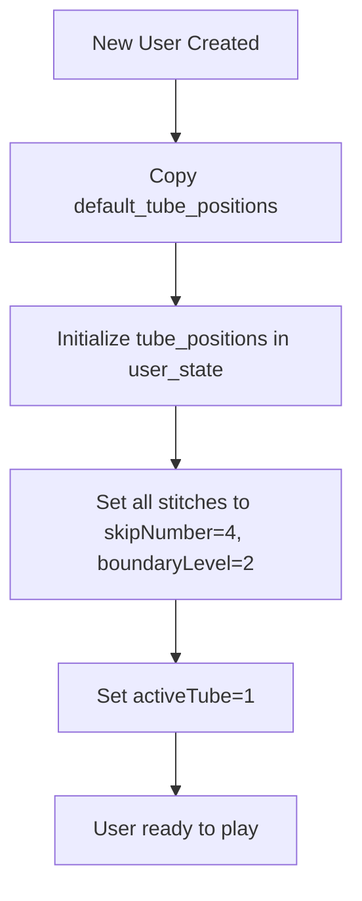
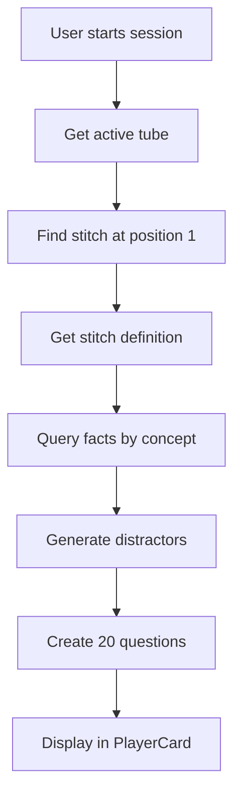
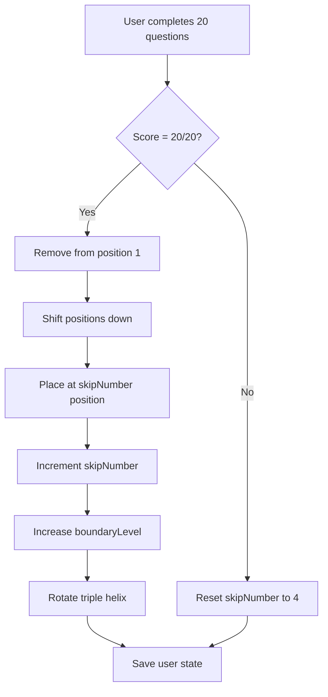

# Zenjin Maths App Architecture - Dynamic Content Generation System

## Executive Summary

Zenjin Maths is a revolutionary adaptive learning platform that implements "Netflix for Maths" - providing zero decision fatigue learning through distinction-based mastery. The architecture represents a fundamental shift from traditional content storage to dynamic content generation, treating stitches as recipes rather than static question banks.

### Core Innovation
- **Dynamic Content Generation**: Questions are generated just-in-time from stitch specifications
- **Sparse Position Management**: Infinite scaling through logical/physical position separation
- **Distinction-Based Learning**: Progression through 5 boundary levels of increasing difficulty
- **Triple Helix Model**: Automatic rotation between knowledge acquisition, skill development, and application

## Architectural Philosophy

### Content as Recipes, Not Storage

Traditional learning systems store thousands of pre-written questions in databases. Zenjin Maths takes a revolutionary approach:

```
Traditional: Database → 10,000 stored questions → Select & Display
Zenjin:      Stitch Recipe → Generate 20 questions → Display & Discard
```

**Benefits:**
- Infinite variations without storage overhead
- Algorithm changes without data migration
- Personalized difficulty adaptation
- A/B testing of question formats

### Distinction-Based Learning Model

Learning happens through making increasingly subtle distinctions:

1. **Category Boundaries** (Level 1): 24 vs "fish" - absurdly obvious
2. **Magnitude Boundaries** (Level 2): 24 vs 240 - order of magnitude differences
3. **Operation Boundaries** (Level 3): 24 vs 30 - wrong operation results
4. **Pattern Near-Miss** (Level 4): 24 vs 28 - close but wrong pattern
5. **Conceptual Near-Miss** (Level 5): 24 vs 26 - very subtle differences

### Spaced Repetition Algorithm

The system implements a unique spaced repetition algorithm with skip numbers:

```
Skip Sequence: [4, 8, 15, 30, 100, 1000]

When user completes a stitch with 20/20:
1. Remove from position 1
2. Shift positions 1-[skip_number] down
3. Place completed stitch at position [skip_number]
4. Increment skip_number

If score < 20/20: Reset skip_number to 4
```

## System Architecture

### Core Components

```
┌─────────────────────────────────────────────────────────────┐
│                     User Interface Layer                      │
│  ┌─────────────┐  ┌──────────────┐  ┌──────────────────┐   │
│  │ PlayerCard  │  │  Dashboard   │  │ Admin Interface  │   │
│  └─────────────┘  └──────────────┘  └──────────────────┘   │
└─────────────────────────────────────────────────────────────┘
                              │
┌─────────────────────────────────────────────────────────────┐
│                    Content Generation Layer                   │
│  ┌─────────────────┐  ┌───────────────┐  ┌──────────────┐  │
│  │ QuestionEngine  │  │  Distractor   │  │   Content    │  │
│  │                 │  │  Generator    │  │   Manager    │  │
│  └─────────────────┘  └───────────────┘  └──────────────┘  │
└─────────────────────────────────────────────────────────────┘
                              │
┌─────────────────────────────────────────────────────────────┐
│                      Stitch Management Layer                  │
│  ┌────────────────┐  ┌─────────────────┐  ┌─────────────┐  │
│  │ StitchManager  │  │ PositionManager │  │ TripleHelix │  │
│  │                │  │                 │  │  Manager    │  │
│  └────────────────┘  └─────────────────┘  └─────────────┘  │
└─────────────────────────────────────────────────────────────┘
                              │
┌─────────────────────────────────────────────────────────────┐
│                        Data Layer                             │
│  ┌────────────────┐  ┌─────────────────┐  ┌─────────────┐  │
│  │FactRepository  │  │   User State    │  │  Database   │  │
│  │                │  │    Storage      │  │  (Supabase) │  │
│  └────────────────┘  └─────────────────┘  └─────────────┘  │
└─────────────────────────────────────────────────────────────┘
```

### Key Design Patterns

#### 1. Sparse Position Storage

Problem: Can't create billions of positions for skip numbers up to 1000.

Solution: Logical vs Physical position separation.

```typescript
// Instead of:
positions: [stitch1, stitch2, stitch3, null, null, null, stitch4, ...]

// We use:
tubePositions: {
  "tube1": {
    "1": "t1-0001-0001",    // Physical position 1
    "8": "t1-0002-0001",    // Physical position 2
    "100": "t1-0003-0001"   // Physical position 3
  }
}
```

#### 2. Dynamic Question Generation Pipeline

```typescript
async generateQuestions(stitchId: string, userId: string): Promise<Question[]> {
  // 1. Get stitch definition (recipe)
  const stitch = await stitchManager.getStitch(stitchId);
  
  // 2. Get user's current boundary level
  const userProgress = await userState.getStitchProgress(userId, stitchId);
  const boundaryLevel = userProgress.boundaryLevel || 2;
  
  // 3. Query facts based on concept parameters
  const facts = await factRepository.queryFacts({
    conceptType: stitch.conceptType,
    parameters: stitch.conceptParams
  });
  
  // 4. Generate questions with appropriate distractor
  const questions = [];
  for (const fact of facts.slice(0, 20)) {
    const distractor = await distractorGenerator.generate(
      fact,
      boundaryLevel
    );
    questions.push({
      fact,
      distractor,
      boundaryLevel
    });
  }
  
  return questions;
}
```

#### 3. Triple Helix Rotation

Three learning tubes rotate automatically after each stitch completion:

```typescript
interface TripleHelixState {
  activeTube: 1 | 2 | 3;
  tubeDefinitions: {
    1: "Knowledge Acquisition",
    2: "Skill Development",
    3: "Application"
  };
}

// After stitch completion:
function rotateHelix(currentState: TripleHelixState): TripleHelixState {
  return {
    ...currentState,
    activeTube: (currentState.activeTube % 3) + 1
  };
}
```

## Database Schema

### Core Tables

#### facts
```sql
CREATE TABLE facts (
  id VARCHAR PRIMARY KEY,           -- 'mult-6-4'
  statement VARCHAR NOT NULL,       -- '6 × 4'
  answer VARCHAR NOT NULL,          -- '24'
  operation_type VARCHAR NOT NULL,  -- 'multiplication'
  metadata JSONB                    -- Additional properties
);
```

#### stitches
```sql
CREATE TABLE stitches (
  id VARCHAR PRIMARY KEY,           -- 't1-0001-0001'
  name VARCHAR NOT NULL,            -- '6 Times Table'
  tube_id VARCHAR NOT NULL,         -- 'tube1'
  concept_type VARCHAR NOT NULL,    -- 'times_table'
  concept_params JSONB NOT NULL     -- {operand: 6, range: [1,20]}
);
```

#### tubes
```sql
CREATE TABLE tubes (
  id VARCHAR PRIMARY KEY,           -- 'tube1'
  name VARCHAR NOT NULL,            -- 'Knowledge Acquisition'
  description TEXT
);
```

#### default_tube_positions
```sql
CREATE TABLE default_tube_positions (
  tube_id VARCHAR NOT NULL,
  logical_position INTEGER NOT NULL,
  stitch_id VARCHAR NOT NULL,
  PRIMARY KEY (tube_id, logical_position)
);
```

### User State Storage

User progress is stored as JSON in the user record:

```typescript
interface UserState {
  tubePositions: {
    [tubeId: string]: {
      [logicalPosition: string]: string; // stitch ID
    }
  };
  stitchProgress: {
    [stitchId: string]: {
      skipNumber: number;        // Current skip: 4, 8, 15, 30, 100, 1000
      boundaryLevel: number;     // Current level: 1-5
      lastCompleted: Date;
    }
  };
  tripleHelixState: {
    activeTube: 1 | 2 | 3;
  };
}
```

## Data Flow

### New User Initialization



### Question Generation Flow



### Stitch Completion Flow



## Content Management

### Stitch Definition Structure

```typescript
interface StitchDefinition {
  id: string;                    // 't1-0001-0001'
  name: string;                  // '6 Times Table'
  tubeId: string;               // 'tube1'
  conceptType: string;          // 'times_table'
  conceptParams: {
    operand?: number;           // 6
    range?: [number, number];   // [1, 20]
    operation?: string;         // 'multiplication'
  };
  surpriseWeight?: number;      // 0.1 for 10% surprise content
}
```

### Fact Naming Convention

Facts follow a strict naming protocol:

```
multiplication: mult-{operand1}-{operand2}
addition:       add-{operand1}-{operand2}
subtraction:    sub-{minuend}-{subtrahend}
division:       div-{dividend}-{divisor}
```

Examples:
- `mult-6-4` → 6 × 4 = 24
- `add-15-7` → 15 + 7 = 22
- `sub-20-8` → 20 - 8 = 12
- `div-48-6` → 48 ÷ 6 = 8

## Admin Layer Architecture

### Stitch Group Builder
- Define concept templates
- Batch generate multiple stitches
- Preview generated content
- Set surprise distribution flags

### Tube Position Manager
- Visual drag-drop interface
- See all three tubes side by side
- Bulk operations support
- Impact preview: "This change affects 127 users"

### Content Deployment System
- Test run any stitch at any boundary level
- Deploy to default_tube_positions
- Version tracking and rollback
- A/B testing configuration

## Performance Optimizations

### Caching Strategy

```typescript
interface CacheLayer {
  stitchDefinitions: LRUCache<string, StitchDefinition>;
  factQueries: LRUCache<string, Fact[]>;
  userStates: LRUCache<string, UserState>;
}
```

### Position Compression

When gaps become too large:

```typescript
function compressPositions(positions: SparsePositionMap): SparsePositionMap {
  const entries = Object.entries(positions)
    .sort(([a], [b]) => Number(a) - Number(b));
  
  const compressed = {};
  entries.forEach(([_, stitchId], index) => {
    compressed[index + 1] = stitchId;
  });
  
  return compressed;
}
```

## Session Features

### Points System
- First Time Correct (FTC): 3 points
- Eventually Correct (EC): 1 point
- Wrong answers repeat immediately

### Seamless Progression
- No completion screens
- Automatic stitch advancement
- Continuous learning flow
- Background state persistence

### Surprise Content Distribution
- 90% regular content from active tube
- 10% surprise addition/subtraction
- Maintains engagement
- Prevents pattern memorization

## Testing Strategy

### Critical Test Scenarios

1. **Content Addition**: New stitches don't disrupt user progress
2. **Position Compression**: User states remain valid after compression
3. **Boundary Progression**: Levels only increase, never decrease
4. **Sparse Arrays**: Queries handle gaps correctly
5. **State Persistence**: Progress saves reliably

### Performance Benchmarks

- Question generation: < 100ms for 20 questions
- State updates: < 50ms
- Position queries: O(1) with sparse storage
- Fact queries: < 20ms with proper indexing

## Migration Path

### From Static to Dynamic Content

1. Export existing questions to fact definitions
2. Create stitch recipes from question groups
3. Migrate user progress to new state format
4. Deploy with rollback capability
5. A/B test with user cohorts

## Future Extensibility

### Planned Enhancements

1. **Machine Learning Integration**
   - Personalized boundary level progression
   - Optimal skip number calculation
   - Distractor effectiveness analysis

2. **Content Ecosystem**
   - Community-created stitch recipes
   - Curriculum marketplace
   - School-specific progressions

3. **Advanced Analytics**
   - Learning velocity tracking
   - Concept mastery prediction
   - Optimal review timing

## Conclusion

The Zenjin Maths architecture represents a paradigm shift in educational technology. By treating content as dynamic recipes rather than static storage, implementing sparse position management, and focusing on distinction-based learning, the system provides infinite scalability with zero decision fatigue for learners.

The architecture is designed to be:
- **Flexible**: Content changes without data migration
- **Scalable**: Sparse storage handles millions of positions
- **Adaptive**: Personalized progression for each learner
- **Maintainable**: Clear separation of concerns
- **Testable**: Well-defined interfaces and data flows

This design enables the vision of "Netflix for Maths" - where learners simply press play and the system handles all the complexity of adaptive, personalized learning progression.