# Zenjin Maths App Architecture - Dynamic Content Generation System

## Executive Summary

Zenjin Maths is a revolutionary adaptive learning platform that implements "Netflix for Maths" - providing zero decision fatigue learning through distinction-based mastery. The architecture represents a fundamental shift from traditional content storage to dynamic content generation, treating stitches as recipes rather than static question banks.

### Core Innovation
- **Dynamic Content Generation**: Questions are generated just-in-time from stitch specifications
- **Sparse Position Management**: Infinite scaling through logical/physical position separation
- **Distinction-Based Learning**: Progression through 5 boundary levels of increasing difficulty
- **Triple Helix Model**: Automatic rotation between knowledge acquisition, skill development, and application

## Architectural Philosophy

### Content as Recipes, Not Storage

Traditional learning systems store thousands of pre-written questions in databases. Zenjin Maths takes a revolutionary approach:

```
Traditional: Database → 10,000 stored questions → Select & Display
Zenjin:      Stitch Recipe → Generate 20 questions → Display & Discard
```

**Benefits:**
- Infinite variations without storage overhead
- Algorithm changes without data migration
- Personalized difficulty adaptation
- A/B testing of question formats

### Distinction-Based Learning Model

Learning happens through making increasingly subtle distinctions:

1. **Category Boundaries** (Level 1): 24 vs "fish" - absurdly obvious
2. **Magnitude Boundaries** (Level 2): 24 vs 240 - order of magnitude differences
3. **Operation Boundaries** (Level 3): 24 vs 30 - wrong operation results
4. **Pattern Near-Miss** (Level 4): 24 vs 28 - close but wrong pattern
5. **Conceptual Near-Miss** (Level 5): 24 vs 26 - very subtle differences

### Spaced Repetition Algorithm

The system implements a unique spaced repetition algorithm with skip numbers:

```
Skip Sequence: [4, 8, 15, 30, 100, 1000]

When user completes a stitch with 20/20:
1. Remove from position 1
2. Shift positions 1-[skip_number] down
3. Place completed stitch at position [skip_number]
4. Increment skip_number

If score < 20/20: Reset skip_number to 4
```

## System Architecture

### Core Components

```
┌─────────────────────────────────────────────────────────────┐
│                     User Interface Layer                      │
│  ┌─────────────┐  ┌──────────────┐  ┌──────────────────┐   │
│  │ PlayerCard  │  │  Dashboard   │  │ Admin Interface  │   │
│  │             │  │              │  │                  │   │
│  │ PreEngage   │  │ UserSettings │  │ ProjectStatus    │   │
│  └─────────────┘  └──────────────┘  └──────────────────┘   │
└─────────────────────────────────────────────────────────────┘
                              │
┌─────────────────────────────────────────────────────────────┐
│                 Auth-to-Player State Machine                 │
│  ┌─────────────────────────────────────────────────────────┐ │
│  │ AUTH_SUCCESS → PRE_ENGAGEMENT → LOADING → ACTIVE       │ │
│  │      ↓              ↓             ↓        ↓           │ │
│  │ Big Play      Dashboard Link   Animation  Learning      │ │
│  │      ↓              ↓             ↓        ↓           │ │
│  │ → SESSION_ENDING → IDLE (Normal Navigation)           │ │
│  └─────────────────────────────────────────────────────────┘ │
└─────────────────────────────────────────────────────────────┘
                              │
┌─────────────────────────────────────────────────────────────┐
│                    Content Generation Layer                   │
│  ┌─────────────────┐  ┌───────────────┐  ┌──────────────┐  │
│  │ QuestionEngine  │  │  Distractor   │  │   Content    │  │
│  │                 │  │  Generator    │  │   Manager    │  │
│  │ ContentGating   │  │ OfflineCache  │  │ Subscription │  │
│  └─────────────────┘  └───────────────┘  └──────────────┘  │
└─────────────────────────────────────────────────────────────┘
                              │
┌─────────────────────────────────────────────────────────────┐
│                      Stitch Management Layer                  │
│  ┌────────────────┐  ┌─────────────────┐  ┌─────────────┐  │
│  │ StitchManager  │  │ PositionManager │  │ TripleHelix │  │
│  │                │  │                 │  │  Manager    │  │
│  │ SessionMetrics │  │ ProgressSync    │  │ TubeRotation│  │
│  └────────────────┘  └─────────────────┘  └─────────────┘  │
└─────────────────────────────────────────────────────────────┘
                              │
┌─────────────────────────────────────────────────────────────┐
│                        Service Layer                         │
│  ┌────────────────┐  ┌─────────────────┐  ┌─────────────┐  │
│  │FactRepository  │  │   UserSession   │  │  Stripe     │  │
│  │ (APML Context) │  │    Manager      │  │ Integration │  │
│  │                │  │                 │  │             │  │
│  │ Connectivity   │  │ Authentication  │  │ Database    │  │
│  │   Manager      │  │   FlowService   │  │ (Supabase)  │  │
│  └────────────────┘  └─────────────────┘  └─────────────┘  │
└─────────────────────────────────────────────────────────────┘
```

## Interface Contract Diagrams

### Auth-to-Player State Machine Flow

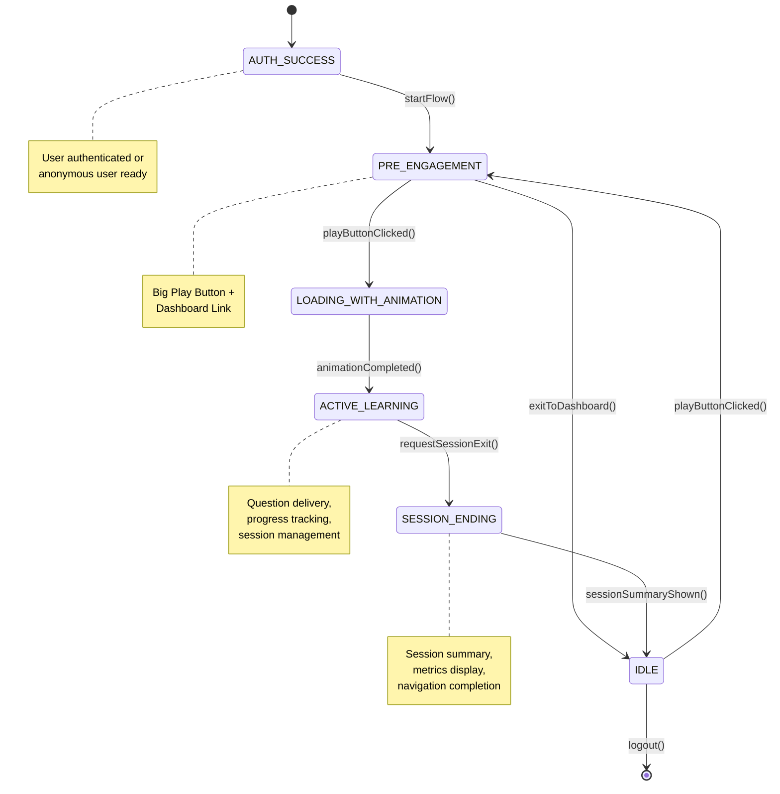

### Service Container Dependencies

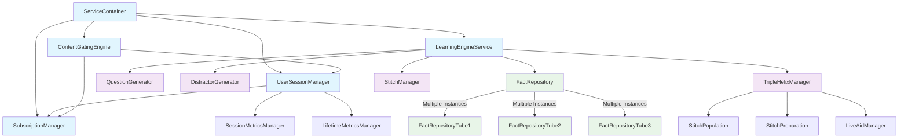

### Question Generation Flow

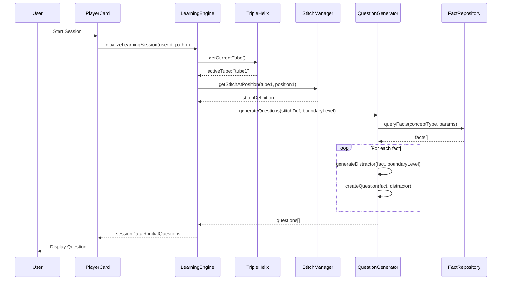

### User Response Processing Flow

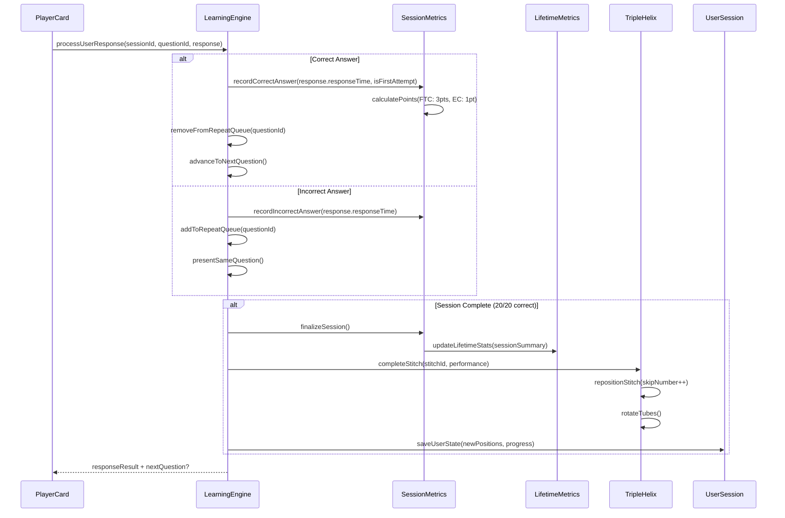

### Component Interface Contracts

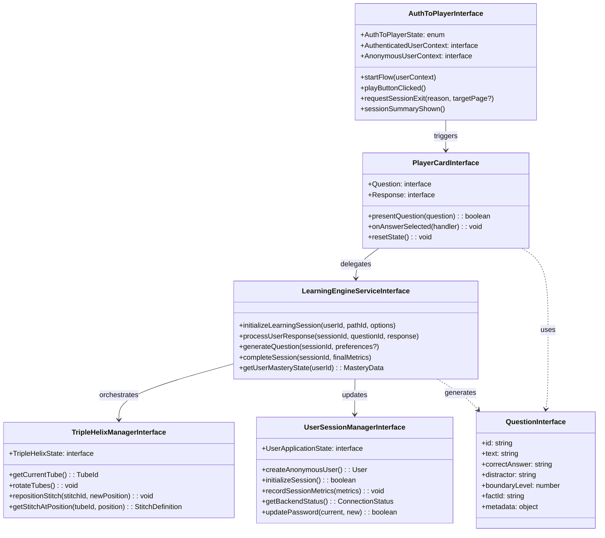

### Data Flow Architecture

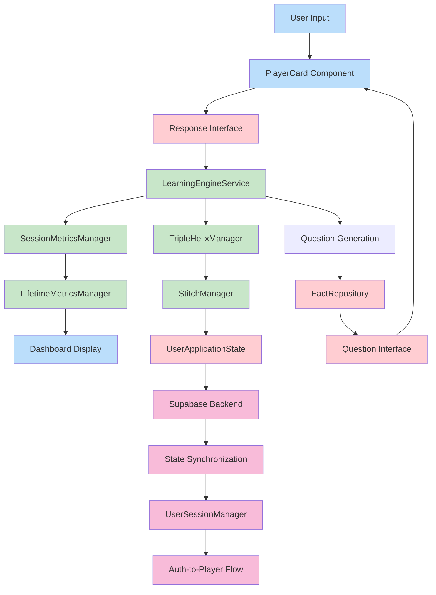

### Content Gating & Subscription Flow

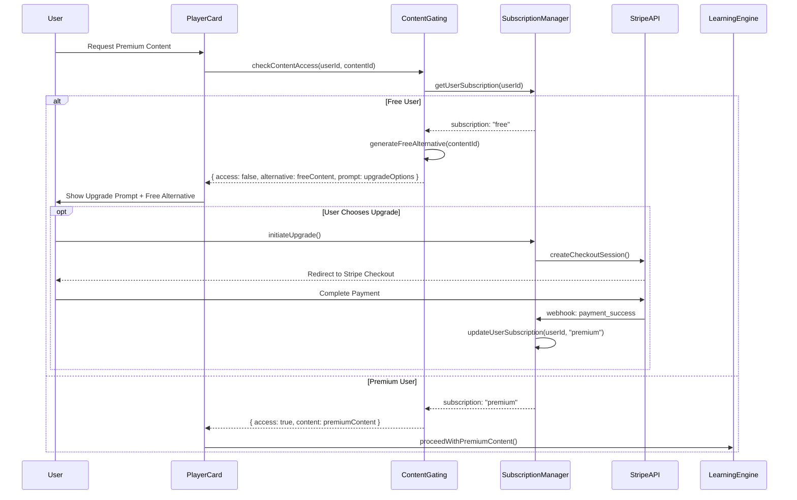

### Admin Interface Integration Flow

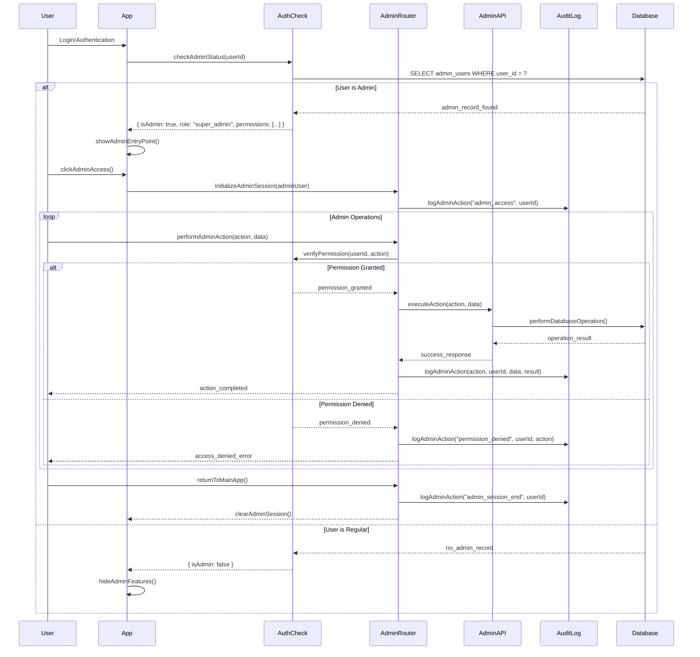

### Complete System Architecture Overview

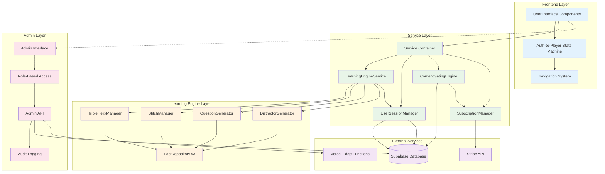

### Event Bus Communication Architecture

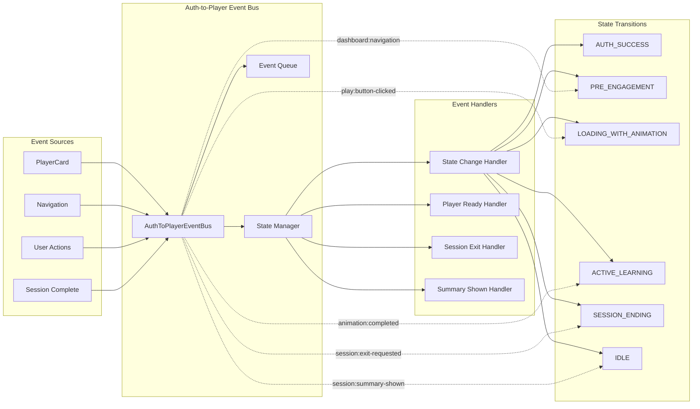

### Key Design Patterns

#### 1. Sparse Position Storage

Problem: Can't create billions of positions for skip numbers up to 1000.

Solution: Logical vs Physical position separation.

```typescript
// Instead of:
positions: [stitch1, stitch2, stitch3, null, null, null, stitch4, ...]

// We use:
tubePositions: {
  "tube1": {
    "1": "t1-0001-0001",    // Physical position 1
    "8": "t1-0002-0001",    // Physical position 2
    "100": "t1-0003-0001"   // Physical position 3
  }
}
```

#### 2. Dynamic Question Generation Pipeline

```typescript
async generateQuestions(stitchId: string, userId: string): Promise<Question[]> {
  // 1. Get stitch definition (recipe)
  const stitch = await stitchManager.getStitch(stitchId);
  
  // 2. Get user's current boundary level
  const userProgress = await userState.getStitchProgress(userId, stitchId);
  const boundaryLevel = userProgress.boundaryLevel || 2;
  
  // 3. Query facts based on concept parameters
  const facts = await factRepository.queryFacts({
    conceptType: stitch.conceptType,
    parameters: stitch.conceptParams
  });
  
  // 4. Generate questions with appropriate distractor
  const questions = [];
  for (const fact of facts.slice(0, 20)) {
    const distractor = await distractorGenerator.generate(
      fact,
      boundaryLevel
    );
    questions.push({
      fact,
      distractor,
      boundaryLevel
    });
  }
  
  return questions;
}
```

#### 3. Triple Helix Rotation

Three learning tubes rotate automatically after each stitch completion:

```typescript
interface TripleHelixState {
  activeTube: 1 | 2 | 3;
  tubeDefinitions: {
    1: "Knowledge Acquisition",
    2: "Skill Development",
    3: "Application"
  };
}

// After stitch completion:
function rotateHelix(currentState: TripleHelixState): TripleHelixState {
  return {
    ...currentState,
    activeTube: (currentState.activeTube % 3) + 1
  };
}
```

## Database Schema

### Core Tables

#### facts
```sql
CREATE TABLE facts (
  id VARCHAR PRIMARY KEY,           -- 'mult-6-4'
  statement VARCHAR NOT NULL,       -- '6 × 4'
  answer VARCHAR NOT NULL,          -- '24'
  operation_type VARCHAR NOT NULL,  -- 'multiplication'
  metadata JSONB                    -- Additional properties
);
```

#### stitches
```sql
CREATE TABLE stitches (
  id VARCHAR PRIMARY KEY,           -- 't1-0001-0001'
  name VARCHAR NOT NULL,            -- '6 Times Table'
  tube_id VARCHAR NOT NULL,         -- 'tube1'
  concept_type VARCHAR NOT NULL,    -- 'times_table'
  concept_params JSONB NOT NULL     -- {operand: 6, range: [1,20]}
);
```

#### tubes
```sql
CREATE TABLE tubes (
  id VARCHAR PRIMARY KEY,           -- 'tube1'
  name VARCHAR NOT NULL,            -- 'Knowledge Acquisition'
  description TEXT
);
```

#### default_tube_positions
```sql
CREATE TABLE default_tube_positions (
  tube_id VARCHAR NOT NULL,
  logical_position INTEGER NOT NULL,
  stitch_id VARCHAR NOT NULL,
  PRIMARY KEY (tube_id, logical_position)
);
```

### User State Storage

User progress is stored as JSON in the user record:

```typescript
interface UserState {
  tubePositions: {
    [tubeId: string]: {
      [logicalPosition: string]: string; // stitch ID
    }
  };
  stitchProgress: {
    [stitchId: string]: {
      skipNumber: number;        // Current skip: 4, 8, 15, 30, 100, 1000
      boundaryLevel: number;     // Current level: 1-5
      lastCompleted: Date;
    }
  };
  tripleHelixState: {
    activeTube: 1 | 2 | 3;
  };
}
```

## Data Flow

### New User Initialization

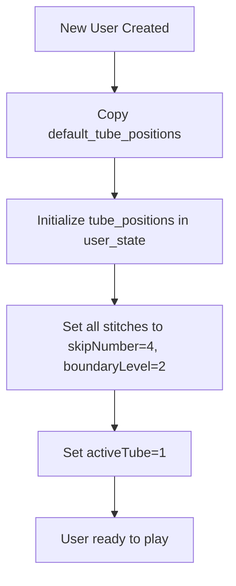

### Question Generation Flow

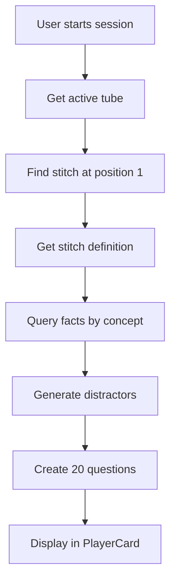

### Stitch Completion Flow

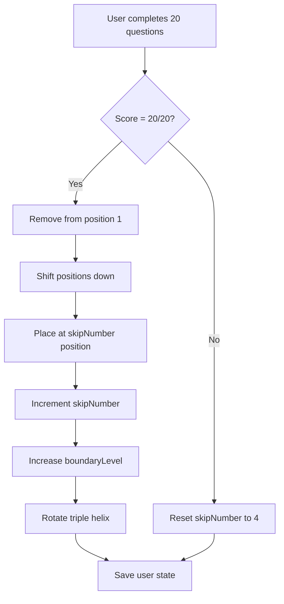

## Content Management

### Stitch Definition Structure

```typescript
interface StitchDefinition {
  id: string;                    // 't1-0001-0001'
  name: string;                  // '6 Times Table'
  tubeId: string;               // 'tube1'
  conceptType: string;          // 'times_table'
  conceptParams: {
    operand?: number;           // 6
    range?: [number, number];   // [1, 20]
    operation?: string;         // 'multiplication'
  };
  surpriseWeight?: number;      // 0.1 for 10% surprise content
}
```

### Fact Naming Convention

Facts follow a strict naming protocol:

```
multiplication: mult-{operand1}-{operand2}
addition:       add-{operand1}-{operand2}
subtraction:    sub-{minuend}-{subtrahend}
division:       div-{dividend}-{divisor}
```

Examples:
- `mult-6-4` → 6 × 4 = 24
- `add-15-7` → 15 + 7 = 22
- `sub-20-8` → 20 - 8 = 12
- `div-48-6` → 48 ÷ 6 = 8

## Admin Layer Architecture

### Stitch Group Builder
- Define concept templates
- Batch generate multiple stitches
- Preview generated content
- Set surprise distribution flags

### Tube Position Manager
- Visual drag-drop interface
- See all three tubes side by side
- Bulk operations support
- Impact preview: "This change affects 127 users"

### Content Deployment System
- Test run any stitch at any boundary level
- Deploy to default_tube_positions
- Version tracking and rollback
- A/B testing configuration

## Performance Optimizations

### Caching Strategy

```typescript
interface CacheLayer {
  stitchDefinitions: LRUCache<string, StitchDefinition>;
  factQueries: LRUCache<string, Fact[]>;
  userStates: LRUCache<string, UserState>;
}
```

### Position Compression

When gaps become too large:

```typescript
function compressPositions(positions: SparsePositionMap): SparsePositionMap {
  const entries = Object.entries(positions)
    .sort(([a], [b]) => Number(a) - Number(b));
  
  const compressed = {};
  entries.forEach(([_, stitchId], index) => {
    compressed[index + 1] = stitchId;
  });
  
  return compressed;
}
```

## Session Features

### Points System
- First Time Correct (FTC): 3 points
- Eventually Correct (EC): 1 point
- Wrong answers repeat immediately

### Seamless Progression
- No completion screens
- Automatic stitch advancement
- Continuous learning flow
- Background state persistence

### Surprise Content Distribution
- 90% regular content from active tube
- 10% surprise addition/subtraction
- Maintains engagement
- Prevents pattern memorization

## Testing Strategy

### Critical Test Scenarios

1. **Content Addition**: New stitches don't disrupt user progress
2. **Position Compression**: User states remain valid after compression
3. **Boundary Progression**: Levels only increase, never decrease
4. **Sparse Arrays**: Queries handle gaps correctly
5. **State Persistence**: Progress saves reliably

### Performance Benchmarks

- Question generation: < 100ms for 20 questions
- State updates: < 50ms
- Position queries: O(1) with sparse storage
- Fact queries: < 20ms with proper indexing

## Migration Path

### From Static to Dynamic Content

1. Export existing questions to fact definitions
2. Create stitch recipes from question groups
3. Migrate user progress to new state format
4. Deploy with rollback capability
5. A/B test with user cohorts

## Future Extensibility

### Planned Enhancements

1. **Machine Learning Integration**
   - Personalized boundary level progression
   - Optimal skip number calculation
   - Distractor effectiveness analysis

2. **Content Ecosystem**
   - Community-created stitch recipes
   - Curriculum marketplace
   - School-specific progressions

3. **Advanced Analytics**
   - Learning velocity tracking
   - Concept mastery prediction
   - Optimal review timing

## Conclusion

The Zenjin Maths architecture represents a paradigm shift in educational technology. By treating content as dynamic recipes rather than static storage, implementing sparse position management, and focusing on distinction-based learning, the system provides infinite scalability with zero decision fatigue for learners.

The architecture is designed to be:
- **Flexible**: Content changes without data migration
- **Scalable**: Sparse storage handles millions of positions
- **Adaptive**: Personalized progression for each learner
- **Maintainable**: Clear separation of concerns
- **Testable**: Well-defined interfaces and data flows

This design enables the vision of "Netflix for Maths" - where learners simply press play and the system handles all the complexity of adaptive, personalized learning progression.

## Current Implementation Status (86% Complete)

### ✅ Completed Core Systems

#### Auth-to-Player State Machine
- **Event-driven architecture** with clean state transitions
- **SESSION_ENDING** state for proper exit flow with session summary
- **IDLE** state for normal app navigation post-session
- **Dashboard integration** from PreEngagement card
- **Navigation preservation** during active learning sessions

#### Premium Subscription System
- **Stripe integration** with secure payment processing
- **Content gating engine** with graceful degradation to free alternatives
- **Subscription management** interface with upgrade/downgrade flows
- **Offline content download** for premium subscribers

#### User Management & Settings
- **Password functionality** to reduce OTP dependency during testing
- **Anonymous user support** with seamless upgrade to authenticated accounts
- **Session persistence** with automatic sync across devices
- **Admin role detection** with secure access control

#### Professional Interface Components
- **Project Status Dashboard** showing 86% completion with 5-day timeline
- **User Settings page** with comprehensive account management
- **Main Dashboard** with lifetime metrics and learning path visualization
- **Responsive navigation** with proper state highlighting

### 🔄 Final Polish Phase (14% Remaining)

#### Session Metrics Refinement
- Enhanced session summary with detailed learning analytics
- Real-time progress tracking during learning sessions
- Historical performance trends and improvement indicators

#### UI Animation & Optimization
- Smooth transitions between learning states
- Loading animation polish for better user experience
- Performance optimization for mobile devices

#### End-to-End Testing
- Complete user journey validation from entry to mastery
- Payment flow testing with real Stripe integration
- Offline functionality verification across all features

#### Production Deployment Setup
- Monitoring and alerting system configuration
- Performance tracking and optimization
- Security hardening and compliance verification

### Recent Architectural Improvements

#### Event-Driven Navigation Fix
Fixed navigation button functionality during active learning sessions by implementing proper event-driven session exit flow:

```typescript
// Navigation during active learning now properly exits sessions
if (authToPlayerState === 'ACTIVE_LEARNING') {
  authToPlayerEventBus.instance.requestSessionExit('navigation', page);
  return; // Wait for session summary before navigating
}
```

#### APML-Compliant Service Architecture
Implemented full APML Framework v2.2 compliance with:
- **Interface-first design** for all major components
- **Service container pattern** with dependency injection
- **Context boundary separation** for FactRepository instances
- **Event bus communication** between loosely coupled components

#### Content Gating Integration
Added sophisticated content access control that:
- **Detects premium content requests** from free users
- **Provides graceful degradation** to free alternatives
- **Maintains learning flow continuity** without breaking sessions
- **Prompts for upgrade** at natural breaking points

## Admin Interface Integration

### Role-Based Access Control Architecture

The admin system integrates seamlessly with the main application through a three-tier permission model that ensures secure, auditable administrative access without disrupting the core learning experience.

#### Admin Role Hierarchy

```typescript
type AdminRole = 'super_admin' | 'content_admin' | 'user_admin';

const rolePermissions = {
  super_admin: [
    'read_stats', 'read_content', 'read_users', 'write_content', 
    'write_users', 'delete_content', 'delete_users', 'manage_system'
  ],
  content_admin: [
    'read_stats', 'read_content', 'read_users', 'write_content', 'delete_content'
  ],
  user_admin: [
    'read_stats', 'read_users'
  ]
};
```

### Admin Interface Components

#### 1. Admin Dashboard
- **System Overview**: Real-time metrics (users, facts, stitches, sessions)
- **System Health**: Database status, performance monitoring
- **Recent Activity**: Admin actions, user registrations, content changes
- **Quick Actions**: Direct access to management functions

#### 2. Content Management
- **Facts Manager**: CRUD operations for mathematical facts
- **Stitches Manager**: Learning progression recipe definitions
- **Tube Positions**: Default learning path configuration
- **Bulk Operations**: Import/export, batch content updates

#### 3. User Management  
- **User Overview**: Search, filter, view user accounts
- **Progress Tracking**: Individual learning progression analysis
- **Account Management**: Profile editing, subscription management
- **Session History**: Detailed learning analytics per user

#### 4. Analytics & Reporting
- **Learning Metrics**: FTC rates, completion statistics, progress velocity
- **Content Performance**: Stitch effectiveness, boundary level analysis
- **User Engagement**: Session patterns, retention analytics
- **System Performance**: Response times, error rates, usage metrics

### Admin Integration Flow

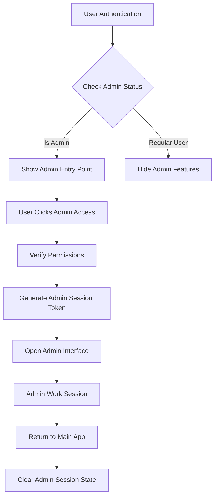

### Security Architecture

#### Manual Admin Creation Only
Admin users can **only** be created manually through direct database access, ensuring complete security control:

```sql
-- Example: Create super admin (replace with actual user ID)
INSERT INTO admin_users (
  user_id, role, permissions, created_by, notes
) VALUES (
  '11111111-1111-1111-1111-111111111111',
  'super_admin',
  '["read_stats","read_content","read_users","write_content","write_users","delete_content","delete_users","manage_system"]'::jsonb,
  'system',
  'Initial super admin created during setup'
);
```

#### Comprehensive Audit Trail
All admin actions are automatically logged for compliance and security:

```typescript
interface AdminActivityLog {
  admin_user_id: string;
  action: 'view_dashboard' | 'edit_user' | 'create_content' | 'delete_content';
  target_type?: 'user' | 'fact' | 'stitch' | 'system';
  target_id?: string;
  details: Record<string, any>;
  ip_address?: string;
  user_agent?: string;
  timestamp: Date;
}
```

### Admin Database Schema Extensions

#### admin_users Table
```sql
CREATE TABLE admin_users (
  user_id UUID PRIMARY KEY REFERENCES app_users(id),
  role VARCHAR(50) NOT NULL CHECK (role IN ('super_admin', 'content_admin', 'user_admin')),
  permissions JSONB NOT NULL DEFAULT '[]',
  created_at TIMESTAMP WITH TIME ZONE NOT NULL DEFAULT NOW(),
  created_by UUID NOT NULL REFERENCES app_users(id),
  last_admin_activity TIMESTAMP WITH TIME ZONE NULL,
  is_active BOOLEAN NOT NULL DEFAULT TRUE,
  notes TEXT NULL
);
```

#### admin_activity_log Table
```sql
CREATE TABLE admin_activity_log (
  id UUID PRIMARY KEY DEFAULT gen_random_uuid(),
  admin_user_id UUID NOT NULL REFERENCES admin_users(user_id),
  action VARCHAR(100) NOT NULL,
  target_type VARCHAR(50) NULL,
  target_id VARCHAR(255) NULL,
  details JSONB NOT NULL DEFAULT '{}',
  ip_address INET NULL,
  user_agent TEXT NULL,
  timestamp TIMESTAMP WITH TIME ZONE NOT NULL DEFAULT NOW()
);
```

### Admin API Architecture

The admin interface communicates with the backend through secure, permission-controlled API endpoints:

```typescript
interface AdminApiRoutes {
  '/api/admin/stats': SystemStats;           // Dashboard metrics
  '/api/admin/users': AdminUserData[];       // User management  
  '/api/admin/facts': MathematicalFact[];    // Content management
  '/api/admin/stitches': StitchDefinition[]; // Learning progressions
  '/api/admin/analytics': AnalyticsData;     // Comprehensive reporting
}

interface AdminApiSecurity {
  authentication: 'Bearer JWT token with admin claims';
  authorization: 'Permission-based access control per endpoint';
  audit_logging: 'All requests logged with user context';
  rate_limiting: 'Protection against abuse and automated attacks';
}
```

### Performance & Integration Considerations

#### Minimal Impact on Core Experience
- Admin features load separately from main application
- No impact on question generation or user session performance
- Admin API calls isolated from learning content delivery
- Cache separation between admin and user-facing data

#### Seamless User Experience Integration
- Admin entry point appears conditionally in main navigation
- Smooth transitions between admin interface and main app
- Preserved user session context during admin activities
- Consistent design language with main application

### Testing Strategy for Admin Features

#### Security Testing
1. **Access Control**: Verify permission enforcement at all levels
2. **Session Management**: Test admin session timeouts and cleanup
3. **Audit Logging**: Ensure all admin actions are properly recorded
4. **Manual Creation**: Verify admin users can only be created manually

#### Integration Testing
1. **UI Integration**: Admin entry points show/hide correctly
2. **Navigation Flow**: Smooth transitions between admin and main app
3. **Data Consistency**: Admin changes reflect immediately in main app
4. **Performance Impact**: Admin usage doesn't affect core user experience

This integrated admin architecture ensures that Zenjin Maths can be professionally managed and maintained while preserving the seamless, zero-decision-fatigue learning experience that defines the platform's core value proposition.

## Development Roadmap & Next Steps

### Immediate Priorities (Next 5 Days)

#### Parallel Development Strategy
With 4 Claude instances working in parallel, the final 14% completion involves:

**Claude Instance 1: Offline Sync Implementation**
- Complete offline content synchronization
- Implement background sync for user progress
- Test offline-to-online transition scenarios

**Claude Instance 2: Performance Optimization**
- Bundle size optimization and code splitting
- Mobile performance enhancement
- Loading state optimization

**Claude Instance 3: End-to-End Testing Suite**
- Complete user journey automation
- Payment flow integration testing  
- Cross-browser compatibility verification

**Claude Instance 4: Deployment & Integration**
- Production environment configuration
- Monitoring and alerting setup
- Security audit and hardening

### Architecture Evolution Path

#### Short-term Enhancements (1-3 months)
1. **Machine Learning Integration**
   - Personalized difficulty progression algorithms
   - Optimal review timing prediction
   - Learning pattern analysis for content optimization

2. **Advanced Analytics Dashboard**
   - Real-time learning effectiveness metrics
   - Predictive retention modeling
   - Educational outcome measurement

3. **Curriculum Marketplace**
   - Teacher-created learning progressions
   - School-specific content adaptation
   - Community content sharing platform

#### Long-term Vision (6-12 months)
1. **Multi-Subject Expansion**
   - Science and reading comprehension modules
   - Cross-curricular learning connections
   - Adaptive assessment across subjects

2. **Global Localization**
   - Multi-language content generation
   - Regional curriculum alignment
   - Cultural learning preference adaptation

3. **Enterprise Features**
   - Classroom management tools
   - Parent/teacher progress sharing
   - District-wide analytics and reporting

### Key Success Metrics

#### Technical Metrics
- **Response Time**: < 100ms for question generation
- **Availability**: 99.9% uptime with global CDN
- **Performance**: Mobile-first with progressive enhancement
- **Security**: Zero-trust architecture with comprehensive audit trails

#### Educational Metrics  
- **Learning Velocity**: Measurable improvement in mathematical fluency
- **Retention Rate**: Sustained engagement over time
- **Conceptual Understanding**: Evidence of deeper mathematical thinking
- **Transfer Learning**: Application to new mathematical contexts

#### Business Metrics
- **Conversion Rate**: Free-to-premium subscription success
- **User Satisfaction**: High NPS scores and positive engagement
- **Market Growth**: Expanding user base and community
- **Revenue Growth**: Sustainable subscription model scaling

### Technical Debt Management

#### Identified Areas for Refinement
1. **Session Metrics System**: Complete implementation of detailed learning analytics
2. **Offline Storage**: Enhanced caching strategy for premium content
3. **Error Handling**: Comprehensive error recovery and user guidance
4. **Performance Monitoring**: Real-time alerting and optimization feedback

#### Code Quality Initiatives
1. **TypeScript Coverage**: 100% type safety across all components
2. **Test Coverage**: Comprehensive unit and integration testing
3. **Documentation**: Living documentation with architectural decision records
4. **Code Review**: Automated quality gates and peer review processes

## Conclusion: Revolutionary Educational Architecture

Zenjin Maths represents a fundamental paradigm shift in educational technology architecture. By implementing:

- **Dynamic content generation** instead of static question storage
- **Distinction-based learning** rather than explanation-driven instruction  
- **Zero-decision fatigue** through algorithmic content curation
- **Event-driven state management** for seamless user experiences
- **APML Framework compliance** for maintainable, scalable code

The platform creates a truly adaptive, personalized learning environment that scales infinitely while maintaining the simplicity of "just press play and learn."

The architecture successfully balances technical sophistication with educational effectiveness, creating a foundation that will transform how children experience mathematical learning while providing educators and administrators with powerful tools for tracking and optimizing educational outcomes.

**Current Status**: 86% complete, targeting launch in 5 days with parallel Claude development team.
**Next Phase**: Production deployment with real-world validation and iterative improvement based on user feedback and learning outcome data.