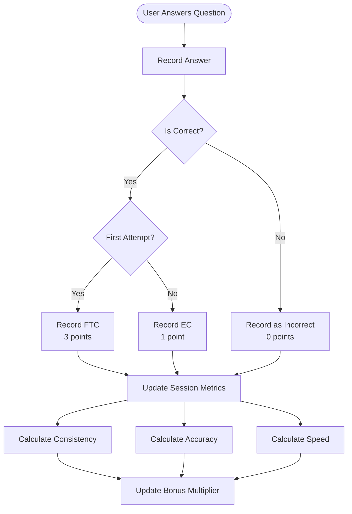
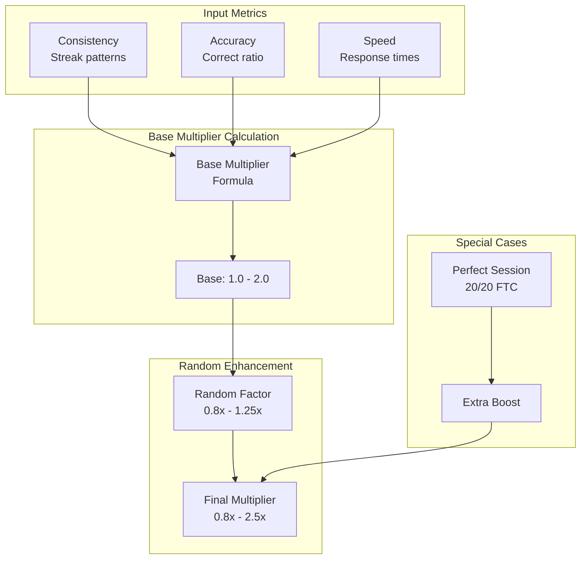
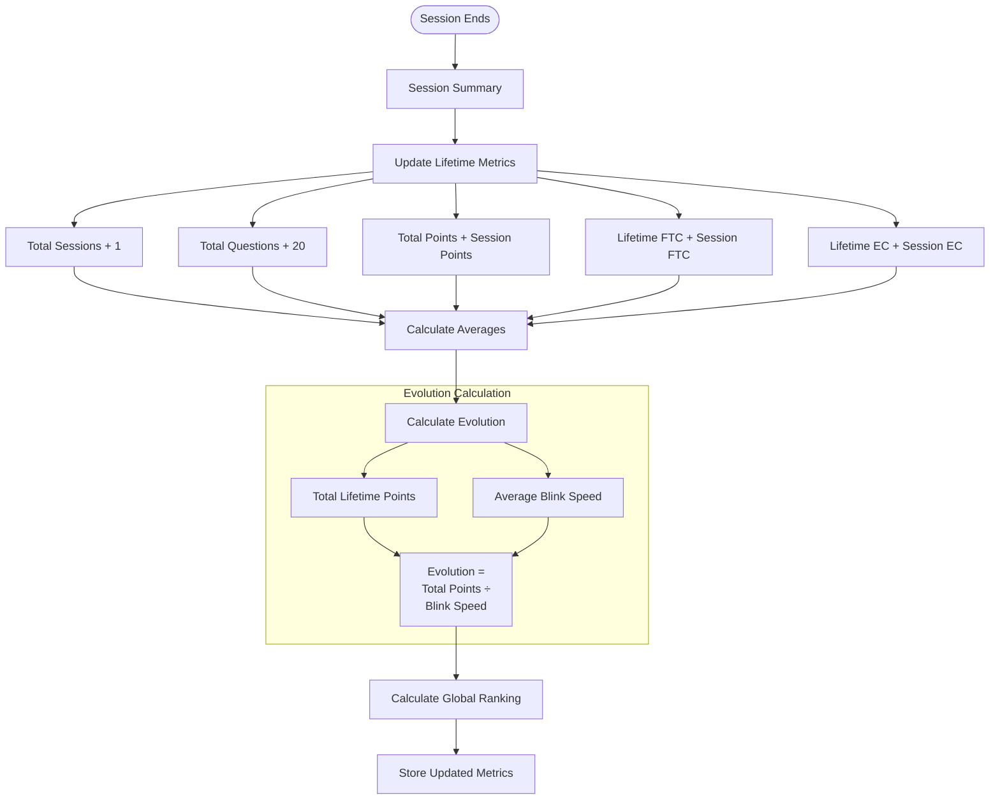
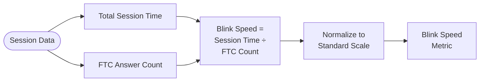

# Zenjin Maths - Metrics and Points System

## Overview

This document details the complete metrics and points calculation system, including session metrics, lifetime metrics, bonus multipliers, and the Evolution scoring system.

## Points System Architecture

### Base Points Structure

```
First Time Correct (FTC): 3 points
Eventually Correct (EC): 1 point
Incorrect: 0 points
```

### Session Metrics Components

1. **FTC Points** - Points from first-time correct answers
2. **EC Points** - Points from eventually correct answers
3. **Base Points** - Sum of FTC and EC points
4. **Bonus Multiplier** - Based on consistency, accuracy, and speed
5. **Blink Speed** - Measure of rapid correct responses
6. **Total Points** - Base Points × Bonus Multiplier

## Detailed Metrics Flows

### 1. Answer Recording Flow



### 2. Session Completion Metrics Flow

```mermaid
flowchart LR
    Complete([Session Complete]) --> GatherData[Gather Session Data]
    
    GatherData --> CalcBase[Calculate Base Points]
    CalcBase --> FTC[FTC Count × 3]
    CalcBase --> EC[EC Count × 1]
    
    GatherData --> CalcMetrics[Calculate Performance Metrics]
    CalcMetrics --> Consistency[Consistency Score]
    CalcMetrics --> Accuracy[Accuracy Score]
    CalcMetrics --> Speed[Speed Score]
    
    Consistency --> BonusCalc[Calculate Bonus Multiplier]
    Accuracy --> BonusCalc
    Speed --> BonusCalc
    
    BonusCalc --> RandomBonus[Apply Random Factor]
    RandomBonus --> FinalMultiplier[Final Multiplier<br/>(0.8x - 2.5x)]
    
    FTC --> TotalCalc[Calculate Total Points]
    EC --> TotalCalc
    FinalMultiplier --> TotalCalc
    
    TotalCalc --> SessionSummary[Generate Session Summary]
    
    GatherData --> BlinkCalc[Calculate Blink Speed]
    BlinkCalc --> SessionSummary
```

### 3. Bonus Multiplier Calculation



### 4. Lifetime Metrics Aggregation



### 5. Blink Speed Calculation



## Metrics Data Structure

### Session Metrics Object

```typescript
interface SessionMetrics {
  sessionId: string;
  userId: string;
  startTime: Date;
  endTime: Date;
  
  // Question Performance
  totalQuestions: number;        // Always 20
  ftcCount: number;             // First time correct
  ecCount: number;              // Eventually correct
  incorrectCount: number;       // Never correct
  
  // Points
  ftcPoints: number;            // ftcCount × 3
  ecPoints: number;             // ecCount × 1
  basePoints: number;           // ftcPoints + ecPoints
  bonusMultiplier: number;      // 0.8 to 2.5
  totalPoints: number;          // basePoints × bonusMultiplier
  
  // Performance Metrics
  consistency: number;          // 0.0 to 1.0
  accuracy: number;             // 0.0 to 1.0
  speed: number;                // 0.0 to 1.0
  blinkSpeed: number;           // Time per FTC
  
  // Streaks
  currentStreak: number;
  longestStreak: number;
  
  // Response Times
  avgResponseTime: number;
  fastestResponse: number;
  slowestResponse: number;
}
```

### Lifetime Metrics Object

```typescript
interface LifetimeMetrics {
  userId: string;
  
  // Totals
  totalSessions: number;
  totalQuestions: number;
  totalFTC: number;
  totalEC: number;
  totalIncorrect: number;
  totalPoints: number;
  
  // Averages
  avgPointsPerSession: number;
  avgAccuracy: number;
  avgBlinkSpeed: number;
  avgResponseTime: number;
  
  // Evolution
  evolution: number;            // totalPoints ÷ avgBlinkSpeed
  
  // Rankings
  globalRanking: number;        // Percentile (0-100)
  evolutionRank: number;        // Rank by evolution score
  pointsRank: number;           // Rank by total points
  
  // Achievements
  perfectSessions: number;      // 20/20 FTC
  streakRecord: number;         // Longest streak ever
  
  // Time Stats
  totalPlayTime: number;        // Milliseconds
  lastPlayed: Date;
  firstPlayed: Date;
}
```

## Calculation Formulas

### Consistency Score
```
consistency = (longestStreak / totalQuestions) × streakBonus
where streakBonus = 1.0 + (numberOfStreaks × 0.1)
```

### Accuracy Score
```
accuracy = (ftcCount × 1.0 + ecCount × 0.5) / totalQuestions
```

### Speed Score
```
speed = 1.0 - (avgResponseTime / maxResponseTime)
where maxResponseTime = 10000ms (10 seconds)
```

### Bonus Multiplier System

The bonus multiplier rewards different types of excellence. Players receive whichever bonus is highest from three categories:

```
bonusMultiplier = MAX(
  consistencyBonus,
  accuracyBonus,
  speedBonus
)
```

The exact thresholds and multiplier values are part of the system's discovery mechanics, encouraging players to experiment with different approaches to maximize their scores.

### Evolution Score
```
evolution = totalLifetimePoints / averageBlinkSpeed
```

## Bonus Discovery System

The system includes hidden bonus multipliers that reward different playstyles. Players are encouraged to discover these through experimentation:

### Consistency Rewards
Players who maintain regular practice patterns over extended periods may discover significant multipliers. The system tracks "valid sessions" and rewards dedication.

### Excellence Rewards  
Achieving high accuracy rates within sessions can unlock substantial bonuses. Perfect performance is especially valued.

### Speed Rewards
The "Blink Speed" metric (total session time ÷ FTC answers) measures rapid-fire accuracy. Exceptional speed unlocks special multipliers.

### Discovery Mechanics
- Bonus thresholds are not explicitly shown to players
- Players see their multiplier but not always why it was achieved
- Encourages experimentation with different approaches
- Creates "aha!" moments when players discover new bonus tiers

## Global Ranking System

Rankings are calculated across three dimensions:

1. **Points Ranking** - Total lifetime points
2. **Evolution Ranking** - Evolution score (efficiency metric)
3. **Activity Ranking** - Recent activity and consistency

### Ranking Calculation Flow

```mermaid
flowchart TB
    User([User Metrics]) --> Points[Total Points]
    User --> Evo[Evolution Score]
    User --> Activity[Recent Activity]
    
    Points --> PointRank[Points Percentile]
    Evo --> EvoRank[Evolution Percentile]
    Activity --> ActRank[Activity Percentile]
    
    PointRank --> Weight[Weighted Average]
    EvoRank --> Weight
    ActRank --> Weight
    
    Weight --> Global[Global Ranking<br/>Percentile]
    
    Global --> Display[Display as<br/>"Top X%"]
```

## Session Summary Display

The session summary shown to users includes:

```typescript
interface SessionSummary {
  // Performance
  questionsCorrect: number;
  accuracy: string;           // "85%"
  
  // Points Breakdown
  basePoints: number;
  bonusMultiplier: string;    // "1.8x"
  totalPoints: number;
  
  // Comparisons
  personalBest: boolean;
  averageComparison: string;  // "+15% above your average"
  
  // Fun Stats
  blinkSpeed: string;         // "Lightning fast!"
  streakInfo: string;         // "Best streak: 12"
  
  // Progress
  evolutionChange: string;    // "+0.5 Evolution"
  rankingChange: string;      // "↑ 2 positions"
  
  // Next Steps
  nextStitch: string;
  encouragement: string;
}
```

## Implementation Notes

1. **Real-time Updates**: Metrics should update after each answer for immediate feedback
2. **Precision**: All calculations maintain 2 decimal places minimum
3. **Performance**: All calculations must complete within 50ms
4. **Persistence**: Session metrics saved even if connection lost
5. **Fairness**: Random multipliers use deterministic seed for reproducibility

This metrics system creates engagement through:
- Clear progression (points accumulation)
- Performance optimization (improving multipliers)
- Competition (global rankings)
- Personal growth (evolution score)
- Immediate feedback (real-time updates)