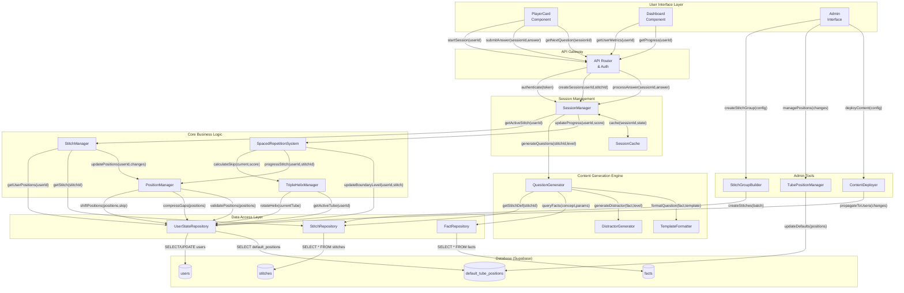
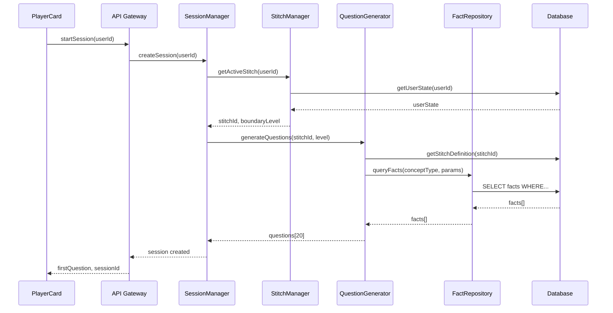
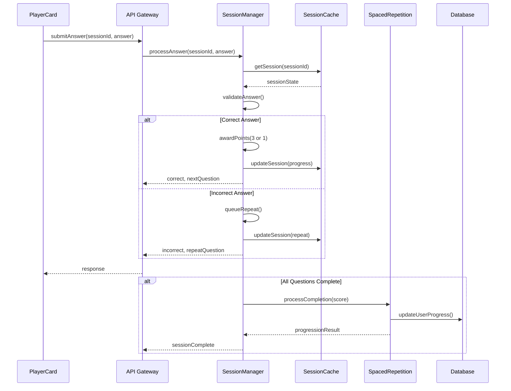
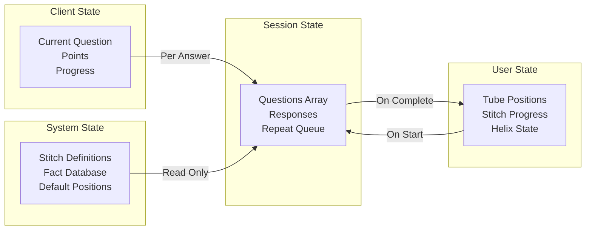

# Zenjin Maths - System Interface Diagram

## Complete System Architecture with Data Flows and Interface Contracts

This document provides a comprehensive visualization of the entire system, showing components, data flows, and interface contracts between all parts of the application.

## Master System Diagram



## Detailed Interface Contracts

### 1. PlayerCard → API Gateway

```typescript
interface PlayerCardAPI {
  // Start a new learning session
  startSession(request: {
    userId: string,
    sessionToken: string
  }): Promise<{
    sessionId: string,
    stitchInfo: {
      id: string,
      name: string,
      tubeId: string
    },
    firstQuestion: Question,
    totalQuestions: number
  }>

  // Submit an answer
  submitAnswer(request: {
    sessionId: string,
    questionIndex: number,
    selectedAnswer: string,
    responseTime: number
  }): Promise<{
    isCorrect: boolean,
    correctAnswer: string,
    points: 0 | 1 | 3,
    totalPoints: number,
    nextAction: 'next' | 'repeat' | 'complete'
  }>

  // Get next question
  getNextQuestion(request: {
    sessionId: string
  }): Promise<{
    question: Question | null,
    isComplete: boolean,
    completionData?: CompletionSummary
  }>
}
```

### SessionManager Role & Responsibilities

The SessionManager is the central coordinator for all learning sessions:

1. **Session Initialization**: Creates new sessions, retrieves active stitch from position 1
2. **Question Management**: Requests question generation from QuestionGenerator, maintains question order
3. **Answer Processing**: Validates answers, tracks points (FTC=3, EC=1), manages repeat logic
4. **Session State**: Maintains ephemeral session data in cache for performance
5. **Completion Handling**: Triggers stitch progression, helix rotation, and state persistence

It acts as the orchestration layer between the UI (PlayerCard) and the business logic components.

### 2. SessionManager → QuestionGenerator

```typescript
interface QuestionGeneratorContract {
  // Generate a set of questions from a stitch
  generateQuestions(request: {
    stitchId: string,
    boundaryLevel: 1 | 2 | 3 | 4 | 5,
    count: number,
    userId?: string  // For personalization
  }): Promise<{
    questions: Question[],
    metadata: {
      factCount: number,
      surpriseRatio: number,
      generationTime: number
    }
  }>

  // Preview questions for admin
  previewQuestions(request: {
    conceptType: string,
    conceptParams: object,
    boundaryLevel: number,
    count: number
  }): Promise<Question[]>
}
```

### 3. QuestionGenerator → FactRepository

```typescript
interface FactRepositoryContract {
  // Query facts by concept
  queryFacts(criteria: {
    conceptType: string,
    parameters?: {
      operand?: number,
      range?: [number, number],
      [key: string]: any
    },
    limit?: number,
    offset?: number
  }): Promise<{
    facts: Fact[],
    total: number,
    hasMore: boolean
  }>

  // Get specific fact
  getFact(factId: string): Promise<Fact | null>

  // Check fact existence
  factExists(factId: string): Promise<boolean>

  // Get facts for concept
  getFactsForConcept(
    conceptType: string,
    params: object
  ): Promise<Fact[]>
}
```

### 4. StitchManager → PositionManager

```typescript
interface PositionManagerContract {
  // Shift positions after completion
  shiftPositions(request: {
    userId: string,
    tubeId: string,
    completedStitchId: string,
    skipNumber: number
  }): Promise<{
    updatedPositions: SparsePositionMap,
    affectedCount: number
  }>

  // Compress sparse positions
  compressPositions(request: {
    userId: string,
    tubeId: string
  }): Promise<{
    before: SparsePositionMap,
    after: SparsePositionMap,
    gapsRemoved: number
  }>

  // Get next active stitch
  getActiveStitch(request: {
    userId: string,
    tubeId: string
  }): Promise<{
    stitchId: string,
    position: number
  } | null>
}
```

### 5. SpacedRepetitionSystem → TripleHelixManager

```typescript
interface TripleHelixContract {
  // Get current active tube
  getActiveTube(userId: string): Promise<{
    tubeId: 'tube1' | 'tube2' | 'tube3',
    tubeName: string
  }>

  // Rotate to next tube
  rotateHelix(request: {
    userId: string,
    currentTube: number
  }): Promise<{
    previousTube: number,
    newTube: number,
    rotationCount: number
  }>

  // Get all tube states
  getTubeStates(userId: string): Promise<{
    tube1: { name: string, stitchCount: number },
    tube2: { name: string, stitchCount: number },
    tube3: { name: string, stitchCount: number },
    activeTube: number
  }>
}
```

### 6. Admin Tools → Content Management

```typescript
interface AdminContentContract {
  // Create stitch group
  createStitchGroup(request: {
    groupName: string,
    conceptTemplate: {
      conceptType: string,
      baseParams: object
    },
    variations: Array<{
      name: string,
      paramOverrides: object
    }>,
    tubeAssignment: string
  }): Promise<{
    created: Stitch[],
    preview: Question[][]
  }>

  // Deploy content update
  deployContent(request: {
    deploymentId: string,
    changes: {
      newStitches?: Stitch[],
      positionUpdates?: PositionUpdate[],
      removals?: string[]
    },
    targetUsers: 'all' | 'new' | string[]
  }): Promise<{
    deploymentId: string,
    affectedUsers: number,
    status: 'success' | 'partial' | 'failed',
    errors?: Error[]
  }>

  // Preview impact
  previewImpact(request: {
    changes: PositionUpdate[]
  }): Promise<{
    affectedUsers: number,
    activeDisruptions: number,
    warnings: string[]
  }>
}
```

## Data Flow Sequences

### Session Start Sequence



### Answer Processing Sequence



## Component Responsibilities

### Core Components

| Component | Primary Responsibility | Key Interfaces |
|-----------|----------------------|----------------|
| SessionManager | Coordinates session lifecycle: initialization, question delivery, answer validation, completion | PlayerCard API, QuestionGenerator |
| QuestionGenerator | Creates questions from stitches | FactRepository, DistractorGenerator |
| StitchManager | Manages stitch positions and access | PositionManager, UserStateRepo |
| PositionManager | Handles sparse position operations | UserStateRepo |
| SpacedRepetitionSystem | Implements learning algorithm | TripleHelixManager, StitchManager |
| FactRepository | Provides fact data access | Database |
| DistractorGenerator | Creates wrong answers by level | Fact data |
| TripleHelixManager | Rotates between learning tubes | UserStateRepo |

### Data Flow Patterns

1. **Request/Response**: UI → API → Business Logic → Data Layer
2. **Caching**: SessionManager ↔ SessionCache for active sessions
3. **Event-Driven**: Completion events trigger state updates
4. **Batch Operations**: Admin tools perform bulk updates
5. **Validation Chain**: Each layer validates before passing down

### State Management



## Implementation Guidelines

### Interface Design Principles

1. **Single Responsibility**: Each interface handles one concern
2. **Type Safety**: All inputs/outputs fully typed
3. **Error Handling**: All methods return Result types or throw typed errors
4. **Async by Default**: All I/O operations are Promise-based
5. **Immutability**: State updates return new objects

### Data Flow Rules

1. **Unidirectional**: Data flows down, events bubble up
2. **Validation Layers**: Validate at boundaries
3. **Atomic Operations**: State changes are transactional
4. **Optimistic Updates**: UI updates before server confirms
5. **Graceful Degradation**: Handle partial failures

### Performance Considerations

1. **Lazy Loading**: Load data only when needed
2. **Batch Queries**: Combine multiple database calls
3. **Cache Warming**: Preload likely next states
4. **Connection Pooling**: Reuse database connections
5. **Debouncing**: Limit rapid state updates

This comprehensive diagram and interface specification provides a complete blueprint for implementing the Zenjin Maths system with clear contracts between all components.