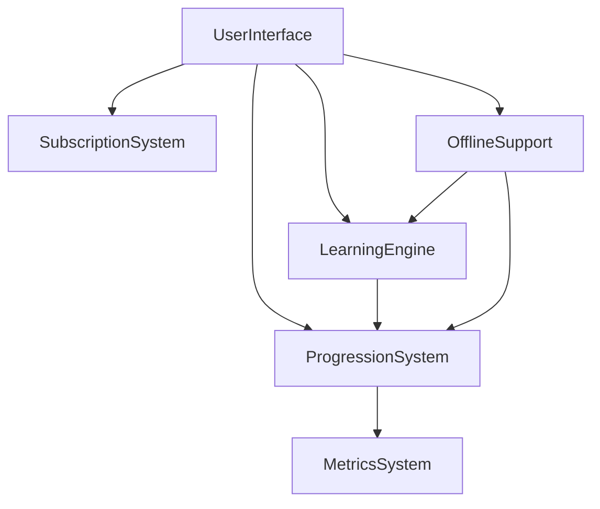
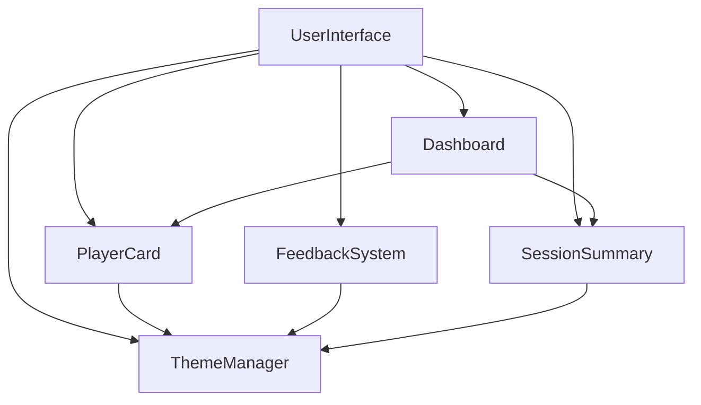
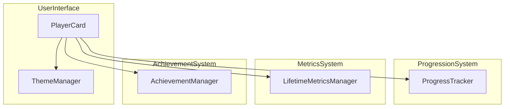
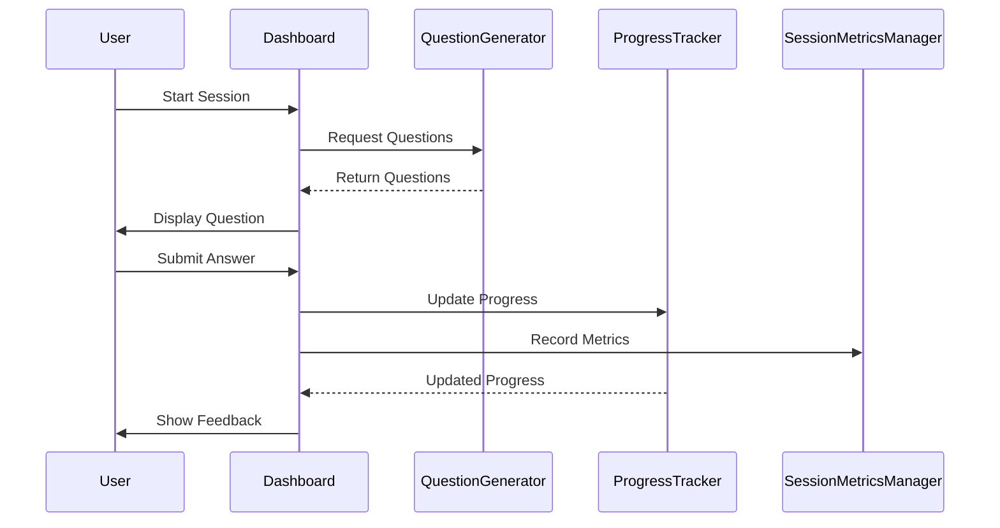

# APML Framework v1.4.3

## Version Information

**Version:** 1.4.3  
**Release Date:** May 28, 2025  
**Status:** Stable Release  
**Authors:** Original concept by Zenjin, developed with Claude, Manus & Gemini

### Change Log
- **v1.4.3 (2025-05-28):** Added Interface Review Queue Protocol and Session Scoping Guidelines. Addresses the interface-breaking change problem where AI sessions make assumptions about compatibility. Introduces mandatory interface review logging and optimal session length guidelines (100k tokens). Enforces single-completion task scoping to prevent cascading changes with unintended consequences.
- **v1.4.2 (2025-05-27):** Added comprehensive Naming Index System as mandatory APML framework practice. Addresses the 80% problem where development errors stem from naming inconsistencies (method typos, import path mismatches, variable reference errors). Introduces naming.apml as mandatory project artifact alongside registry.apml. Provides template structure, integration workflow, and validation requirements. Transforms naming errors into permanent project knowledge through systematic documentation of conventions, patterns, and common mistakes.
- **v1.4.1 (2025-05-26):** Added Specification Type Taxonomy to distinguish between Interface Specifications (component contracts), Behavioral Specifications (state machine logic), and Experience Specifications (user journey choreography). Eliminates conceptual confusion between different specification types. Provides systematic approach to different system aspects. Critical enhancement based on real framework usage patterns.
- **v1.4.0 (2025-05-25):** Added mandatory External Service Integration Protocol as core framework requirement. Eliminates debugging cycles through interface-first external service integration. Requires comprehensive service documentation capture before implementation. Proven to resolve complex integrations (Supabase Auth) on first attempt with zero debugging. Transforms APML from framework to comprehensive methodology for any external service integration.
- **v1.3.3 (2025-05-24):** Added Continuing Chat Protocol as integral part of the APML Framework. Provides complete standardized handoff system for seamless multi-session AI development with zero context loss. Includes handoff document template, session startup protocol, quality assurance checklists, and integration with main framework phases. Framework is now fully self-contained for all AI-assisted development scenarios.
- **v1.3.2 (2025-05-23):** Added formal Six-Phase Implementation Status Tracking System to the APML Framework. Introduced comprehensive status levels (not-started, scaffolded, functional, integrated, tested, optimized) with clear criteria, next steps, and registry integration. Enhanced project progress visibility and quality assurance through systematic status tracking. Added visual indicators and completion percentage tracking for modules and components.
- **v1.3.1 (2025-05-23):** Added APML-to-TypeScript Interface Bridge Tool to automatically generate TypeScript interfaces from APML interface definitions. Implemented two-way synchronization between APML specifications and TypeScript implementations. Created detailed documentation and setup instructions for the bridge tool. Enhanced project's type safety through consistent interface implementations.
- **v1.3.0 (2025-05-22):** Enhanced "Testing Strategy" to explicitly incorporate APML principles for the development, management, and lifecycle of testing systems and infrastructure (e.g., test harnesses). Added guidelines for APML-compliant development of testing systems, ensuring they adhere to framework phases, artifact generation, non-coder accessibility, and naming conventions. Added example `TestSystemInception.apml` and visual diagram. Updated validation levels to include testing system validation.
- **v1.2.6 (2025-05-22):** Added comprehensive naming conventions section with clear guidelines for case styles (PascalCase, camelCase, kebab-case, snake_case) and standardized conventions for all file types, variables, and database fields.
- **v1.2.5 (2025-05-22):** Added GitHub integration guidelines, HTML-based component testing for non-coders, and component relationship visualization. Introduced Better × Simpler × Cheaper principle for non-coders.
- **v1.2.3-1.2.4 (2025-05-21):** Updated README file naming convention to `ComponentName.README.md`. Moved registry.apml to project root as the single source of truth. Added status.html for project status visualization. Standardized component exports with index.ts files.
- **v1.2.0-1.2.2 (2025-05-20):** Added Phase 0N: New Project Inception & Definition for comprehensive initial context capture for new projects. Clarified relationship with Phase 0R. Added explicit framework phases. Expanded validation requirements. Improved implementation package format. Added module interaction documentation.
- **v1.1.0 (2025-05-18):** Added Phase 0R: Rebuild Knowledge Capture. Established APML-first approach. Enhanced token management strategies. Formalized Interface Definition Phase. Added Markdown APML as human-readable representation.
- **v1.0.0 (2025-05-18):** Initial stable release. Formalized APML syntax. Added Context Slop elimination. Interface-first component architecture. Multi-LLM implementation strategy. Comprehensive checklist approach.

## Core Concept: A Programmatic Checklist Approach

This framework transforms AI-assisted development from an ad-hoc process into a structured program that humans execute with AI assistance. Following the Checklist Manifesto approach, it provides a precise sequence of steps that ensure consistent, high-quality outcomes while working within AI system constraints.

## Core Principles for Non-Coders

The framework emphasizes three core principles for non-coders:

1. **Better × Simpler × Cheaper**: All decisions should optimize for this combination, making development more accessible.
2. **Approachable Testing**: Testing should be simple enough for non-coders to verify component functionality.
3. **Minimal Tooling**: Rely on simple, widely available tools rather than complex development environments.

## Foundations: AI Project Markup Language (APML)

The framework is built upon AI Project Markup Language (APML) - a formal structural language designed specifically for human-AI collaboration. APML exists in three forms:

1. **Standard APML** - Complete XML representation for storage, documentation, and tools (single source of truth)
2. **Markdown APML** - Human-readable representation for review and verification
3. **Token-Optimized APML** - Compact representation for AI session contexts

## Axioms

### Axiom 1: Complete Context Boundaries
All entities must have explicitly defined context boundaries that fit within AI token limitations.

### Axiom 2: Interface Before Implementation
Interfaces must be fully specified before implementation begins.

### Axiom 2a: Interface Review Queue Protocol
When AI sessions encounter potential interface mismatches or breaking changes, they must log these to an interface review queue rather than making assumptions. This prevents cascading changes with unintended consequences.

### Axiom 3: Single-Session Completability
All defined tasks must be completable within a single AI session's context limits.

### Axiom 4: Explicit Knowledge Capture
All decisions and rationales must be explicitly documented for future sessions.

### Axiom 5: Validation Through Distinction
All implementations must be validated through explicit test-linked criteria.

## Interface Review Queue Protocol

### Purpose
Prevents AI sessions from making assumptions about interface compatibility that lead to cascading changes with unintended consequences.

### Protocol
When encountering potential interface mismatches, AI sessions must:

1. **Stop implementation** rather than making assumptions
2. **Log the interface concern** to a review queue
3. **Provide specific details** about the mismatch
4. **Suggest review actions** rather than implementing fixes

### Interface Review Queue Format
```xml
<InterfaceReviewQueue>
  <ReviewItem priority="high" session="2025-05-28" component="PlayerCard">
    <Issue>PlayerCard expects 'distractor: string' but AuthToPlayerEventBus provides 'wrongAnswers: string[]'</Issue>
    <Impact>INVALID_QUESTION errors prevent user from seeing questions</Impact>
    <Suggestion>Either update PlayerCard interface or modify AuthToPlayerEventBus output format</Suggestion>
    <Decision>Pending human review</Decision>
  </ReviewItem>
</InterfaceReviewQueue>
```

### Benefits
- Prevents assumption-driven fixes
- Maintains interface integrity
- Provides clear decision trail
- Reduces session complexity

## Session Scoping Guidelines

### Optimal Session Length
**Target: 100k tokens maximum per session**

### Why 100k Tokens
- Leaves 100k tokens for working memory
- Prevents context pollution
- Enables focused completion
- Reduces cognitive overhead

### Session Scoping Rules

**Good Session Scope:**
- "Fix PlayerCard question validation"
- "Debug Auth-to-Player state transitions"
- "Add question progression logic"

**Too Large for One Session:**
- "Fix entire user interface"
- "Implement complete learning flow"
- "Debug all authentication issues"

### Session Boundaries
End session when:
- Target task completed (success)
- Interface mismatch discovered (review queue)
- Approaching 100k token limit
- Scope creep detected

### Context Handoff
Between sessions, preserve only:
- Task outcome
- Interface review items
- Critical architectural decisions

## Multi-LLM Component Architecture

The framework employs a "prefabricated components" approach where different AI systems can implement isolated components that connect through well-defined interfaces:

### 1. Interface Contracts Define Boundaries
- Each component has a clearly defined interface (inputs/outputs/behaviors)
- These interfaces act as contracts that implementations must fulfill
- Components interact only through their defined interfaces

### 2. Independent Implementation
- Different AI systems can implement different components
- The same AI can implement multiple components in isolation
- Each implementation focuses only on its specific responsibilities

### 3. Strategic AI Assignment
| Component Type | Recommended AI | Rationale |
|----------------|----------------|-----------|
| UI Components | Claude Pro | Consistent design approach and user experience |
| Core Algorithms | Claude Code | Complex reasoning and educational algorithm expertise |
| Data Models | Gemini/GPT | Structured data handling capabilities |
| State Management | Claude Pro | Consistent approach to state handling |
| Security Layer | Security-focused prompt | Consistent security implementation |

### 4. System Requirements in Interfaces

```xml
<Interface name="ComponentName">
  <!-- Standard interface definition -->
  
  <SystemRequirements>
    <Requirement type="Performance" name="ResponseTime">
      Must execute within 100ms
    </Requirement>
    <Requirement type="Security" name="DataValidation">
      Must validate all input data against XSS attacks
    </Requirement>
  </SystemRequirements>
  
  <StateInteractions>
    <SharedState name="StateName" access="read-write" />
  </StateInteractions>
</Interface>
```

## Process Flow: The Human-AI Program

The framework structures AI-assisted development as a deterministic sequence of steps humans follow with AI assistance:

## Phase 0N: New Project Inception & Definition (For New Projects)

### Purpose
To thoroughly define the context, objectives, scope, and critical parameters for a brand-new software project, ensuring a solid foundation for AI-assisted development using the APML framework. This phase ensures that the "why" and "what" are deeply understood before moving to "how."

### Applicability Rules
- This phase is mandatory for all new projects that are not direct rebuilds of existing systems.
- Should be executed before Phase 0 (Framework Initialization) and Phase 1 (Project Registry Creation).

### Steps
1. **Define Problem & Opportunity:** Document the specific problem, need, target audience, current solutions, and unique value proposition.
2. **Outline Solution Vision & Objectives:** Describe the core concept, key functionalities, long-term vision, and SMART objectives for the initial version.
3. **Identify Users & Stakeholders:** Define primary user personas and key internal/external stakeholders, along with their needs and expectations.
4. **Establish Initial Scope & Boundaries:** Detail essential features for the MVP (in-scope) and explicitly deferred features (out-of-scope), plus known dependencies/integrations.
5. **Document Constraints & Assumptions:** List known budget, time, technology, legal, and resource constraints, alongside critical project assumptions.
6. **Detail Data & AI-Specific Considerations:** Specify data needs for AI, data quality/availability, privacy/security measures, and AI model explainability/ethics.
7. **Note Initial Technical & Architectural Thoughts:** High-level ideas on platform, deployment, and non-functional requirements.
8. **Record Alternatives Considered:** Briefly document other solutions considered and why the proposed one was chosen.

**Output:** ProjectInception.apml (containing detailed, structured answers to the inception questions).

### Integration With Main Framework
- The ProjectInception.apml artifact serves as a primary input for Phase 0.2 (Establish project context and domain) and Phase 1 (Project Registry Creation).

## Phase 0R: Rebuild Knowledge Capture (For Rebuild Projects)

### Purpose
Provides a structured process for capturing expert knowledge from previous project iterations before initiating a rebuild using the APML framework. This phase ensures hard-earned insights are preserved while enabling a clean implementation.

### Applicability Rules
- This phase is optional and only applicable to rebuild projects or projects heavily iterating on a direct predecessor.
- If a project is a rebuild, this phase should be executed before Phase 0 and Phase 1.
- Can be abbreviated for projects where time constraints are significant.

### Steps
1. **Expert Knowledge Session:** Conduct a structured session to capture expert knowledge about the current system's strengths, weaknesses, and critical design decisions.
   - **Output:** ExpertKnowledge.apml
2. **Previous Implementation Assessment:** High-level assessment of the previous implementation, focusing on identifying technical debt sources and opportunities for improvement.
   - **Output:** ImplementationAssessment.apml
3. **Rebuild Requirements Definition:** Define clear requirements for the rebuilt system based on learnings from the previous implementation.
   - **Output:** RebuildRequirements.apml
4. **Knowledge Integration Strategy:** Create a strategy for integrating captured knowledge into the APML-driven rebuild process.
   - **Output:** KnowledgeIntegrationStrategy.apml

### Integration With Main Framework
- Artifacts from Phase 0R serve as primary inputs for Phase 0.2 and Phase 1 for rebuild projects.
- All components should be validated against the RebuildRequirements.apml in addition to standard validation criteria.

## Phase 0: Framework Initialization

1. Introduce framework document to AI assistant
2. Establish project context and domain (drawing from ProjectInception.apml for new projects or ExpertKnowledge.apml/RebuildRequirements.apml for rebuilds)
3. Verify AI understanding of framework principles
4. Configure token management and API constraints
5. Initialize project workspace
6. Transition to Phase 1 execution

## Phase 1: Project Setup

Establish project goals, scope, and structure.

1. Create ProjectRegistry.apml file
2. Create naming.apml file (see Naming Index System below)
3. Define project purpose (max 200 tokens) (informed by Phase 0N/0R outputs)
4. Identify core modules (3-7 recommended) (informed by Phase 0N/0R outputs)
5. Document critical interfaces between modules
6. Set up project directories and documentation structure
7. Initialize version control (if desired)
8. Validate registry with token-check tool

## Phase 2: Interface Definition & Module Definition

Define the interfaces for all components and module structures.

1. Create Module.apml for highest-priority module
2. Define module purpose (max 150 tokens)
3. Set context boundary with token estimation
4. Define module interfaces
   - Specify public APIs and data structures
   - Define input/output contracts
   - Document error handling
5. Identify module components
6. Document module dependencies
7. Create visual relationship mappings
8. Validate module with context-fit check

## Phase 3: Component Implementation

Implement individual components based on interface definitions.

1. Create DevelopmentSession.apml for target component
2. Define implementation goal (single session scope)
3. Identify high-priority context references
4. Generate implementation prompt
5. Execute AI coding session
6. Validate implementation against criteria
7. Document completion status and next steps
8. Create simple test files for component verification

## Phase 4: Integration and Validation

Integrate components and validate system behavior.

1. Create IntegrationSession.apml
2. Define integration scope and boundaries
3. Identify components to be integrated
4. Generate integration prompt
5. Execute AI coding session
6. Test component interactions
7. Validate system behavior against requirements
8. Identify and resolve integration issues
9. Document integration status, patterns, and relationships

## Phase 5: Reflection and Refinement

Reflect on the implementation and refine as needed.

1. Complete ReflectionChecklist.apml
2. Document effective patterns
3. Identify improvement opportunities
4. Update project practices
5. Plan next development cycle
6. Consider deployment options

## Naming Index System

### Purpose and Motivation

Research and field experience demonstrate that approximately 80% of development errors in AI-assisted projects stem from naming inconsistencies: method name typos, import path mismatches, variable reference errors, and case convention violations. The Naming Index System provides a systematic approach to prevent these errors through explicit documentation of project naming conventions.

### Core Principle

**Every APML project maintains a living naming index** that captures all naming conventions, patterns, validated examples, and common mistakes encountered during development. This transforms naming errors from recurring problems into permanent project knowledge.

### Mandatory Project Artifact: naming.apml

The `naming.apml` file is a mandatory project artifact alongside `registry.apml` and `README.md`. It serves as the single source of truth for all naming conventions used throughout the project.

#### Template Structure

```xml
<?xml version="1.0" encoding="UTF-8"?>
<NamingIndex version="1.0" project="{PROJECT_NAME}" framework="APML Framework v1.4.1">
  <Purpose>
    Single source of truth for all naming conventions, patterns, and validated examples used throughout the {PROJECT_NAME} project.
  </Purpose>

  <Classes>
    <Convention>PascalCase</Convention>
    <Pattern>{Purpose}{Type} or {Domain}{Component}</Pattern>
    <ValidatedExamples>
      <Class name="ComponentName" component="module" pattern="purpose-type" verified="true" />
    </ValidatedExamples>
    <CommonMistakes>
      <Mistake wrong="componentname" correct="ComponentName" issue="case-mismatch" />
    </CommonMistakes>
  </Classes>

  <Methods>
    <Convention>camelCase</Convention>
    <Patterns>
      <Pattern type="getter">get{Entity}()</Pattern>
      <Pattern type="setter">set{Entity}()</Pattern>
      <Pattern type="action">{verb}{Object}()</Pattern>
    </Patterns>
    <ValidatedExamples>
      <Method name="methodName" component="ComponentName" pattern="action" verified="true" />
    </ValidatedExamples>
    <CommonMistakes>
      <Mistake wrong="wrongMethodName" correct="correctMethodName" component="ComponentName" issue="method-name-mismatch" verified="true" />
    </CommonMistakes>
  </Methods>

  <Files>
    <Conventions>
      <FileType type="component" convention="PascalCase.tsx" example="ComponentName.tsx" />
      <FileType type="service" convention="PascalCase.ts" example="ServiceName.ts" />
      <FileType type="interface" convention="PascalCaseInterface.ts" example="ComponentInterface.ts" />
    </Conventions>
    <CommonMistakes>
      <Mistake wrong="component-name" correct="ComponentName" type="import-path" issue="case-kebab-vs-pascal" verified="true" />
    </CommonMistakes>
  </Files>

  <ImportPaths>
    <Conventions>
      <PathType type="relative-component" pattern="./ComponentName" />
      <PathType type="relative-service" pattern="../services/ServiceName" />
    </Conventions>
    <CommonMistakes>
      <Mistake wrong="./component-name" correct="./ComponentName" issue="filename-case-mismatch" verified="true" />
    </CommonMistakes>
  </ImportPaths>

  <ErrorPatterns>
    <NamingErrors>
      <Error type="method-name-mismatch" description="Calling non-existent method variant" frequency="high" />
      <Error type="import-path-case" description="Incorrect case in import paths" frequency="medium" />
    </NamingErrors>
  </ErrorPatterns>
</NamingIndex>
```

#### Naming Categories

The naming index should document conventions for all project naming entities:

1. **Code Structure**: Classes, methods, properties, variables, functions
2. **Files & Imports**: File names, directory names, import paths, export names
3. **Interfaces & Types**: Interface names, type definitions, enum values
4. **Data & State**: Database fields, API endpoints, environment variables, configuration keys
5. **Components**: React components, services, modules, events
6. **Framework-Specific**: APML status levels, validation criteria, module completion states

#### Integration with Development Workflow

1. **Mandatory Reading**: Include `naming.apml` in development constraints as required reading
2. **Error Documentation**: When encountering naming errors, immediately document them in the `<CommonMistakes>` section
3. **Validation Reference**: Use naming index to verify method names, import paths, and conventions before implementation
4. **Living Document**: Update naming index throughout project development as new patterns emerge

#### Validation Requirements

- All examples marked as `verified="true"` must exist and function correctly in the codebase
- Common mistakes must include actual errors encountered during development
- Naming patterns must be consistent across all project modules
- Import paths must match exact file names and directory structures

### Framework Integration

The Naming Index System integrates with other APML framework components:

- **Phase 1**: Create initial naming.apml structure during project setup
- **Phase 3**: Update naming index during component implementation
- **Phase 4**: Validate naming consistency during integration testing
- **Registry Integration**: Reference naming conventions in component documentation
- **Handoff Documents**: Include naming index updates in change documentation

## Implementation Status Tracking System

### Six-Phase Component Status Model

The APML Framework includes a formal 6-phase status tracking system for comprehensive implementation progress monitoring. This system provides clear milestones for component development and enables accurate project completion assessment.

#### Status Levels

1. **🔴 not-started**: Component has been identified in the registry but no implementation work has begun
   - **Criteria**: No files exist, interface not implemented
   - **Next Step**: Create basic file structure and interface stubs

2. **🟡 scaffolded**: Basic structure exists but component is not functional
   - **Criteria**: Files created, interfaces defined, but core functionality missing
   - **Next Step**: Implement core business logic and basic functionality

3. **🟠 functional**: Basic functionality works but not polished or fully integrated
   - **Criteria**: Core features work in isolation, basic test coverage exists
   - **Next Step**: Integration with other components and error handling

4. **🟢 integrated**: Component works properly with other system components
   - **Criteria**: Successfully integrates with dependent components, comprehensive error handling
   - **Next Step**: Add comprehensive test coverage and validation

5. **🔵 tested**: Has comprehensive tests covering functionality, integration, and edge cases
   - **Criteria**: High test coverage, all validation criteria passed, documented usage
   - **Next Step**: Performance optimization and production readiness

6. **⭐ optimized**: Performance optimized and production-ready
   - **Criteria**: Performance benchmarks met, production deployment ready, comprehensive documentation
   - **Maintenance**: Ongoing monitoring and refinement as needed

#### Registry Implementation

The status tracking system integrates with the `registry.apml` file structure:

```xml
<ImplementationProgress>
  <StatusLevels>
    <Level name="not-started" description="Not implemented at all" />
    <Level name="scaffolded" description="Basic structure exists but not functional" />
    <Level name="functional" description="Basic functionality works but not polished" />
    <Level name="integrated" description="Works with other components properly" />
    <Level name="tested" description="Has comprehensive tests" />
    <Level name="optimized" description="Performance optimized and production-ready" />
  </StatusLevels>
  
  <ModuleStatus>
    <Module name="ModuleName" interfaces="5/5" components="5/5" status="functional" completion="85%" />
  </ModuleStatus>
  
  <CompletedComponents>
    <Component module="ModuleName" name="ComponentName" date="2025-05-23" status="integrated" />
  </CompletedComponents>
  
  <CriticalGaps>
    <Gap module="ModuleName" component="ComponentName" issue="Description" priority="high" />
  </CriticalGaps>
</ImplementationProgress>
```

#### Benefits of Six-Phase Tracking

- **Clear Progress Visualization**: Each component's maturity level is immediately apparent
- **Prioritization Support**: Identifies which components need attention and in what order
- **Quality Assurance**: Ensures systematic progression through development milestones
- **Project Planning**: Enables accurate completion estimates and resource allocation
- **Risk Management**: Critical gaps section highlights potential blockers early

#### Integration with Framework Phases

The status tracking system aligns with the main framework phases:

- **Phases 0-2**: Components typically move from not-started to scaffolded
- **Phase 3**: Primary progression from scaffolded through functional to integrated
- **Phase 4**: Focus on moving from integrated to tested status
- **Phase 5**: Optimization phase for production readiness

This systematic approach ensures consistent quality standards while providing clear visibility into project progress and remaining work.

## File Structure and Naming Conventions

### Directory Structure

```
/project-root/
├── registry.apml               # SINGLE SOURCE OF TRUTH for what needs to be built
├── status.html                 # Current project status visualization
├── README.md                   # Project overview
├── framework_relationships.md  # Visual mapping of component relationships
├── apml_framework_v1.3.0.md    # Current framework version in root for easy reference
│
├── framework/                  # Framework definition
│   ├── current/                # Current framework version (copy)
│   │   └── apml_framework_v1.3.0.md
│   └── archive/                # Previous versions
│
├── docs/                       # Documentation and build artifacts
│   ├── build/                  # Build artifacts
│   │   ├── apml/               # APML definition files
│   │   │   ├── interfaces/     # Interface definitions
│   │   │   ├── modules/        # Module definitions
│   │   │   └── sessions/       # Development sessions
│   │   └── implementation_packages/ # LLM implementation instructions
│   │
│   ├── integration/            # Integration documentation
│   └── testing/                # Testing documentation (May include APML specs for Test Systems)
│
├── src/                        # Source code
│   ├── components/             # UI components
│   └── engines/                # Business logic components
│
└── tests/                      # Global test configurations and fixtures
    ├── visual/                 # Simple HTML-based component tests
    └── harness/                # (Optional) Source code for a dedicated test harness if built as a sub-project
```

### Component Organization

Components should be organized into their own directories with standardized file structure:

#### UI Components (`/src/components/ComponentName/`)
- `ComponentName.tsx` - Main component implementation
- `ComponentName.test.tsx` - Component tests
- `ComponentNameExample.tsx` - Usage examples
- `componentName.css` - Component styles (if needed)
- `ComponentName.README.md` - Component documentation
- `index.ts` - Exports for the component

#### Engine Components (`/src/engines/ComponentName/`)
- `ComponentName.ts` - Main implementation
- `ComponentNameTypes.ts` - Type definitions
- `ComponentName.test.ts` - Component tests
- `ComponentNameExample.ts` - Usage examples
- `ComponentName.README.md` - Component documentation
- `index.ts` - Exports for the component

### File Naming Conventions

- **README Files**: Each component directory should have a `ComponentName.README.md` file.
- **Interface Files**: Interface definitions should be named `ComponentNameInterface.apml`.
- **Development Session Files**: Development sessions should be named `ComponentName.DevelopmentSession.apml`.
- **Implementation Package Files**: Implementation packages should be named `ComponentName_Implementation_Package.md`.
- **Visual Test Files**: Simple HTML tests should be named `ComponentName-test.html`.

## Naming Conventions

### Case Style Guidelines

The APML Framework uses specific case styles for different elements to maintain consistency:

1. **PascalCase** (e.g., `ComponentName`, `UserInterface`)
   - Component names and classes
   - Type and interface names
   - Component files (except CSS)
   - Module names
   - React components

2. **camelCase** (e.g., `getUserData`, `isValidInput`)
   - Variables and function names
   - Method names
   - CSS files and class names
   - Attributes and properties
   - Instance names

3. **kebab-case** (e.g., `component-test`, `user-profile`)
   - HTML file names
   - CSS class names when used in HTML
   - URL routes and paths
   - HTML attributes
   - HTML test files

4. **snake_case** (e.g., `implementation_package`, `user_settings`)
   - Implementation package files
   - Database field names
   - Some documentation files
   - Environment variables

### Specific Naming Conventions by Type

#### File Naming
| File Type | Convention | Example |
|-----------|------------|---------|
| React/TypeScript Components | PascalCase.tsx | `PlayerCard.tsx` |
| Component Tests | PascalCase.test.tsx | `PlayerCard.test.tsx` |
| Component Examples | PascalCase + Example.tsx | `PlayerCardExample.tsx` |
| CSS Files | camelCase.css | `playerCard.css` |
| README Files | PascalCase.README.md | `PlayerCard.README.md` |
| Interface Definitions | PascalCaseInterface.apml | `PlayerCardInterface.apml` |
| Development Sessions | PascalCase.DevelopmentSession.apml | `PlayerCard.DevelopmentSession.apml` |
| Implementation Packages | PascalCase_Implementation_Package.md | `PlayerCard_Implementation_Package.md` |
| Visual HTML Tests | PascalCase-test.html | `PlayerCard-test.html` |
| JavaScript Utilities | camelCase.js/ts | `formatHelper.ts` |
| Index Files | index.ts | `index.ts` |

#### Code Naming
| Element Type | Convention | Example |
|--------------|------------|---------|
| React Components | PascalCase | `export function PlayerCard() {}` |
| Hooks | camelCase prefixed with "use" | `useThemeManager()` |
| Context Providers | PascalCase + Provider | `ThemeProvider` |
| Event Handlers | camelCase prefixed with "handle" | `handleSubmit()` |
| Boolean Variables | camelCase prefixed with "is", "has", "should" | `isLoading`, `hasError` |
| Constants | UPPER_SNAKE_CASE | `MAX_ATTEMPTS`, `API_URL` |
| Enums | PascalCase for name, PascalCase for members | `enum FeedbackType { Correct, Incorrect }` |
| Interfaces | PascalCase prefixed with "I" | `IPlayerCardProps` |
| Types | PascalCase | `PlayerCardProps` |
| CSS Classes (in JS) | camelCase | `feedbackContainer` |
| CSS Classes (in HTML) | kebab-case | `feedback-container` |

#### Database Naming
| Element Type | Convention | Example |
|--------------|------------|---------|
| Tables | PascalCase | `Users`, `LearningPaths` |
| Columns | snake_case | `user_id`, `first_name` |
| Foreign Keys | snake_case with referenced table | `user_id`, `learning_path_id` |
| Junction Tables | PascalCase with both tables | `UserLearningPaths` |
| Indexes | idx_snake_case | `idx_users_email` |

#### API Naming
| Element Type | Convention | Example |
|--------------|------------|---------|
| Endpoints | kebab-case | `/api/learning-paths` |
| Query Parameters | camelCase | `?userId=123&includeArchived=true` |
| Response Fields | camelCase | `{ "userName": "John", "isActive": true }` |
| HTTP Methods | UPPERCASE | `GET`, `POST`, `PUT`, `DELETE` |

#### Abbreviations and Acronyms
- Common abbreviations (ID, UI, API) should be treated as single words
- For camelCase: `userId`, `apiKey`, `uiComponent`
- For PascalCase: `UserId`, `ApiKey`, `UiComponent`
- For kebab-case: `user-id`, `api-key`, `ui-component`
- For snake_case: `user_id`, `api_key`, `ui_component`

## Fractal Patterns

The framework maintains its fractal nature through:

### 1. Context-Interface-Implementation (CII) Triangle

Every development entity exists within a CII triangle:

```
           Context
            /   \
           /     \
     Interface---Implementation
```

- **Context:** Why it exists and how it relates to the whole
- **Interface:** How it communicates with other entities
- **Implementation:** How it fulfills its responsibilities

This triangle is preserved at all scales, creating a fractal structure that maintains consistency while allowing for appropriate complexity at each level.

### 2. Recursive Documentation Structure

Documentation follows a recursive structure where each level contains the same elements but with appropriate detail for that level.

### 3. LLM-Aware Structural Patterns

The framework explicitly incorporates understanding of how LLMs function:

- **Context Window Management:** Explicit mechanisms for managing token limits
- **Information Retention Patterns:** Structures that optimize for LLM memory characteristics
- **Prompt Construction Templates:** Standardized formats optimized for AI comprehension
- **Implementation Unit Sizing:** Component boundaries designed to fit LLM processing capacity
- **Error Recovery Protocols:** Systematic approaches to addressing AI misunderstandings

## APML-First Approach

Standard APML serves as the single source of truth for all framework objects, with automated conversion to other formats:

### 1. Standard APML (Storage & Documentation)
- Complete XML representation
- Authoritative source for all framework objects
- Used for storage, documentation, and tools

### 2. Markdown APML (Human Readability)
- Generated from Standard APML
- Used for human review and verification
- Preserves all essential information in readable format

### 3. Token-Optimized APML (AI Sessions)
- Generated from Standard APML
- Compact representation for AI session contexts
- Optimized for token efficiency while preserving semantics

### Example: Standard APML vs. Token-Optimized APML

**Standard APML (Storage & Documentation)**
```xml
<Component name="TokenManager" module="Authentication">
  <Purpose>
    Generates and validates authentication tokens
  </Purpose>
  <ContextBoundary size="small" tokenEstimate="5000">
  </ContextBoundary>
  <Interfaces>
    <Interface name="generateToken">
      <Input name="userId" type="string" required="true" />
      <Output name="token" type="string" />
    </Interface>
  </Interfaces>
  <ValidationCriteria>
    <Criterion id="SEC001" test="tests/security/token_tamper_test.js">
      Tokens must be cryptographically secure and tamper-evident
    </Criterion>
  </ValidationCriteria>
</Component>
```

**Token-Optimized APML (AI Sessions)**
```xml
<C name="TokenManager" module="Authentication" 
   purpose="Generates and validates authentication tokens"
   contextSize="small" tokens="5000">
  <I name="generateToken">
    <In name="userId" type="string" req="1" />
    <Out name="token" type="string" />
  </I>
  <V id="SEC001" test="tests/security/token_tamper_test.js">
    Tokens must be cryptographically secure and tamper-evident
  </V>
</C>
```

## Context Efficiency: Eliminating "Context Slop"

A critical aspect of effective AI-assisted development is minimizing "context slop" - unnecessary information that consumes valuable context window space without providing tangible benefits.

### Context Slop Detection

Common sources of context slop include:
- Redundant Documentation - Repeating the same explanation or context in multiple prompts
- Over-detailed Historical Context - Including complete conversation history when only the latest decisions matter
- Excessive Code Duplication - Sending entire codebases when only specific files are relevant
- Unrelated References - Including references to components not directly related to the current task
- Verbose Setup Information - Repeating environment and configuration details in every prompt

### Slop Elimination Strategies

#### 1. Context Relevance Filtering

Before each AI interaction, apply strict relevance filtering:
```yaml
relevant_context:
  - current_component_only: true
  - direct_dependencies_only: true
  - implementation_details: false  # Only send interfaces
  - historical_decisions:
      max_age: 1  # Only include decisions from current session
      max_count: 3  # Only most recent 3 decisions
```

#### 2. Context Compression Techniques

Apply compression techniques to reduce token usage:
- Reference Summarization: Replace complete component descriptions with summaries and interfaces
- Code Skeleton Mode: Send only function signatures and critical comments, not implementations
- Dependency Bridging: Only include direct dependencies, not the entire dependency chain
- Decision Distillation: Compress decision history into outcome statements

#### 3. Session-Specific Context

For each session type, define a minimal context profile:
```yaml
context_profiles:
  implementation:
    includes:
      - target_component_interface
      - direct_dependencies_interfaces
      - implementation_standards
      - test_criteria
    excludes:
      - other_components_implementation
      - historical_conversations
      - unrelated_modules
      
  bugfix:
    includes:
      - buggy_component_implementation
      - reproduction_steps
      - relevant_tests
      - error_logs
    excludes:
      - unaffected_components
      - historical_development_context
```

#### 4. Context Budget Enforcement

Strictly enforce context budgets with hard limits:
```yaml
context_budget:
  total_max: 200000  # token limit
  allocation:
    project_context: 20000  # Just 10% for project context
    component_interfaces: 30000  # 15% for interfaces
    implementation_space: 130000  # 65% for actual implementation
    response_space: 20000  # 10% reserved for response
  enforcement: 
    action: "truncate"  # Automatically truncate if over budget
    priority: "newest_first"  # Keep newest information
```

#### 5. Targeted Reference Loading

Replace blanket inclusion with targeted references:
```xml
<References>
  <Load id="AuthComponent.Interface" />
  <Load id="UserModel.Interface" />
  <!-- Do NOT load entire codebase -->
</References>
```

## Testing Strategy

### Testing Philosophy

The testing approach is guided by the following principles:

1. **Distinction-Based Validation**: All components must be validated through explicit test-linked criteria, following Axiom 5 of the APML framework.

2. **Dual Validation Approach**: Combining automated testing for objective criteria with human evaluation for subjective aspects.

3. **Progressive Verification**: Testing occurs at multiple stages of development rather than only at the end.

4. **Interface-First Testing**: Tests validate that implementations fulfill their interface contracts.

5. **Context-Aware Evaluation**: Tests consider the component's purpose and context within the larger system.

### Testing Approaches

Four complementary testing approaches, each with specific applications:

#### 1. Component-Level Testing with Mock Data

**Description**: Testing individual components in isolation using mock data based on interface contracts.

**When to Use**:
- During Phase 3 (Component Implementation)
- When validating that a component meets its interface requirements
- For rapid feedback during development

**Implementation**:
- Unit tests written alongside component implementation
- Mock data generated based on interface contracts
- Tests run automatically after component integration

**Advantages**:
- Immediate feedback on component functionality
- Precise identification of issues
- Focused testing of specific functionality

**Limitations**:
- Doesn't validate component interactions
- Mock data may not represent real-world scenarios

#### 2. Progressive Testing in Development Environment

**Description**: Testing components in a controlled environment as they are developed, with incremental integration.

**When to Use**:
- After completing related components that interact with each other
- When validating component interactions
- For testing user flows that span multiple components

**Implementation**:
- Integration tests that exercise multiple components
- Test environment with controlled data
- Automated test scripts with manual verification of results

**Advantages**:
- Validates component interactions
- Identifies integration issues early
- Allows for incremental testing of the system

**Limitations**:
- More complex test setup
- May require partial mocking of unimplemented components

#### 3. Comprehensive Test Phase After Module Completion

**Description**: Dedicated testing phase after completing all components in a module, using structured test scenarios.

**When to Use**:
- After Phase 3 (Component Implementation) for a module is complete
- Before Phase 4 (Integration and Validation)
- When validating that a module fulfills its purpose

**Implementation**:
- End-to-end tests for module functionality
- Structured test scenarios based on module requirements
- Combination of automated tests and manual verification

**Advantages**:
- Comprehensive validation of module functionality
- Tests real user scenarios within the module
- Validates that the module fulfills its purpose

**Limitations**:
- Delayed feedback on issues
- May be difficult to isolate issues to specific components

#### 4. End-to-End Testing After System Completion

**Description**: Testing the complete system after all modules are implemented, with extensive logging for issue identification.

**When to Use**:
- After Phase 4 (Integration and Validation)
- During Phase 5 (Reflection and Refinement)
- For final validation of the system

**Implementation**:
- Comprehensive end-to-end tests
- Real-world test scenarios
- Extensive logging for issue identification
- User acceptance testing

**Advantages**:
- Validates the complete system
- Tests real-world scenarios
- Identifies issues that only appear in the full system

**Limitations**:
- Latest feedback on issues
- Complex issue isolation
- Resource-intensive

### Recommended Testing Strategy

A combined approach that leverages the strengths of each testing method:

#### Phase 3: Component Implementation

1. **Component-Level Testing (Automated)**
   - Unit tests for each component
   - Validation against interface contracts
   - Automated tests run after implementation
   - Test reports included in DevelopmentSession.apml

2. **Subjective Evaluation (Manual)**
   - Human review of UI components
   - Evaluation against subjective criteria
   - Documentation of findings
   - Feedback incorporated into implementation

#### Phase 4: Integration and Validation

1. **Module Integration Testing (Automated + Manual)**
   - Integration tests for module functionality
   - Validation against module purpose
   - Combination of automated and manual testing
   - Test reports included in IntegrationSession.apml

2. **Cross-Module Testing (Automated + Manual)**
   - Tests for interactions between modules
   - Validation of critical paths
   - Focus on boundary conditions
   - Documentation of issues

#### Phase 5: Reflection and Refinement

1. **System Testing (Automated + Manual)**
   - End-to-end tests for complete system
   - Validation against project purpose
   - Extensive logging for issue identification
   - User acceptance testing

2. **Performance and Stress Testing (Automated)**
   - Load testing for performance
   - Stress testing for stability
   - Validation of non-functional requirements
   - Documentation of results

### Objective vs. Subjective Criteria

#### Objective Criteria (Automated Testing)

Objective criteria are measurable, deterministic aspects that can be verified through automated testing:

1. **Functional Correctness**
   - Component behaves according to its interface contract
   - All methods return expected results for given inputs
   - Error handling works as specified

2. **Technical Requirements**
   - Performance meets specified thresholds
   - Accessibility requirements are met
   - Browser compatibility requirements are met

3. **Integration Requirements**
   - Components interact correctly with other components
   - Data flows correctly between components
   - System behavior is consistent across components

#### Subjective Criteria (Manual Evaluation)

Subjective criteria require human judgment and cannot be fully automated:

1. **User Experience**
   - Interface is intuitive and easy to use
   - Visual design is appealing and appropriate
   - Interactions feel natural and responsive

2. **Educational Effectiveness**
   - Content presentation supports learning objectives
   - Feedback is helpful and motivational
   - Progression feels appropriate and engaging

3. **Emotional Impact**
   - Experience is calming and non-anxiety-inducing
   - Achievements feel rewarding and meaningful
   - Overall experience is engaging and motivational

### Validation Framework

To ensure consistent evaluation, a structured validation framework is used:

#### Component Validation Matrix

Each component is validated against a matrix of criteria:

| Criterion Type | Examples | Validation Method | Documentation |
|----------------|----------|-------------------|--------------|
| Interface Compliance | Methods implement specified behavior | Automated tests | Test reports |
| Functional Requirements | Component performs required functions | Automated tests | Test reports |
| Technical Requirements | Performance, accessibility, compatibility | Automated tests | Test reports |
| User Experience | Usability, visual design, interactions | Manual evaluation | Evaluation reports |
| Educational Effectiveness | Learning support, feedback quality | Manual evaluation | Evaluation reports |
| Emotional Impact | Anxiety reduction, engagement | Manual evaluation | Evaluation reports |

#### Validation Levels

Validation occurs at multiple levels:

1. **Component Level**
   - Validation against component interface and requirements
   - Documented in DevelopmentSession.apml

2. **Module Level**
   - Validation against module purpose and requirements
   - Documented in IntegrationSession.apml

3. **System Level**
   - Validation against project purpose and requirements
   - Documented in ReflectionChecklist.apml

4. **Testing System Level**
   - Validation against test system purpose and requirements
   - Documented in TestSystemReflection.apml
   - Focuses on the effectiveness of the testing system itself
   - Evaluates coverage, usability, and integration with APML artifacts

### Testing Implementation Process

1. **Test Planning**
   - Define test scenarios based on requirements
   - Identify validation criteria
   - Determine appropriate testing methods

2. **Test Implementation**
   - Develop automated tests
   - Create evaluation protocols for manual testing
   - Implement logging for issue identification

3. **Test Execution**
   - Run automated tests
   - Conduct manual evaluations
   - Document results and issues

4. **Test Analysis**
   - Analyze test results
   - Identify patterns and root causes
   - Prioritize issues for resolution

5. **Test Reporting**
   - Generate test reports
   - Document validation status
   - Update project registry

### Testing Checklists

#### Component Testing Checklist

- [ ] Unit tests implemented for all methods
- [ ] Interface compliance verified
- [ ] Functional requirements tested
- [ ] Technical requirements verified
- [ ] Subjective evaluation conducted
- [ ] Test results documented
- [ ] Issues identified and prioritized
- [ ] Validation status updated in project registry

#### Module Testing Checklist

- [ ] Integration tests implemented for module
- [ ] Module purpose validation conducted
- [ ] Component interactions tested
- [ ] Module-level requirements verified
- [ ] Subjective evaluation of module conducted
- [ ] Test results documented
- [ ] Issues identified and prioritized
- [ ] Validation status updated in project registry

#### System Testing Checklist

- [ ] End-to-end tests implemented
- [ ] System-level requirements verified
- [ ] Performance testing conducted
- [ ] User acceptance testing conducted
- [ ] Test results documented
- [ ] Issues identified and prioritized
- [ ] Validation status updated in project registry

## APML-Compliant Testing Systems

The APML Framework extends its principles to the development, management, and lifecycle of testing systems themselves. Testing infrastructure (such as test harnesses, test runners, and validation tools) should be developed following the same APML principles as the main application components.

### Test Systems as APML Projects

Testing systems should be treated as first-class APML projects with their own:

1. **Project Inception**: Using `TestSystemInception.apml` to define the problem, solution vision, and scope
2. **Registry**: Defining modules and components specific to the testing system
3. **Interfaces**: Establishing clear contracts for test system components
4. **Development Sessions**: Implementing test system components with validation criteria
5. **Integration**: Ensuring proper interaction between test system components
6. **Reflection**: Continuously improving the test system based on feedback

### Example: TestSystemInception.apml

Below is an example of a `TestSystemInception.apml` file for a component test harness:

```xml
<TestSystemInception name="ComponentTestHarness">
  <Problem>
    <Description>
      Current component testing relies on simple HTML files that lack standardization, 
      comprehensive validation capabilities, and proper integration with the APML Framework. 
      Non-coders struggle to verify component functionality without a structured approach, 
      and developers lack visibility into component behavior across different states and configurations.
    </Description>
    <CurrentSolutions>
      <Solution name="SimpleHTMLTests">
        <Strengths>
          <Strength>Minimal tooling requirements</Strength>
          <Strength>Accessible to non-coders</Strength>
        </Strengths>
        <Weaknesses>
          <Weakness>Limited state manipulation</Weakness>
          <Weakness>No standardized validation</Weakness>
          <Weakness>Poor integration with APML artifacts</Weakness>
          <Weakness>Difficult to maintain at scale</Weakness>
        </Weaknesses>
      </Solution>
      <Solution name="ManualComponentTesting">
        <Strengths>
          <Strength>No additional infrastructure needed</Strength>
        </Strengths>
        <Weaknesses>
          <Weakness>Inconsistent testing approach</Weakness>
          <Weakness>No validation history</Weakness>
          <Weakness>Cannot easily reproduce specific states</Weakness>
        </Weaknesses>
      </Solution>
    </CurrentSolutions>
    <TargetAudience>
      <Audience type="Primary">Non-coding project stakeholders</Audience>
      <Audience type="Secondary">Developers implementing components</Audience>
      <Audience type="Tertiary">QA specialists validating system behavior</Audience>
    </TargetAudience>
    <UniqueValueProposition>
      An APML-compliant test harness that enables comprehensive component testing 
      with standardized validation criteria, state manipulation, and integration with 
      existing APML artifacts, while remaining accessible to non-coders.
    </UniqueValueProposition>
  </Problem>
  
  <SolutionVision>
    <CoreConcept>
      A modular test harness built using Vite+React+TypeScript that provides a unified 
      interface for testing all components in the system, with capabilities for state 
      manipulation, event monitoring, and validation against APML-defined criteria.
    </CoreConcept>
    <KeyFunctionalities>
      <Functionality name="ComponentSelector">
        Allows users to select any component in the system for testing
      </Functionality>
      <Functionality name="PropEditor">
        Enables manipulation of component props to test different configurations
      </Functionality>
      <Functionality name="StateVisualizer">
        Displays component internal state and updates in real-time
      </Functionality>
      <Functionality name="EventMonitor">
        Logs all events triggered by the component
      </Functionality>
      <Functionality name="ValidationChecker">
        Verifies component behavior against APML-defined validation criteria
      </Functionality>
      <Functionality name="ScenarioRunner">
        Executes predefined test scenarios from DevelopmentSession.apml files
      </Functionality>
      <Functionality name="FeedbackCollector">
        Captures subjective feedback on component behavior
      </Functionality>
    </KeyFunctionalities>
    <LongTermVision>
      A comprehensive testing ecosystem that integrates with the APML Framework 
      at all levels, providing continuous validation of components, modules, and 
      the entire system throughout the development lifecycle.
    </LongTermVision>
    <SMARTObjectives>
      <Objective name="ComponentCoverage">
        Enable testing of 100% of UI and Engine components by project completion
      </Objective>
      <Objective name="ValidationIntegration">
        Automatically import and validate against criteria from DevelopmentSession.apml files
      </Objective>
      <Objective name="NonCoderAccessibility">
        Achieve 90% task completion rate for non-coders in usability testing
      </Objective>
      <Objective name="DevelopmentEfficiency">
        Reduce component validation time by 50% compared to manual testing
      </Objective>
      <Objective name="DocumentationGeneration">
        Automatically generate validation reports for all tested components
      </Objective>
    </SMARTObjectives>
  </SolutionVision>
  
  <!-- Additional sections omitted for brevity -->
</TestSystemInception>
```

For the complete example, see the full `TestSystemInception.apml` in the framework documentation.

### Test Harness Integration with APML Framework

The following diagram illustrates how a test harness integrates with the APML Framework:

```
                                APML Framework
                                     │
                                     │
                 ┌─────────────────┐ │ ┌─────────────────┐
                 │                 │ │ │                 │
                 │  Main Project   │◄┼─┤  Test Harness   │
                 │                 │ │ │                 │
                 └────────┬────────┘ │ └────────┬────────┘
                          │          │          │
                          ▼          │          ▼
                 ┌────────────────┐  │  ┌────────────────┐
                 │                │  │  │                │
                 │ Project APML   │  │  │ Test APML      │
                 │ Artifacts      │  │  │ Artifacts      │
                 │                │  │  │                │
                 │ - registry.apml│  │  │ - TestSystem   │
                 │ - interfaces/  │  │  │   Inception.apml
                 │ - modules/     │  │  │ - TestModule.apml
                 │ - sessions/    │  │  │ - TestInterfaces/
                 │                │  │  │                │
                 └────────┬───────┘  │  └────────┬───────┘
                          │          │           │
                          │          │           │
                          ▼          │           ▼
                 ┌────────────────┐  │  ┌────────────────┐
                 │                │  │  │                │
                 │ Implementation │  │  │ Test Harness   │
                 │ Components     │  │  │ Components     │
                 │                │  │  │                │
                 │ - UI Components│  │  │ - UI Module    │
                 │ - Engine       │◄─┼──┤ - Engine Module│
                 │   Components   │  │  │ - Integration  │
                 │                │  │  │   Layer        │
                 └────────┬───────┘  │  └────────┬───────┘
                          │          │           │
                          │          │           │
                          ▼          │           ▼
                 ┌────────────────┐  │  ┌────────────────┐
                 │                │  │  │                │
                 │ Validation     │◄─┼──┤ Test Execution │
                 │ Criteria       │  │  │ & Reporting    │
                 │                │  │  │                │
                 │ - Objective    │  │  │ - Component    │
                 │   Criteria     │  │  │   Tests        │
                 │ - Subjective   │  │  │ - Validation   │
                 │   Criteria     │  │  │   Reports      │
                 │                │  │  │                │
                 └────────────────┘  │  └────────────────┘
                                     │
                                     ▼
                            ┌─────────────────┐
                            │                 │
                            │ Project Status  │
                            │ & Documentation │
                            │                 │
                            │ - status.html   │
                            │ - Validation    │
                            │   Reports       │
                            │                 │
                            └─────────────────┘
```

### APML Principles for Test Systems

Test systems should adhere to the following APML principles:

#### 1. Interface Contracts for Test Components

Test system components must have clearly defined interfaces:

```xml
<Interface name="TestHarnessComponentSelector">
  <Purpose>
    Provides a mechanism for selecting components for testing
  </Purpose>
  <Methods>
    <Method name="listAvailableComponents">
      <Output name="componentList" type="ComponentInfo[]" />
    </Method>
    <Method name="selectComponent">
      <Input name="componentId" type="string" required="true" />
      <Output name="selectedComponent" type="ComponentInstance" />
    </Method>
  </Methods>
  <ValidationCriteria>
    <Criterion id="TS-001">
      Must display all available components from registry.apml
    </Criterion>
    <Criterion id="TS-002">
      Must support filtering and searching components
    </Criterion>
  </ValidationCriteria>
</Interface>
```

#### 2. Context Boundaries for Test Systems

Test systems must respect context boundaries:

```xml
<ContextBoundary size="medium" tokenEstimate="8000">
  <Rationale>
    Test harness requires moderate context due to need to understand
    both the test infrastructure and the components being tested
  </Rationale>
  <ContextInclusions>
    <Include>Component interfaces being tested</Include>
    <Include>Validation criteria from DevelopmentSession.apml</Include>
    <Include>Test harness component interfaces</Include>
  </ContextInclusions>
  <ContextExclusions>
    <Exclude>Implementation details of unrelated components</Exclude>
    <Exclude>Historical test results</Exclude>
  </ContextExclusions>
</ContextBoundary>
```

#### 3. Validation Criteria for Test Systems

Test systems must have their own validation criteria:

```xml
<ValidationCriteria>
  <Criterion id="TS-HARNESS-001" test="tests/harness/accessibility_test.js">
    Test harness must meet WCAG 2.1 AA accessibility standards
  </Criterion>
  <Criterion id="TS-HARNESS-002" test="tests/harness/non_coder_usability_test.js">
    Non-coders must be able to complete basic testing tasks without assistance
  </Criterion>
  <Criterion id="TS-HARNESS-003" test="tests/harness/validation_criteria_test.js">
    Test harness must correctly import and validate against criteria from DevelopmentSession.apml
  </Criterion>
  <Criterion id="TS-HARNESS-004" test="tests/harness/component_coverage_test.js">
    Test harness must support testing of all component types in the system
  </Criterion>
</ValidationCriteria>
```

### Implementation Requirements for Test Systems

Test systems must meet the following implementation requirements:

1. **APML Artifact Integration**
   - Must parse and utilize APML artifacts (interfaces, development sessions)
   - Must extract validation criteria from DevelopmentSession.apml files
   - Must report validation results in APML-compatible format

2. **Non-Coder Accessibility**
   - Must provide intuitive interfaces for non-technical users
   - Must use clear, non-technical language in UI and documentation
   - Must support guided testing workflows

3. **Component Coverage**
   - Must support testing of all component types (UI, Engine)
   - Must handle different component interfaces and behaviors
   - Must provide appropriate testing tools for each component type

4. **Validation Reporting**
   - Must generate structured validation reports
   - Must track validation status over time
   - Must integrate with project status reporting

5. **APML-Compliant Architecture**
   - Must follow modular architecture with clear interfaces
   - Must respect context boundaries
   - Must implement validation criteria for its own components

### Test System Development Process

The development of test systems should follow the same APML process as the main application:

1. **Phase 0N: Test System Inception**
   - Create TestSystemInception.apml
   - Define test system purpose, scope, and requirements
   - Identify test system users and stakeholders

2. **Phase 1: Test System Registry**
   - Create TestSystemRegistry.apml
   - Define test system modules and components
   - Document critical interfaces between test system components

3. **Phase 2: Test System Interfaces**
   - Define interfaces for test system components
   - Establish context boundaries
   - Document validation criteria for test system components

4. **Phase 3: Test System Implementation**
   - Implement test system components
   - Validate against test system criteria
   - Document completion status

5. **Phase 4: Test System Integration**
   - Integrate test system components
   - Test integration with main application components
   - Validate system behavior

6. **Phase 5: Test System Reflection**
   - Evaluate test system effectiveness
   - Identify improvement opportunities
   - Plan next development cycle

### Test System Naming Conventions

Test systems should follow the same naming conventions as the main application, with the following additions:

1. **Test System Files**
   - TestSystemInception.apml
   - TestSystemRegistry.apml
   - TestModule.apml
   - TestComponentInterface.apml
   - TestComponent.DevelopmentSession.apml
   - TestComponent_Implementation_Package.md

2. **Test System Components**
   - TestHarnessUI
   - TestRunner
   - ValidationReporter
   - TestDataGenerator
   - ScenarioExecutor

3. **Test System Directories**
   - /tests/harness/ - Source code for test harness
   - /docs/testing/ - Documentation for test systems
   - /docs/build/apml/test_systems/ - APML artifacts for test systems

## GitHub Integration

The APML Framework supports integration with GitHub for version control, collaboration, and project management.

### Repository Structure

The GitHub repository should mirror the file structure defined in the framework:

```
/project-root/
├── registry.apml
├── status.html
├── README.md
├── framework_relationships.md
├── apml_framework_v1.3.0.md
├── framework/
├── docs/
├── src/
└── tests/
```

### Branch Strategy

1. **main** - Stable, production-ready code
2. **develop** - Integration branch for feature development
3. **feature/feature-name** - Individual feature branches
4. **component/component-name** - Branches for specific component implementations

### Pull Request Template

```markdown
## Component Implementation

**Component Name:** ComponentName
**Interface:** [Link to ComponentNameInterface.apml]
**Development Session:** [Link to ComponentName.DevelopmentSession.apml]

### Implementation Details
- Brief description of implementation approach
- Key design decisions
- Notable optimizations or trade-offs

### Validation Status
- [ ] Unit tests implemented
- [ ] Interface compliance verified
- [ ] Validation criteria met
- [ ] Documentation updated

### Additional Notes
Any other relevant information about the implementation.
```

### Issue Templates

#### Component Implementation Issue

```markdown
## Component Implementation Request

**Component Name:** ComponentName
**Module:** ModuleName
**Priority:** High/Medium/Low

### Interface Definition
[Link to ComponentNameInterface.apml]

### Development Session
[Link to ComponentName.DevelopmentSession.apml]

### Implementation Requirements
- Key requirements for implementation
- Specific constraints or considerations
- Dependencies on other components

### Validation Criteria
- Criteria for successful implementation
- Specific test scenarios to consider
```

#### Bug Report Issue

```markdown
## Bug Report

**Component:** ComponentName
**Severity:** Critical/High/Medium/Low

### Description
Clear description of the bug

### Steps to Reproduce
1. Step 1
2. Step 2
3. Step 3

### Expected Behavior
What should happen

### Actual Behavior
What actually happens

### Context
- Browser/Environment
- User role/permissions
- Any other relevant context
```

### GitHub Actions

Automated workflows for APML projects:

1. **Validation Workflow**
   - Validates APML files against schema
   - Checks for context boundary compliance
   - Verifies naming conventions

2. **Documentation Generation**
   - Generates Markdown documentation from APML files
   - Updates status.html with current project state
   - Builds framework_relationships.md visualization

3. **Test Execution**
   - Runs automated tests for components
   - Validates against criteria in DevelopmentSession.apml
   - Reports validation status

### Project Boards

Recommended project board structure:

1. **Component Backlog**
   - Components pending implementation
   - Prioritized by module and dependencies

2. **In Development**
   - Components currently being implemented
   - Assigned to specific developers or AI systems

3. **Validation**
   - Components awaiting validation
   - Testing in progress

4. **Complete**
   - Fully implemented and validated components
   - Ready for integration

5. **Integration**
   - Components being integrated with others
   - Cross-component testing

## HTML-Based Component Testing for Non-Coders

To support the "Approachable Testing" principle, the framework includes a simple HTML-based testing approach for non-coders.

### Purpose

- Allow non-technical stakeholders to verify component functionality
- Provide a simple way to test components without complex tooling
- Support the "Better × Simpler × Cheaper" principle

### Implementation

For each UI component, create a simple HTML test file:

```html
<!DOCTYPE html>
<html lang="en">
<head>
  <meta charset="UTF-8">
  <meta name="viewport" content="width=device-width, initial-scale=1.0">
  <title>PlayerCard Component Test</title>
  <link rel="stylesheet" href="../../dist/styles.css">
  <script src="../../dist/bundle.js" defer></script>
  <style>
    body {
      font-family: Arial, sans-serif;
      padding: 20px;
    }
    .test-container {
      border: 1px solid #ccc;
      padding: 20px;
      margin-bottom: 20px;
    }
    .test-controls {
      margin-top: 20px;
      padding: 10px;
      background-color: #f5f5f5;
    }
    .test-description {
      margin-bottom: 10px;
      font-weight: bold;
    }
    .validation-criteria {
      margin-top: 20px;
      padding: 10px;
      background-color: #e6f7ff;
    }
    .validation-item {
      margin-bottom: 5px;
    }
    .validation-checkbox {
      margin-right: 10px;
    }
  </style>
</head>
<body>
  <h1>PlayerCard Component Test</h1>
  
  <div class="test-container">
    <div class="test-description">Default State</div>
    <div id="test-default"></div>
    <div class="test-controls">
      <button onclick="resetDefault()">Reset</button>
    </div>
  </div>
  
  <div class="test-container">
    <div class="test-description">With Progress (75%)</div>
    <div id="test-progress"></div>
    <div class="test-controls">
      <button onclick="updateProgress(25)">25%</button>
      <button onclick="updateProgress(50)">50%</button>
      <button onclick="updateProgress(75)">75%</button>
      <button onclick="updateProgress(100)">100%</button>
    </div>
  </div>
  
  <div class="test-container">
    <div class="test-description">With Achievements</div>
    <div id="test-achievements"></div>
    <div class="test-controls">
      <button onclick="addAchievement()">Add Achievement</button>
      <button onclick="resetAchievements()">Reset</button>
    </div>
  </div>
  
  <div class="validation-criteria">
    <h2>Validation Criteria</h2>
    <div class="validation-item">
      <input type="checkbox" class="validation-checkbox" id="criteria-1">
      <label for="criteria-1">Player name and avatar display correctly</label>
    </div>
    <div class="validation-item">
      <input type="checkbox" class="validation-checkbox" id="criteria-2">
      <label for="criteria-2">Progress bar updates smoothly</label>
    </div>
    <div class="validation-item">
      <input type="checkbox" class="validation-checkbox" id="criteria-3">
      <label for="criteria-3">Achievements display with correct icons</label>
    </div>
    <div class="validation-item">
      <input type="checkbox" class="validation-checkbox" id="criteria-4">
      <label for="criteria-4">Component is responsive on different screen sizes</label>
    </div>
    <div class="validation-item">
      <input type="checkbox" class="validation-checkbox" id="criteria-5">
      <label for="criteria-5">Visual design matches application theme</label>
    </div>
    <button onclick="saveValidation()">Save Validation Results</button>
  </div>
  
  <script>
    // Simple test harness code
    document.addEventListener('DOMContentLoaded', function() {
      initializeTests();
    });
    
    function initializeTests() {
      // Initialize default test
      const defaultContainer = document.getElementById('test-default');
      renderPlayerCard(defaultContainer, {
        name: 'Alex Johnson',
        avatar: '../../assets/avatars/default.png',
        level: 3,
        progress: 50
      });
      
      // Initialize progress test
      const progressContainer = document.getElementById('test-progress');
      renderPlayerCard(progressContainer, {
        name: 'Alex Johnson',
        avatar: '../../assets/avatars/default.png',
        level: 3,
        progress: 75
      });
      
      // Initialize achievements test
      const achievementsContainer = document.getElementById('test-achievements');
      renderPlayerCard(achievementsContainer, {
        name: 'Alex Johnson',
        avatar: '../../assets/avatars/default.png',
        level: 3,
        progress: 50,
        achievements: ['fast-learner', 'problem-solver']
      });
    }
    
    function renderPlayerCard(container, props) {
      // This would normally use the actual component
      // For this example, we're just creating a simple representation
      container.innerHTML = `
        <div class="player-card">
          
          <div class="player-info">
            <div class="player-name">${props.name}</div>
            <div class="player-level">Level ${props.level}</div>
            <div class="player-progress">
              <div class="progress-bar" style="width: ${props.progress}%"></div>
            </div>
            ${props.achievements ? `
              <div class="player-achievements">
                ${props.achievements.map(a => `<span class="achievement ${a}"></span>`).join('')}
              </div>
            ` : ''}
          </div>
        </div>
      `;
    }
    
    function resetDefault() {
      const defaultContainer = document.getElementById('test-default');
      renderPlayerCard(defaultContainer, {
        name: 'Alex Johnson',
        avatar: '../../assets/avatars/default.png',
        level: 3,
        progress: 50
      });
    }
    
    function updateProgress(value) {
      const progressContainer = document.getElementById('test-progress');
      renderPlayerCard(progressContainer, {
        name: 'Alex Johnson',
        avatar: '../../assets/avatars/default.png',
        level: 3,
        progress: value
      });
    }
    
    let achievements = ['fast-learner', 'problem-solver'];
    const allAchievements = ['fast-learner', 'problem-solver', 'persistent', 'curious', 'team-player'];
    
    function addAchievement() {
      if (achievements.length < allAchievements.length) {
        const remaining = allAchievements.filter(a => !achievements.includes(a));
        achievements.push(remaining[0]);
        const achievementsContainer = document.getElementById('test-achievements');
        renderPlayerCard(achievementsContainer, {
          name: 'Alex Johnson',
          avatar: '../../assets/avatars/default.png',
          level: 3,
          progress: 50,
          achievements: achievements
        });
      }
    }
    
    function resetAchievements() {
      achievements = [];
      const achievementsContainer = document.getElementById('test-achievements');
      renderPlayerCard(achievementsContainer, {
        name: 'Alex Johnson',
        avatar: '../../assets/avatars/default.png',
        level: 3,
        progress: 50,
        achievements: achievements
      });
    }
    
    function saveValidation() {
      const results = {
        component: 'PlayerCard',
        timestamp: new Date().toISOString(),
        criteria: {
          'Player name and avatar display correctly': document.getElementById('criteria-1').checked,
          'Progress bar updates smoothly': document.getElementById('criteria-2').checked,
          'Achievements display with correct icons': document.getElementById('criteria-3').checked,
          'Component is responsive on different screen sizes': document.getElementById('criteria-4').checked,
          'Visual design matches application theme': document.getElementById('criteria-5').checked
        }
      };
      
      console.log('Validation Results:', results);
      // In a real implementation, this would save to a file or send to a server
      alert('Validation results saved!');
    }
  </script>
</body>
</html>
```

### Usage Guidelines

1. **Simplicity First**
   - Keep HTML tests as simple as possible
   - Minimize dependencies on external libraries
   - Use inline styles and scripts for portability

2. **Validation Criteria**
   - Include explicit validation criteria from DevelopmentSession.apml
   - Provide checkboxes for manual verification
   - Include a way to save validation results

3. **Interactive Controls**
   - Add simple controls to manipulate component state
   - Allow testing of different configurations
   - Provide reset buttons to return to default state

4. **Documentation**
   - Include clear descriptions of each test case
   - Document expected behavior
   - Provide context for non-technical users

5. **Accessibility**
   - Ensure test files are accessible
   - Use clear language and instructions
   - Support keyboard navigation

### Integration with Framework

1. **Automatic Generation**
   - Generate HTML test files from DevelopmentSession.apml
   - Update test files when validation criteria change
   - Link test files to component documentation

2. **Validation Reporting**
   - Collect validation results from HTML tests
   - Integrate with project status reporting
   - Track validation status over time

3. **Distribution**
   - Include HTML tests in project repository
   - Make tests accessible via simple web server
   - Support offline testing when needed

## Component Relationship Visualization

To support understanding of component relationships, the framework includes tools for visualizing component interactions.

### Purpose

- Provide clear visualization of component relationships
- Help identify dependencies and potential issues
- Support communication between technical and non-technical stakeholders

### Implementation

Generate a `framework_relationships.md` file with visualizations:

```markdown
# Component Relationship Visualization

## Module Overview



## UserInterface Module Components



## Component Dependencies: PlayerCard



## Data Flow: User Session


```

### Visualization Types

1. **Module Overview**
   - High-level view of module relationships
   - Shows primary dependencies between modules
   - Helps understand system architecture

2. **Module Components**
   - Components within each module
   - Internal relationships between components
   - Module boundaries and responsibilities

3. **Component Dependencies**
   - Detailed view of a specific component's dependencies
   - Shows cross-module relationships
   - Highlights potential coupling issues

4. **Data Flow Diagrams**
   - Sequence diagrams for key user flows
   - Shows how data moves through the system
   - Illustrates component interactions over time

5. **State Transitions**
   - State diagrams for complex components
   - Shows how components change state
   - Helps understand component behavior

### Integration with Framework

1. **Automatic Generation**
   - Generate visualizations from APML files
   - Update visualizations when interfaces change
   - Link visualizations to component documentation

2. **Validation Use**
   - Use visualizations to validate component relationships
   - Identify unexpected dependencies
   - Ensure clean module boundaries

3. **Documentation Integration**
   - Include visualizations in component documentation
   - Link visualizations from status.html
   - Use visualizations in implementation packages

## Continuing Chat Protocol

### Purpose

AI-assisted development often spans multiple chat sessions due to token limitations, context switching, or natural project breakpoints. The Continuing Chat Protocol ensures seamless handoffs between AI sessions while maintaining APML compliance and project continuity.

### Protocol Overview

The protocol standardizes how context is preserved and transferred when moving from one chat instance to another, ensuring zero context loss and continued APML compliance.

### Handoff Document Structure

Every chat session ending should produce a `HANDOFF_NEXT_CHAT.apml` file containing:

```xml
<?xml version="1.0" encoding="UTF-8"?>
<HandoffDocument version="1.0.0" date="[ISO_TIMESTAMP]">
  <ProjectContext>
    <ProjectName>Project Name</ProjectName>
    <CurrentStatus>Brief description of current state</CurrentStatus>
    <APMLFrameworkVersion>1.3.2</APMLFrameworkVersion>
    <OverallCompletion>XX%</OverallCompletion>
    <WorkingDirectory>/absolute/path/to/project</WorkingDirectory>
  </ProjectContext>

  <RecentMajorAchievement>
    <Title>What was just completed</Title>
    <Date>YYYY-MM-DD</Date>
    <StatusChange>Module: old_status → new_status (XX% completion)</StatusChange>
    <KeyDeliverables>
      <Deliverable>Specific file or feature completed</Deliverable>
      <Deliverable>Interface specifications created</Deliverable>
      <Deliverable>APML validation evidence</Deliverable>
    </KeyDeliverables>
    <Evidence>
      <BuildStatus>✅/❌ Build status with details</BuildStatus>
      <LiveDeployment>✅/❌ Deployment status</LiveDeployment>
      <ValidationResults>Concrete proof of functionality</ValidationResults>
      <APMLCompliance>Evidence of interface-first development</APMLCompliance>
    </Evidence>
  </RecentMajorAchievement>

  <CurrentModuleStatus>
    <Module name="ModuleName" status="phase" completion="XX%" priority="high/medium/low">
      Brief status description and next steps
    </Module>
    <!-- Repeat for all modules -->
  </CurrentModuleStatus>

  <NextPriorityTasks>
    <Task priority="1" module="ModuleName" effort="high/medium/low">
      <Title>Specific task title</Title>
      <Description>Detailed description of what needs to be done</Description>
      <APMLRequirements>
        <Requirement>Define interfaces before implementation</Requirement>
        <Requirement>Follow 6-phase status progression</Requirement>
        <Requirement>Provide evidence-based validation</Requirement>
      </APMLRequirements>
      <Components>
        <Component name="ComponentName" currentStatus="phase" targetStatus="phase" />
      </Components>
      <ExpectedOutcome>Measurable success criteria</ExpectedOutcome>
    </Task>
    <!-- Additional tasks in priority order -->
  </NextPriorityTasks>

  <CriticalProjectFiles>
    <File path="/registry.apml" importance="critical">
      Single source of truth for component status
    </File>
    <File path="/apml_framework_v1.3.2.md" importance="critical">
      APML Framework specification - must be followed
    </File>
    <File path="/specific/interface/file.apml" importance="high">
      Key interface definitions for current work
    </File>
  </CriticalProjectFiles>

  <APMLComplianceReminders>
    <Principle>Axiom 2: Interface Before Implementation - ALWAYS create interface specs first</Principle>
    <Principle>Axiom 5: Validation Through Distinction - Require evidence for status changes</Principle>
    <Principle>6-Phase Status System - Use: not-started → scaffolded → functional → integrated → tested → optimized</Principle>
    <Principle>Context Boundaries - Respect token limitations in interface definitions</Principle>
    <Principle>Single-Session Completability - Design tasks that fit within one AI session</Principle>
  </APMLComplianceReminders>

  <WorkingState>
    <LastSuccessfulBuild>ISO_TIMESTAMP</LastSuccessfulBuild>
    <LiveDeploymentStatus>Status and URL if applicable</LiveDeploymentStatus>
    <BackendIntegration>Status of backend services</BackendIntegration>
    <DatabaseStatus>Current database state</DatabaseStatus>
    <KnownIssues>
      <Issue severity="high/medium/low">Issue description and impact</Issue>
    </KnownIssues>
    <DevelopmentEnvironment>
      <DeploymentMethod>How code is deployed (e.g., GitHub → Vercel)</DeploymentMethod>
      <BuildCommand>Command to build project</BuildCommand>
      <TestingMethod>How to validate changes</TestingMethod>
    </DevelopmentEnvironment>
  </WorkingState>

  <HandoffInstructions>
    <Step>1. Confirm understanding of recent achievements and current status</Step>
    <Step>2. Review APML Framework v1.3.2 requirements</Step>
    <Step>3. Focus on Priority 1 task using interface-first development</Step>
    <Step>4. Use TodoWrite tool to track progress throughout session</Step>
    <Step>5. Update registry.apml when components advance between phases</Step>
    <Step>6. Provide evidence-based validation for all status changes</Step>
    <Step>7. Test changes using specified deployment workflow</Step>
  </HandoffInstructions>

  <SuccessMetrics>
    <Metric>Specific measurable outcomes expected</Metric>
    <Metric>Module status advancement with evidence</Metric>
    <Metric>Successful build and deployment</Metric>
    <Metric>APML compliance maintained throughout</Metric>
  </SuccessMetrics>
</HandoffDocument>
```

### Handoff Triggers

Create a handoff document when:

1. **Session Approaching Token Limits** - Proactive handoff before context overflow
2. **Major Milestone Completed** - Natural breakpoint after significant achievement
3. **Context Switch Required** - Moving to different type of work (e.g., UI to backend)
4. **User Requests Handoff** - Explicit transition point

### Session Startup Protocol

When beginning a new session with a handoff document, follow this protocol:

#### User Prompt Template

```
I'm continuing work on this APML project from a previous chat session. Please read the handoff document below and confirm your understanding of:

1. What was just completed with evidence
2. Current project status and module completion
3. Next priority tasks in order
4. APML compliance requirements

Then begin work on the Priority 1 task following strict APML protocols.

[PASTE HANDOFF_NEXT_CHAT.apml CONTENT HERE]
```

#### AI Response Protocol

1. **Acknowledge Handoff** - "I understand this APML project handoff for [ProjectName]..."
2. **Summarize Achievements** - "You just completed [X] with evidence: [Y]..."
3. **Confirm Current Status** - "Current module status shows [X] modules at [Y] completion..."
4. **State Next Priority** - "Priority 1 task is [X] for [Module] to advance from [current] to [target] status..."
5. **Initialize Tracking** - Use TodoWrite to capture all priority tasks
6. **Begin Work** - Start immediately on Priority 1 task following APML protocols

### Quality Assurance

#### Handoff Document Validation

Before creating handoff, verify:
- [ ] All module statuses are current and accurate per registry.apml
- [ ] Evidence section contains concrete proof of functionality
- [ ] Next tasks are properly prioritized and scoped for single sessions
- [ ] APML compliance principles are clearly stated
- [ ] File paths are absolute and verified to exist
- [ ] Success metrics are specific and measurable

#### Session Continuity Validation

New session should verify:
- [ ] Can access all critical files mentioned in handoff
- [ ] Build status matches description in working state
- [ ] Deployment status is as described
- [ ] TodoWrite tracking system is functional
- [ ] APML framework version is available and matches

### Integration with APML Phases

The Continuing Chat Protocol integrates with the main framework phases:

- **Phase 0-2**: Handoffs typically occur after interface definitions are complete
- **Phase 3**: Natural handoff point after component implementation
- **Phase 4**: Handoff after integration and validation completion
- **Phase 5**: Handoff after reflection and planning next development cycle

### Anti-Patterns to Avoid

#### Poor Handoffs
- ❌ **Vague Descriptions** - "Working on backend stuff" instead of specific achievements
- ❌ **Missing Evidence** - "Everything is working" without concrete proof
- ❌ **Unclear Priorities** - Multiple "high priority" tasks without clear ordering
- ❌ **Stale References** - Pointing to deleted/moved files or outdated information
- ❌ **APML Violations** - Ignoring interface-first protocols in next steps

#### Poor Session Starts
- ❌ **Ignoring Handoff** - Starting fresh without reading provided context
- ❌ **No Confirmation** - Beginning work without confirming understanding
- ❌ **Protocol Violations** - Implementing before defining interfaces
- ❌ **Poor Tracking** - Not using TodoWrite for systematic task management

### Benefits

- **Zero Context Loss** - Complete preservation of project state and progress
- **APML Compliance Continuity** - Framework principles maintained across sessions
- **Clear Accountability** - Evidence-based tracking of what was accomplished
- **Prioritized Productivity** - Immediate focus on highest-value next steps
- **Consistent Quality** - Same standards regardless of AI instance
- **Efficient Onboarding** - New sessions start immediately with full context

### Example Usage

See project handoff documents for real-world examples of this protocol in action, such as documenting completed backend integrations and setting up subsequent development priorities.

### Integration with Project Documentation

The Continuing Chat Protocol works with other APML artifacts:

- **registry.apml** - Source of truth for current module status
- **status.html** - Visual dashboard of progress
- **README.md** - High-level project overview
- **Framework documentation** - Complete APML compliance guide

This creates a comprehensive system where the framework contains everything needed for seamless multi-session development while maintaining strict APML compliance.

## External Service Integration Protocol

### Purpose

Modern applications rely heavily on external services (databases, authentication providers, payment processors, cloud services, APIs). Traditional debugging approaches to integration lead to technical debt accumulation, unpredictable behavior, and long development cycles. The External Service Integration Protocol ensures interface-first integration with zero debugging tolerance.

### Protocol Overview

This protocol mandates comprehensive service documentation capture and interface-first design before any external service implementation. It transforms complex integrations from debugging exercises into structured interface implementations.

### Mandatory Protocol Steps

#### Step 1: Service Documentation Capture

**Before any integration implementation:**

```xml
<ExternalServiceDocumentation>
  <ServiceName>Service Name (e.g., Supabase Auth)</ServiceName>
  <DocumentationSources>
    <Source url="https://official-docs-url" type="official">
      Primary service documentation
    </Source>
    <Source url="https://api-reference-url" type="api-reference">
      Complete API specification
    </Source>
    <Source url="https://specific-feature-url" type="feature-specific">
      Feature-specific documentation (e.g., OTP flows)
    </Source>
  </DocumentationSources>
  <ServiceBehaviorMapping>
    <Behavior name="MethodName" creates_session="true/false" side_effects="description">
      Exact description of what this method does
    </Behavior>
    <Behavior name="AnotherMethod" authentication_required="true/false" rate_limits="description">
      Complete behavioral contract
    </Behavior>
  </ServiceBehaviorMapping>
  <CommonAntiPatterns>
    <AntiPattern>Don't assume method behavior without documentation</AntiPattern>
    <AntiPattern>Don't implement based on method names alone</AntiPattern>
    <AntiPattern>Don't guess at error handling patterns</AntiPattern>
  </CommonAntiPatterns>
</ExternalServiceDocumentation>
```

#### Step 2: APML Interface Mapping

**Map external service behavior to APML-compliant interfaces:**

```xml
<ExternalServiceInterface name="ServiceIntegration">
  <ServiceContract>
    <Method name="sendOTP" returns="Promise<{success: boolean, error?: string}>">
      <Behavior>Sends OTP without creating session</Behavior>
      <SideEffects>None - purely transactional</SideEffects>
      <ErrorStates>
        <ErrorState>Invalid email format</ErrorState>
        <ErrorState>Rate limit exceeded</ErrorState>
        <ErrorState>Service unavailable</ErrorState>
      </ErrorStates>
    </Method>
    <Method name="verifyOTP" returns="Promise<{success: boolean, user?: User}>">
      <Behavior>Verifies OTP and creates authenticated session</Behavior>
      <SideEffects>Creates user session, triggers authentication state</SideEffects>
      <StateChanges>
        <StateChange>User authentication status: false → true</StateChange>
        <StateChange>Session created in auth.sessions table</StateChange>
      </StateChanges>
    </Method>
  </ServiceContract>
  
  <APMLCompliantAdapter>
    <AdapterMethod name="sendOTPOnly">
      <Purpose>APML wrapper ensuring no session creation</Purpose>
      <Implementation>Call service method with session-prevention options</Implementation>
    </AdapterMethod>
    <AdapterMethod name="verifyAndCreateSession">
      <Purpose>APML wrapper for authentication completion</Purpose>
      <Implementation>Call service verification with proper state management</Implementation>
    </AdapterMethod>
  </APMLCompliantAdapter>
</ExternalServiceInterface>
```

#### Step 3: Service Adapter Implementation

**Create APML-compliant adapters that isolate external service quirks:**

```typescript
// APML Service Adapter Pattern
interface APMLExternalService {
  // Interface contract based on APML requirements, NOT service API
  sendVerificationCode(email: string): Promise<{success: boolean, error?: string}>;
  verifyCodeAndAuthenticate(email: string, code: string): Promise<{success: boolean, user?: User}>;
}

class ExternalServiceAdapter implements APMLExternalService {
  constructor(private externalService: ExternalServiceSDK) {}
  
  async sendVerificationCode(email: string): Promise<{success: boolean, error?: string}> {
    // Adapter logic that handles external service behavior
    // Maps to APML interface contract
    const result = await this.externalService.methodWithQuirks(email, {
      preventSessionCreation: true,
      customOptions: "based on documentation"
    });
    
    return { success: !result.error, error: result.error?.message };
  }
}
```

#### Step 4: Interface Contract Validation

**Before implementation, validate that:**

- [ ] Complete service documentation captured
- [ ] All service methods mapped to APML interfaces
- [ ] Service behavioral quirks isolated in adapters
- [ ] Error patterns documented and handled
- [ ] State management conflicts resolved
- [ ] Interface contracts match APML requirements

#### Step 5: Implementation with Zero Debugging Tolerance

**Implementation must:**

- [ ] Follow APML interface specifications exactly
- [ ] Use service adapters, not direct service calls
- [ ] Implement proper error boundaries
- [ ] Maintain state management integrity
- [ ] Provide immediate interface feedback

### Service Integration Evidence Requirements

**For APML compliance, provide evidence that:**

1. **Documentation Completeness**: All relevant service documentation captured and analyzed
2. **Interface Mapping**: External service behavior correctly mapped to APML interfaces
3. **Adapter Implementation**: Service adapters properly isolate external service quirks
4. **Contract Validation**: Implementation follows interface specifications exactly
5. **Zero Debugging**: Integration works on first attempt following interface contract

### Case Study: Supabase Authentication Integration

**Problem**: OTP authentication flow not transitioning to verification screen despite successful OTP send.

**Traditional Approach** (Failed):
- Debugging console logs
- Incremental fixes
- Guessing at service behavior
- Multiple debugging cycles

**APML Protocol Approach** (Success):
1. **Documentation Capture**: Fetched complete Supabase Auth documentation (OTP, Sessions, Users, Identities)
2. **Behavior Mapping**: Discovered `signInWithOtp()` creates session vs `verifyOtp()` pattern
3. **Interface Mapping**: Mapped Supabase behavior to APML state machine requirements
4. **Adapter Implementation**: Created interface-compliant component with proper state management
5. **Contract Validation**: Verified interface requirements before implementation
6. **Result**: **Perfect implementation on first attempt** - zero debugging required

### Integration with APML Phases

**Phase 2: Module Definition**
- Include external service integration requirements
- Define service adapter interfaces
- Document service dependencies

**Phase 3: Component Implementation**  
- Implement service adapters before application components
- Follow External Service Integration Protocol steps
- Validate against service documentation

**Phase 4: Integration and Validation**
- Test service adapters independently
- Validate interface contracts
- Provide integration evidence

### Anti-Patterns to Eliminate

**❌ Debugging-Based Integration**
- Implementing without service documentation
- Guessing at API behavior from method names
- Incremental fixes to resolve service quirks
- Console.log driven development

**✅ Interface-First Integration**
- Complete documentation capture before implementation
- Service behavior mapped to interface contracts
- Adapter patterns isolating service quirks  
- Zero debugging tolerance

### Success Metrics

**Traditional Approach**: Multiple debugging cycles, unpredictable behavior, technical debt accumulation

**APML Protocol Approach**: First-attempt success, predictable behavior, clean interface implementations

This protocol transforms external service integration from a debugging exercise into a structured interface implementation process, eliminating the most common source of technical debt in modern applications.

## Specification Type Taxonomy

### Purpose

APML development involves multiple types of specifications that serve different purposes and require different approaches. Clear distinction between specification types prevents conceptual confusion and enables systematic thinking about different system aspects.

### The Three Specification Types

APML v1.4.1 formally distinguishes between three fundamental specification categories:

#### 1. Interface Specifications
**Purpose**: Define component contracts and integration boundaries  
**Focus**: What components can do, how they communicate, what they expose  
**Audience**: Developers implementing component interactions  

```xml
<InterfaceSpecification name="ComponentName" version="1.0.0">
  <Purpose>Brief description of what this component does</Purpose>
  
  <Methods>
    <Method name="methodName" returns="ReturnType">
      <Parameter name="paramName" type="Type" required="true">Parameter description</Parameter>
      <Description>What this method does</Description>
      <SideEffects>Any side effects or state changes</SideEffects>
    </Method>
  </Methods>
  
  <Props>
    <Prop name="propName" type="Type" required="true">
      <Description>What this prop controls</Description>
      <DefaultValue>Default value if optional</DefaultValue>
    </Prop>
  </Props>
  
  <Events>
    <Event name="eventName" payload="PayloadType">
      <Description>When this event is triggered</Description>
      <Usage>How consumers should handle this event</Usage>
    </Event>
  </Events>
  
  <StateContract>
    <StateProperty name="stateName" type="Type">
      <Description>What this state represents</Description>
      <Mutations>How this state can change</Mutations>
    </StateProperty>
  </StateContract>
</InterfaceSpecification>
```

#### 2. Behavioral Specifications
**Purpose**: Define state machine logic, business rules, and system behavior  
**Focus**: How systems behave over time, what triggers changes, when things happen  
**Audience**: Developers implementing business logic and state management  

```xml
<BehavioralSpecification name="SystemBehaviorName" version="1.0.0">
  <Purpose>Description of the behavioral system being specified</Purpose>
  
  <StateMachine>
    <States>
      <State name="STATE_NAME">
        <Description>What this state represents</Description>
        <EntryConditions>When system enters this state</EntryConditions>
        <ExitConditions>When system leaves this state</ExitConditions>
        <AllowedActions>What can happen in this state</AllowedActions>
      </State>
    </States>
    
    <Transitions>
      <Transition from="SOURCE_STATE" to="TARGET_STATE">
        <Trigger>What causes this transition</Trigger>
        <Conditions>Any conditions that must be met</Conditions>
        <Actions>What happens during transition</Actions>
        <Duration>How long transition takes</Duration>
      </Trigger>
    </Transitions>
  </StateMachine>
  
  <BusinessRules>
    <Rule name="RuleName">
      <Condition>When this rule applies</Condition>
      <Action>What happens when rule is triggered</Action>
      <Priority>Rule priority if conflicts arise</Priority>
    </Rule>
  </BusinessRules>
  
  <TimingRequirements>
    <Requirement type="Performance" name="ResponseTime">
      <Description>Maximum acceptable response time</Description>
      <Value>100ms</Value>
    </Requirement>
  </TimingRequirements>
</BehavioralSpecification>
```

#### 3. Experience Specifications
**Purpose**: Define user journey choreography, interaction flows, and experience design  
**Focus**: How users interact with systems, what they see, when they see it  
**Audience**: UX designers, developers implementing user interactions  

```xml
<ExperienceSpecification name="UserJourneyName" version="1.0.0">
  <Purpose>Description of the user experience being designed</Purpose>
  
  <UserJourney>
    <Step number="1" name="StepName">
      <UserState>What the user sees/feels at this point</UserState>
      <SystemState>What the system is doing behind the scenes</SystemState>
      <Interactions>What the user can do</Interactions>
      <Feedback>How system responds to user actions</Feedback>
      <Duration>How long this step typically takes</Duration>
    </Step>
  </UserJourney>
  
  <InteractionPatterns>
    <Pattern name="PatternName">
      <Trigger>User action that starts this pattern</Trigger>
      <Sequence>Step-by-step interaction sequence</Sequence>
      <VisualFeedback>What user sees during interaction</VisualFeedback>
      <CompletionCriteria>How user knows interaction is complete</CompletionCriteria>
    </Pattern>
  </InteractionPatterns>
  
  <AnimationChoreography>
    <Animation name="AnimationName">
      <Purpose>Why this animation exists</Purpose>
      <Trigger>What starts the animation</Trigger>
      <Duration>How long animation takes</Duration>
      <EasingFunction>Animation timing curve</EasingFunction>
      <VisualElements>What elements are animated</VisualElements>
    </Animation>
  </AnimationChoreography>
  
  <AccessibilityRequirements>
    <Requirement type="ScreenReader">
      <Description>Screen reader compatibility requirements</Description>
    </Requirement>
    <Requirement type="KeyboardNavigation">
      <Description>Keyboard-only navigation requirements</Description>
    </Requirement>
  </AccessibilityRequirements>
</ExperienceSpecification>
```

### Specification Type Selection Guide

**Use Interface Specifications When:**
- Defining component APIs
- Specifying service contracts
- Creating reusable component libraries
- Establishing integration boundaries
- Documenting external service adapters

**Use Behavioral Specifications When:**
- Designing state machines
- Implementing business logic
- Creating workflow systems
- Defining system behaviors over time
- Specifying conditional logic and rules

**Use Experience Specifications When:**
- Designing user flows
- Planning interaction sequences
- Choreographing animations
- Optimizing user experience
- Creating accessibility requirements

### Integration Between Specification Types

**Specifications work together but remain distinct:**

1. **Experience Specifications** define what users need
2. **Behavioral Specifications** define how systems respond
3. **Interface Specifications** define how components interact

**Example Integration:**
- Experience Spec: "User clicks play button and sees loading animation"
- Behavioral Spec: "System transitions from PRE_ENGAGEMENT to LOADING_WITH_ANIMATION state"
- Interface Spec: "PlayButton component exposes onClick event and isLoading prop"

### Validation Requirements

**Each specification type has different validation criteria:**

**Interface Specifications:**
- [ ] All methods have clear return types
- [ ] All props have defined types and descriptions
- [ ] Events specify payload structures
- [ ] Side effects are documented

**Behavioral Specifications:**
- [ ] All states have clear entry/exit conditions
- [ ] All transitions have defined triggers
- [ ] Business rules don't conflict
- [ ] Timing requirements are measurable

**Experience Specifications:**
- [ ] User journey is complete and logical
- [ ] Interactions have clear feedback
- [ ] Animations serve functional purposes
- [ ] Accessibility requirements are specified

### Anti-Patterns to Avoid

**❌ Specification Type Mixing**
- Putting user interaction details in interface specs
- Including technical API details in experience specs
- Mixing state machine logic with component contracts

**❌ Wrong Specification Type Selection**
- Using interface specs for user experience design
- Using experience specs for technical integration
- Using behavioral specs for component APIs

**✅ Clear Separation of Concerns**
- Each specification type addresses its specific domain
- Cross-references between specs without duplication
- Appropriate level of detail for each audience

This taxonomy provides systematic thinking about different system aspects while maintaining clear boundaries between technical implementation, system behavior, and user experience design.
