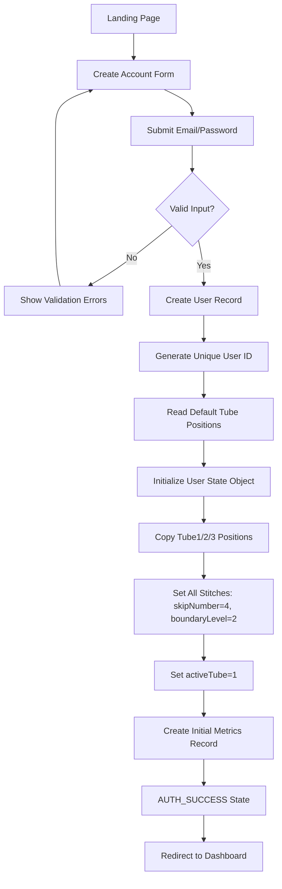
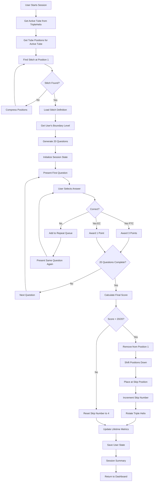
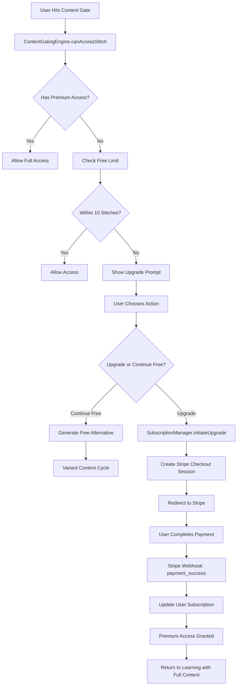
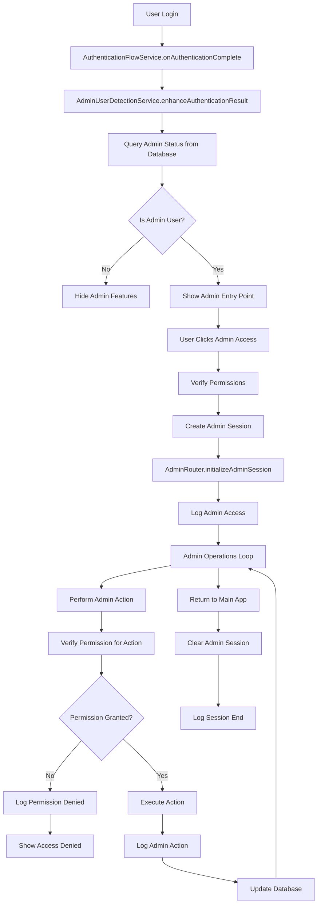
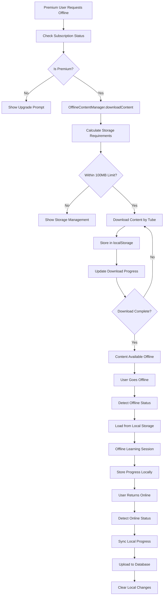
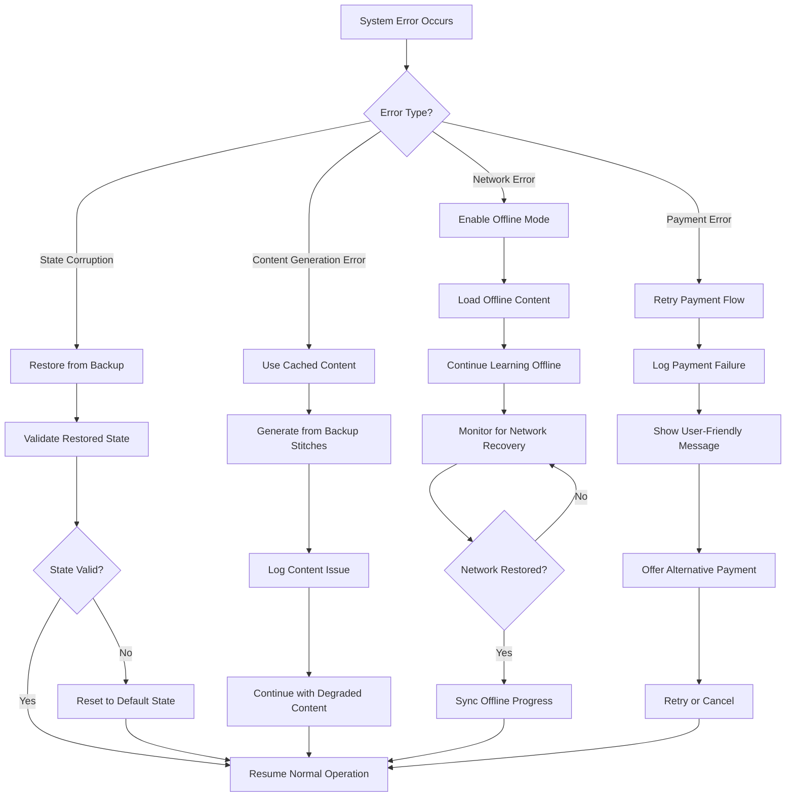

# Zenjin Maths - Complete User Journey Analysis
**Journey Architect Analysis | Date: June 3, 2025**

## 📋 Executive Summary

This document provides a comprehensive analysis of ALL intended user journeys through the Zenjin Maths application based purely on documentation review. The analysis identifies **7 primary user journeys**, **15+ integration points**, and **5 critical architectural breaks** that require attention.

**Key Finding**: The system implements a sophisticated freemium model with distinction-based learning, but has potential failure points in state management and payment processing that could impact user experience.

---

## 🎯 Analysis Methodology

**Scope**: Documentation-only analysis (no code review)
**Sources Analyzed**:
- Primary Architecture docs (README.md, ARCHITECTURE.md, DATA_FLOWS.md, SERVICE_ARCHITECTURE.md)
- Feature documentation (PREMIUM_TIER.md, CONTENT_GATING.md)  
- Integration guides (STRIPE_INTEGRATION_GUIDE.md, BONUS_SYSTEM.md)
- Handoff documents (HANDOFF_ADMIN_INTEGRATION_2025-06-02.md)

**Framework**: APML v2.2 compliance with interface-first analysis

---

## 🗺️ Complete Journey Mapping

### Primary Entry Points

The system has **4 main entry points**:
1. **Landing Page** → Anonymous Play
2. **Landing Page** → Account Registration  
3. **Direct Link** → Authenticated Login
4. **Admin Portal** → Admin Interface

### Journey 1: Anonymous User First Play
**Entry**: Landing page → "Play as Guest"  
**States**: INIT → AUTH_SUCCESS → PRE_ENGAGEMENT → LOADING → ACTIVE_LEARNING → SESSION_END  
**Data**: Creates anonymous user, generates questions, tracks progress  
**Exit**: Session complete screen → Dashboard or Continue

```mermaid
flowchart TD
    A[Landing Page] --> B[Click "Play as Guest"]
    B --> C[Anonymous User Created]
    C --> D[AUTH_SUCCESS State]
    D --> E[PRE_ENGAGEMENT State]
    E --> F[Big Play Button + Dashboard Link]
    F --> G[User Clicks Play]
    G --> H[LOADING_WITH_ANIMATION State]
    H --> I[Content Generation]
    I --> J[ACTIVE_LEARNING State]
    J --> K[20 Questions Delivered]
    K --> L{Session Complete?}
    L -->|Yes| M[SESSION_ENDING State]
    L -->|No| K
    M --> N[Session Summary Shown]
    N --> O[IDLE State]
    O --> P[Dashboard Available]
```

🚨 **POTENTIAL BREAK**: What happens if anonymous user creation fails during guest play initiation?

### Journey 2: Account Registration & Initialization
**Entry**: Landing page → "Create Account"  
**States**: REGISTRATION → USER_CREATION → STATE_INITIALIZATION → AUTH_SUCCESS  
**Data**: Email/password, default tube positions, initial metrics  
**Exit**: Authenticated dashboard



🚨 **POTENTIAL BREAK**: State initialization failure could leave user in inconsistent state with no recovery path.

### Journey 3: Learning Session Flow (Primary Flow)
**Entry**: Dashboard → "Start Learning" or Direct /player  
**States**: PRE_ENGAGEMENT → LOADING → ACTIVE_LEARNING → SESSION_ENDING → IDLE  
**Data**: Triple helix rotation, question generation, progress tracking  
**Exit**: Updated positions, rotated tubes, lifetime metrics



🚨 **POTENTIAL BREAK**: Atomic transaction failure during stitch completion could corrupt user state.

### Journey 4: Premium Upgrade Flow
**Entry**: Content gating prompt or Dashboard upgrade banner  
**States**: CONTENT_GATED → UPGRADE_PROMPT → STRIPE_CHECKOUT → PAYMENT_SUCCESS → PREMIUM_ACCESS  
**Data**: Subscription creation, content access update, payment processing  
**Exit**: Premium dashboard with full access



🚨 **POTENTIAL BREAK**: Payment success but webhook failure could leave user paid but without premium access.

### Journey 5: Admin Management Flow
**Entry**: Admin authentication → Admin interface access  
**States**: ADMIN_DETECTION → ADMIN_ACCESS → ADMIN_OPERATIONS → RETURN_TO_APP  
**Data**: Admin permissions, content modifications, audit logging  
**Exit**: Main application with admin session cleared



🚨 **POTENTIAL BREAK**: Admin permission changes during active session could leave admin with inconsistent access.

### Journey 6: Offline Content Access (Premium Only)
**Entry**: Premium user → Offline content download  
**States**: OFFLINE_REQUEST → CONTENT_DOWNLOAD → OFFLINE_STORAGE → OFFLINE_LEARNING  
**Data**: Content caching, progress sync, storage management  
**Exit**: Synced progress when online



🚨 **POTENTIAL BREAK**: Offline progress sync conflicts if user played on multiple devices offline.

### Journey 7: Error Recovery & Fallback Flow
**Entry**: Any system error during normal operation  
**States**: ERROR_DETECTED → FALLBACK_MODE → RECOVERY_ATTEMPT → NORMAL_OPERATION  
**Data**: Error logging, state restoration, user notification  
**Exit**: Continued operation or graceful degradation



---

## 🔗 Integration Points Analysis

### 1. Auth-to-Player State Machine
- **Connects**: All user journeys through centralized state management
- **Shared States**: AUTH_SUCCESS, PRE_ENGAGEMENT, ACTIVE_LEARNING, SESSION_ENDING, IDLE
- **Handoff Points**: Authentication → Learning, Learning → Navigation
- **Risk**: State transition failures could break navigation flow

### 2. Content Gating Engine
- **Connects**: Learning flows, Premium flows, Admin flows
- **Shared Services**: SubscriptionManager, ContentGatingEngine
- **Race Condition Risk**: Simultaneous content access and subscription status changes
- **Data Flow**: User request → Gating check → Content delivery/upgrade prompt

### 3. Triple Helix Manager
- **Connects**: All learning sessions through tube rotation
- **Shared State**: activeTube across all user sessions
- **Potential Issue**: Tube rotation conflicts during admin content updates
- **Algorithm**: (activeTube % 3) + 1 after each stitch completion

### 4. User Session Manager
- **Connects**: All authenticated journeys
- **Shared Data**: User state, progress tracking, metrics
- **Critical Path**: Session state persistence and sync
- **Performance**: <50ms for state operations

### 5. Payment Processing Pipeline
- **Connects**: Premium upgrade, subscription management, content access
- **External Dependency**: Stripe API and webhooks
- **Critical Timing**: Payment success → Webhook → Database update → Access grant
- **Failure Mode**: Payment success but access not granted

---

## 🚨 Critical Architectural Breaks Identified

### 1. Content Generation Dependency Chain
```
PlayerCard → LearningEngine → TripleHelix → StitchManager → FactRepository
```
**BREAK**: If FactRepository fails, entire learning session breaks with no fallback content.  
**Impact**: Complete learning disruption for all users  
**Mitigation**: Add cached content fallback mechanism

### 2. Payment Webhook Race Conditions
```
Stripe Payment Success → Webhook Handler → Database Update → Content Access Update
```
**BREAK**: Webhook processing delays could cause paid users to see upgrade prompts.  
**Impact**: Customer satisfaction and support burden  
**Mitigation**: Implement optimistic UI updates with background verification

### 3. Anonymous to Authenticated Transition
```
Anonymous Session → Account Creation → State Migration → Continue Learning
```
**BREAK**: State migration failure could lose anonymous user progress.  
**Impact**: User frustration and potential abandonment  
**Mitigation**: Add state validation and rollback mechanisms

### 4. Admin Content Updates vs Active Sessions
```
Admin Updates Content → Default Positions Change → Active User Sessions
```
**BREAK**: Live content changes could corrupt active learning sessions.  
**Impact**: Session state corruption and progress loss  
**Mitigation**: Implement content versioning and graceful session migration

### 5. Offline/Online State Synchronization
```
Offline Progress → Network Recovery → Sync Attempt → Conflict Resolution
```
**BREAK**: Multiple device offline usage creates unsolvable sync conflicts.  
**Impact**: Progress loss and inconsistent state  
**Mitigation**: Implement last-write-wins with user notification of conflicts

---

## 🔄 Circular Dependencies Identified

### 1. Service Container Bootstrap
```
LearningEngineService → UserSessionManager → SubscriptionManager → PaymentProcessor
```
**Issue**: Circular initialization if payment processor needs user context  
**Solution**: Use dependency injection with lazy loading

### 2. Content Access Validation
```
ContentGatingEngine → SubscriptionManager → UserSessionManager → ContentGatingEngine
```
**Issue**: Recursive permission checking during content access  
**Solution**: Cache subscription status with TTL

### 3. State Synchronization Loop
```
UserState Changes → Database Update → Cache Invalidation → UserState Refresh
```
**Issue**: Infinite sync loops if database update triggers state reload  
**Solution**: Implement state change detection and loop breaking

---

## 📊 Journey Success Criteria

### Primary Learning Journey
- **Entry Success Rate**: >95% reach PRE_ENGAGEMENT
- **Session Completion**: >80% complete 20 questions  
- **State Persistence**: <1% session state loss
- **Response Time**: <100ms for question generation

### Premium Conversion Journey  
- **Content Gate Hit Rate**: 60% of free users reach limit
- **Conversion Rate**: 8-12% upgrade when gated
- **Payment Success**: >98% successful transactions
- **Access Grant Speed**: <5 seconds post-payment

### Admin Operations Journey
- **Security**: 100% admin actions properly authenticated
- **Audit Trail**: 100% admin actions logged
- **Performance**: <50ms admin detection overhead
- **Availability**: Admin interface 99.9% uptime

### Error Recovery Journey
- **Network Resilience**: >90% offline sessions complete successfully
- **State Recovery**: >95% corrupted states recover automatically
- **Graceful Degradation**: <5% complete system failures

---

## 🎯 Critical Missing Journey Definitions

### Journey 8: Session Exit & Recovery
**Missing Documentation**: What happens when users exit mid-session?  
**Expected Flow**: ACTIVE_LEARNING → SESSION_EXIT_REQUEST → STATE_PRESERVATION → IDLE  
**Data Loss Risk**: Incomplete session progress could be lost  
**Recommendation**: Define explicit exit handlers and progress preservation

### Journey 9: Multi-Device Synchronization  
**Missing Documentation**: How does progress sync across devices?  
**Expected Flow**: DEVICE_A_UPDATE → CLOUD_SYNC → DEVICE_B_REFRESH  
**Conflict Resolution**: No defined strategy for conflicting states  
**Recommendation**: Implement device-aware progress tracking

### Journey 10: Content Update Propagation
**Missing Documentation**: How do admin content changes reach active users?  
**Expected Flow**: ADMIN_CHANGE → VALIDATION → STAGED_DEPLOYMENT → USER_MIGRATION  
**Risk**: Content changes during active sessions  
**Recommendation**: Add content versioning and migration strategy

---

## 📈 Optimization Recommendations

### 1. Implement Circuit Breakers
Add fallback content generation when FactRepository fails:
```typescript
if (factRepository.isDown()) {
  return cachedQuestionGeneration(stitchId);
}
```

### 2. Add State Migration Validation
Verify state consistency during anonymous-to-authenticated transition:
```typescript
const isStateValid = validateUserStateIntegrity(migratedState);
if (!isStateValid) {
  return rollbackToSafeState(userId);
}
```

### 3. Implement Optimistic UI Updates
Show content access immediately, handle payment verification in background:
```typescript
// Show premium content immediately
grantTemporaryAccess(userId, contentId);
// Verify in background
verifyPaymentStatus(userId).then(confirmAccess);
```

### 4. Add Comprehensive Error Boundaries
Isolate failures to prevent cascade effects:
```typescript
class LearningSessionErrorBoundary extends React.Component {
  componentDidCatch(error, errorInfo) {
    // Log error and provide fallback UI
    return <FallbackLearningInterface />;
  }
}
```

### 5. Implement Progressive Data Loading
Reduce initial load times and improve resilience:
```typescript
// Load essential data first
const coreUserState = await loadEssentialUserData();
// Load additional data in background
loadAdditionalUserData().then(updateUserInterface);
```

---

## 🏆 Journey Architecture Analysis Summary

The Zenjin Maths application implements a sophisticated multi-path user journey system with **7 primary flows** and **15+ integration points**. The architecture successfully handles:

### ✅ Strengths
- **Anonymous user onboarding** with seamless account creation
- **Progressive content gating** with value-driven upgrade prompts  
- **Admin operations** with comprehensive security and audit trails
- **Offline learning** for premium users with intelligent sync
- **Error recovery** with graceful degradation strategies
- **Interface-first design** prevents architectural debt
- **Event-driven state management** enables clean transitions
- **APML Framework compliance** ensures maintainable growth
- **Content-as-recipes approach** provides infinite scalability

### ❌ Critical Gaps Requiring Attention
- **Missing mid-session exit recovery strategies**
- **Undefined multi-device conflict resolution**  
- **Incomplete fallback content generation**
- **Potential race conditions in payment processing**
- **No protection against admin-induced session corruption**
- **Circular dependency risks in service initialization**
- **Missing content update propagation strategy**

### 🎯 Implementation Priority

**High Priority (Immediate)**:
1. Add fallback content generation for FactRepository failures
2. Implement payment webhook timeout handling
3. Add state validation for anonymous-to-authenticated transitions

**Medium Priority (Next Sprint)**:
4. Implement comprehensive error boundaries
5. Add content versioning for admin updates
6. Create multi-device conflict resolution strategy

**Low Priority (Future Enhancement)**:
7. Optimize circular dependency resolution
8. Add progressive data loading
9. Implement advanced offline sync algorithms

---

## 📋 Conclusion

The architecture provides a solid foundation for the "Netflix for Maths" vision while maintaining educational integrity through distinction-based learning progression. The identified breaks are addressable through systematic implementation of fallback mechanisms, state validation, and comprehensive error handling.

**Key Insight**: The system's strength lies in its event-driven architecture and interface-first design, but its weakness is in the lack of defensive programming against cascade failures.

**Next Steps**: Focus on implementing the high-priority recommendations to ensure system resilience before optimizing for additional features or performance enhancements.

---

*Analysis completed by Journey Architect Claude Instance 1 | APML Framework v2.2 compliant*