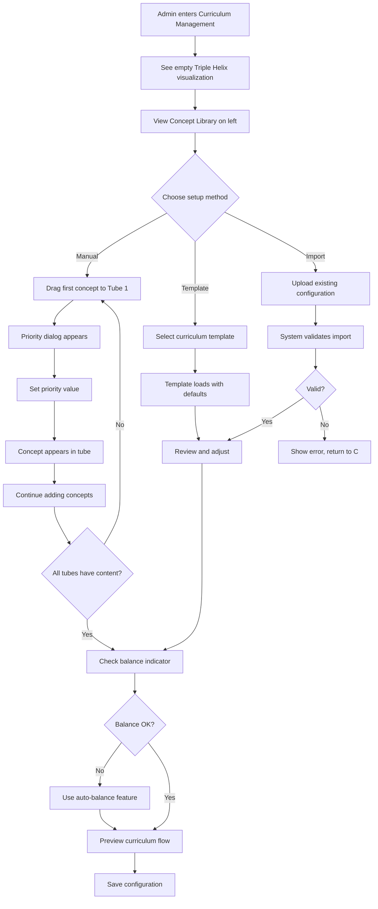
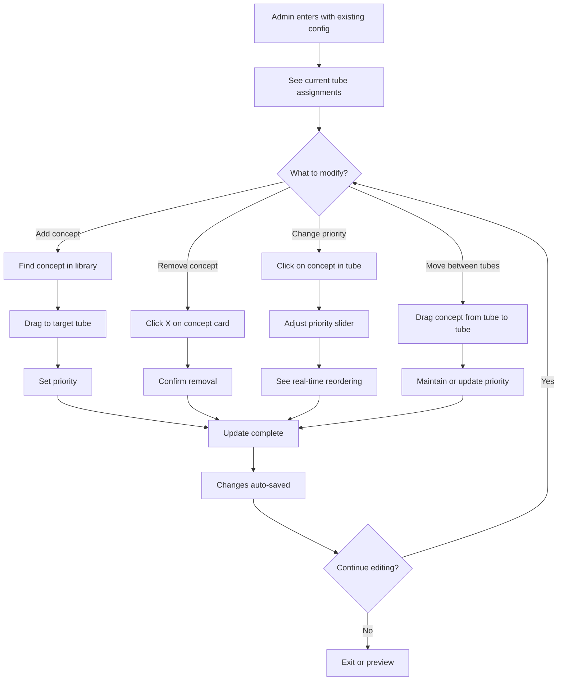
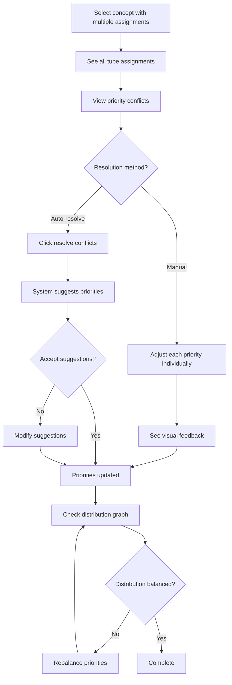
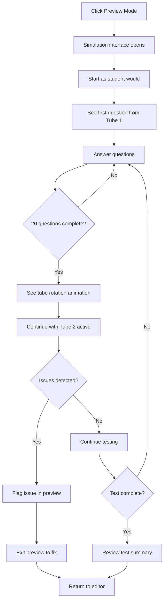
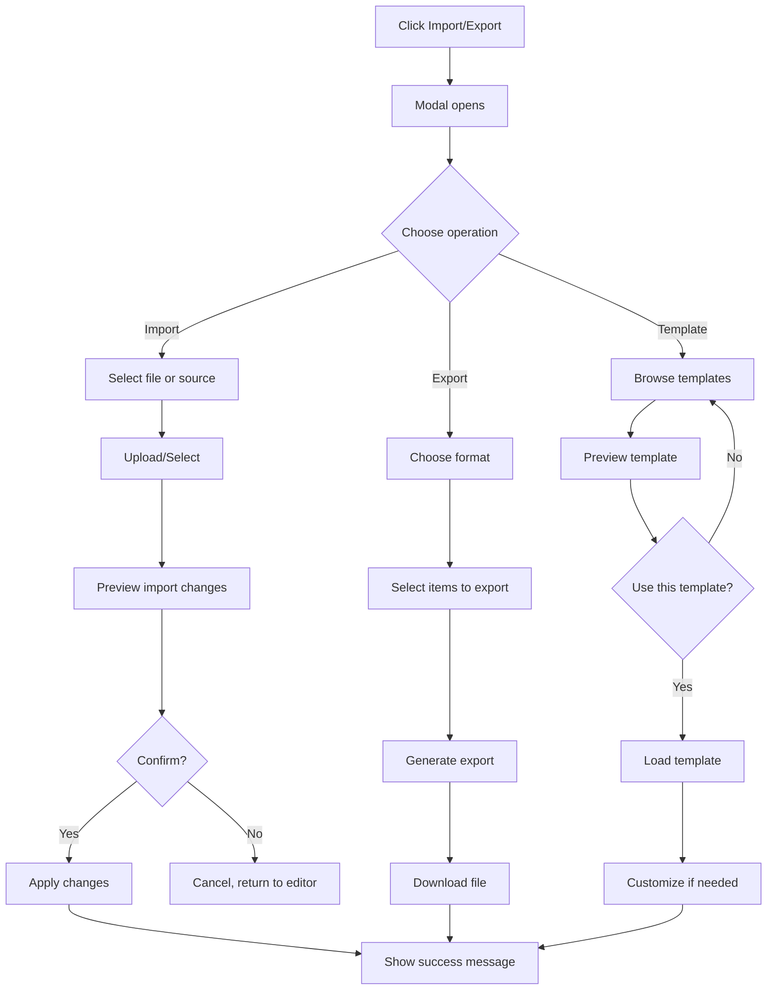
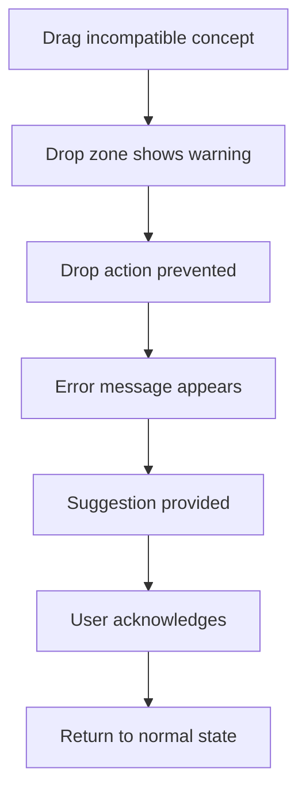
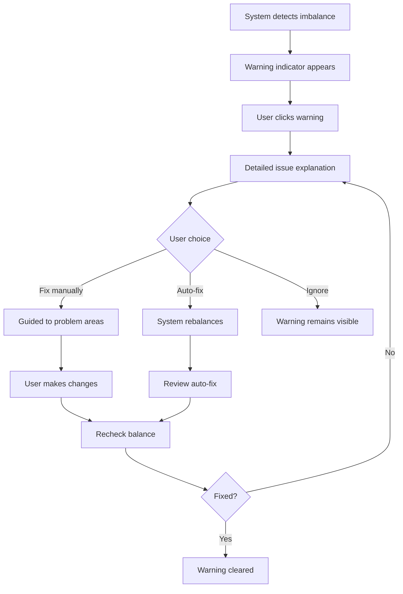
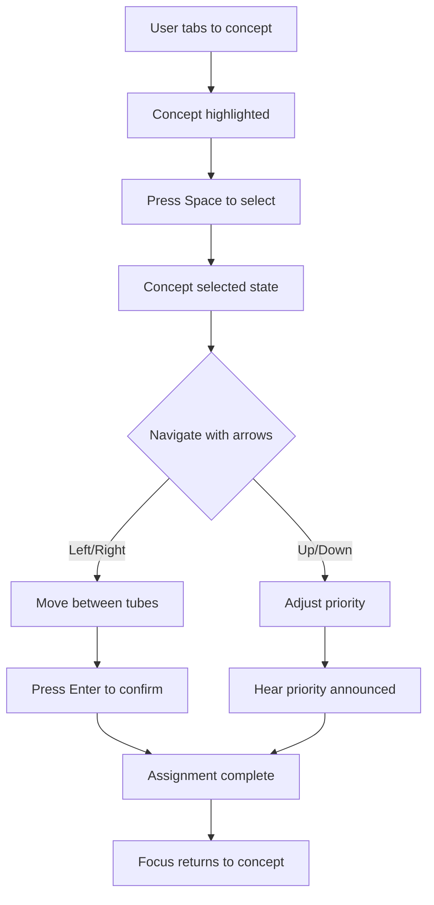
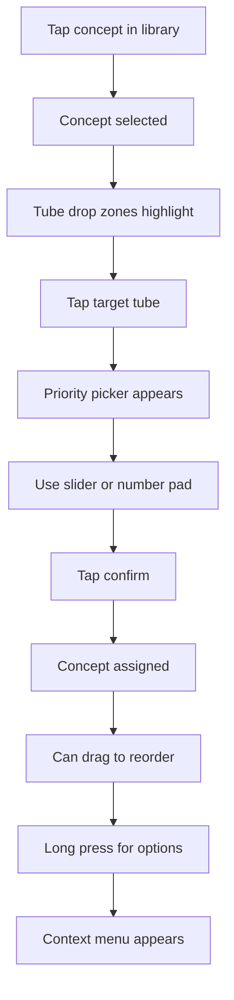

# Curriculum Management User Flows

## Primary User Flows

### Flow 1: First-Time Curriculum Setup

### Flow 2: Modifying Existing Curriculum

### Flow 3: Using Priority Management

### Flow 4: Preview Mode Testing

### Flow 5: Bulk Operations

## Error Handling Flows

### Error Flow 1: Invalid Assignment Attempt

### Error Flow 2: Unbalanced Curriculum Detection

## Accessibility Flows

### Keyboard Navigation Flow

## Mobile/Tablet Flows

### Touch-Based Assignment Flow

## Performance Considerations

1. **Loading States**: Show skeleton screens while data loads
2. **Optimistic Updates**: Apply changes immediately, revert on error
3. **Debounced Saves**: Auto-save after 500ms of inactivity
4. **Progressive Loading**: Load concepts in batches for large datasets
5. **Cached Previews**: Store preview results for quick access

## Success Metrics

- **Time to first assignment**: < 10 seconds
- **Complete curriculum setup**: < 5 minutes
- **Error recovery**: < 30 seconds
- **Preview generation**: < 2 seconds
- **Bulk import processing**: < 5 seconds for 1000 concepts