# Zenjin Maths - Data Flow Diagrams

## Visual Data Flow Representations

This document provides visual diagrams for the key data flows in the Zenjin Maths system using Mermaid syntax. These can be rendered in any Markdown viewer that supports Mermaid.

## 1. User Session Lifecycle

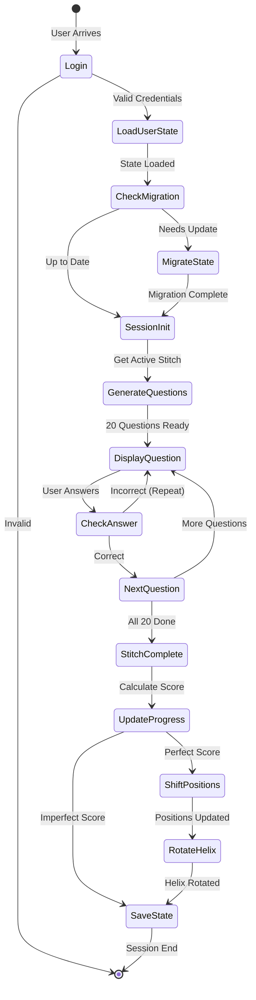

## 2. Question Generation Pipeline

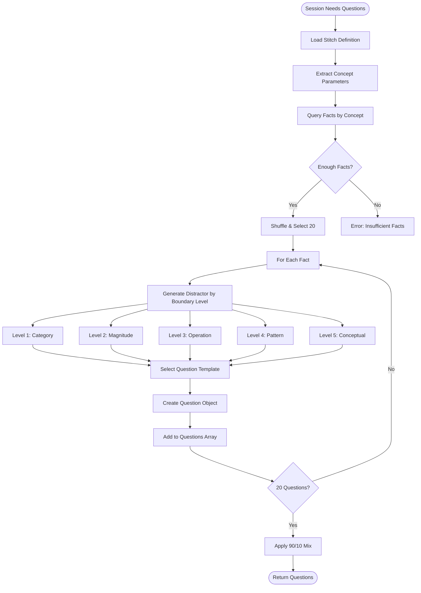

## 3. Stitch Progression Algorithm

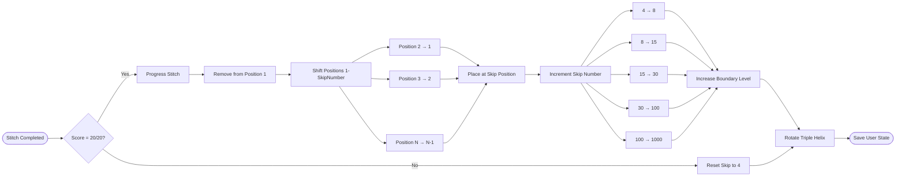

## 4. Sparse Position Management

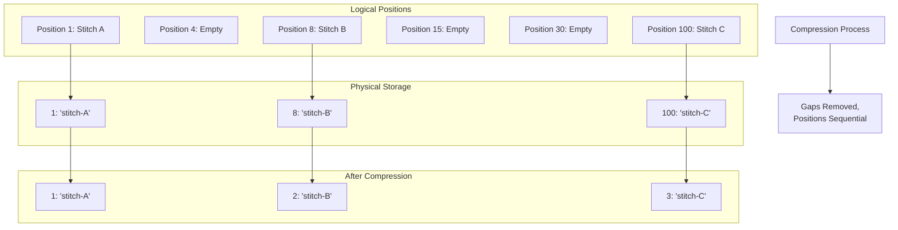

## 5. Triple Helix Data Flow

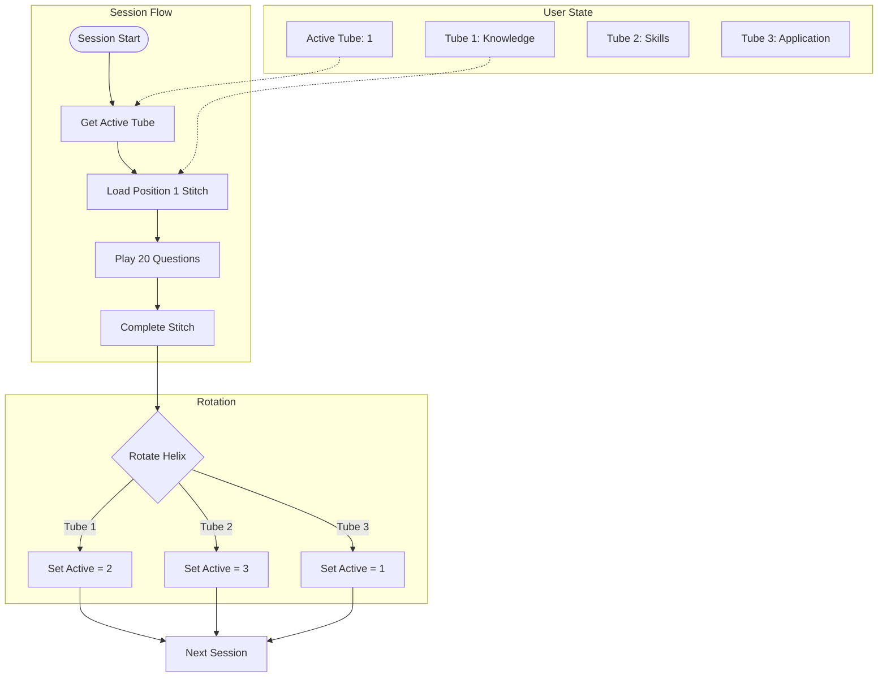

## 6. Admin Content Deployment Flow

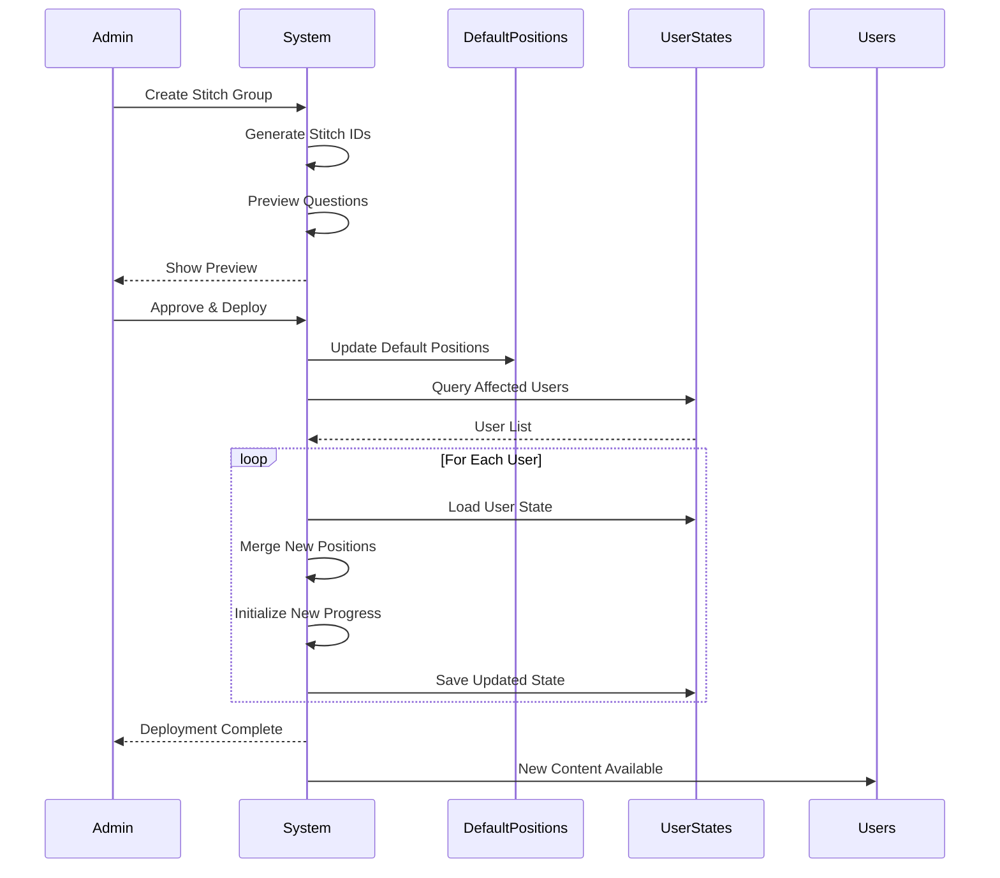

## 7. Data Transformation Pipeline

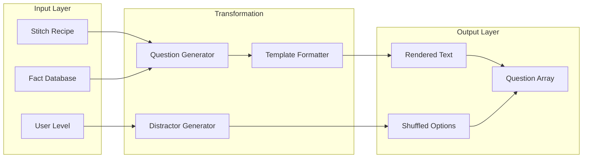

## 8. State Synchronization Flow

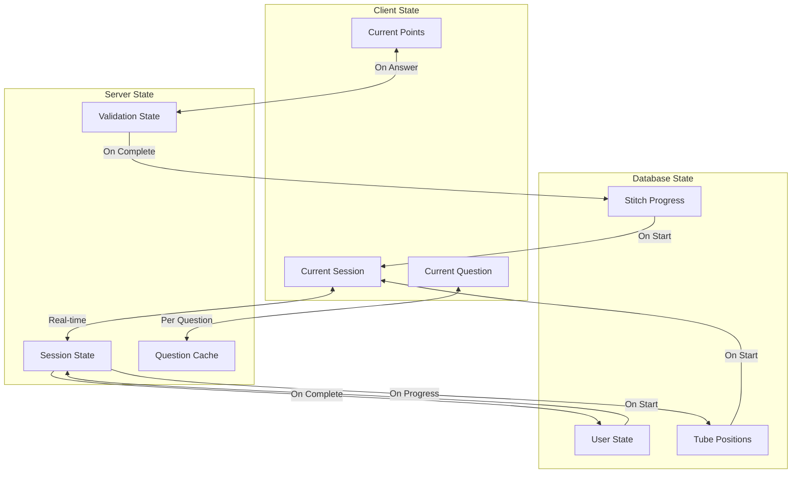

## 9. Error Recovery Flow

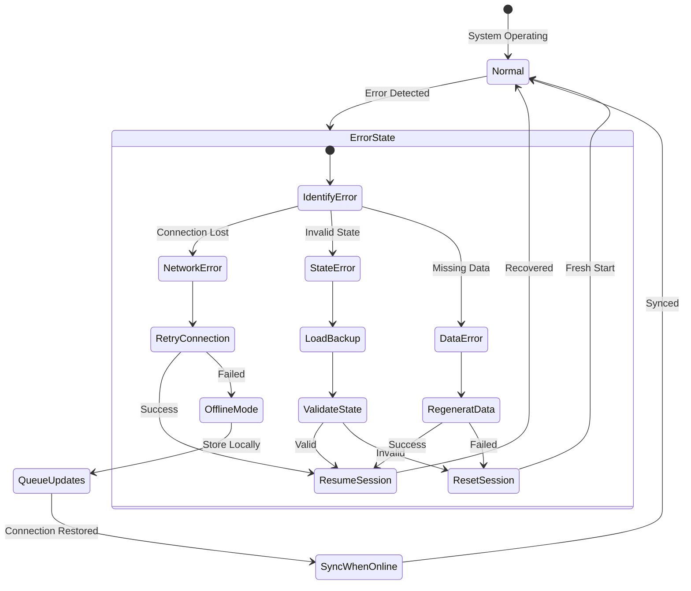

## 10. Performance Optimization Flow

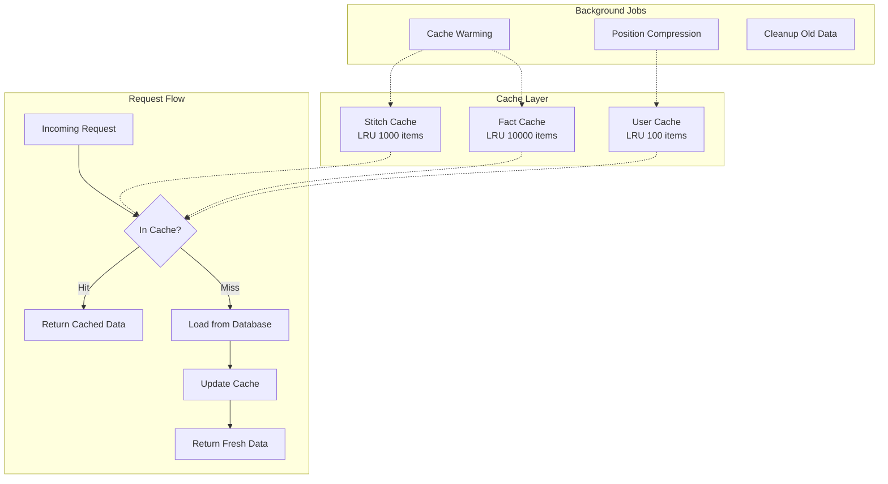

## 11. Metrics and Points Calculation Flow

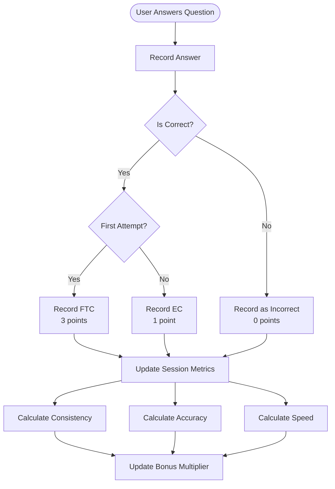

## 12. Session Summary Generation

```mermaid
flowchart LR
    Complete([Session Complete]) --> GatherData[Gather Session Data]
    
    GatherData --> CalcBase[Calculate Base Points]
    CalcBase --> FTC[FTC Count × 3]
    CalcBase --> EC[EC Count × 1]
    
    GatherData --> CalcMetrics[Calculate Performance Metrics]
    CalcMetrics --> Consistency[Consistency Score]
    CalcMetrics --> Accuracy[Accuracy Score]
    CalcMetrics --> Speed[Speed Score]
    
    Consistency --> BonusCalc[Calculate Bonus Multiplier]
    Accuracy --> BonusCalc
    Speed --> BonusCalc
    
    BonusCalc --> SelectBonus[Select Highest Bonus<br/>MAX(Consistency, Excellence, Speed)]
    SelectBonus --> FinalMultiplier[Final Multiplier<br/>Ranges from x2 to x30]
    
    FTC --> TotalCalc[Calculate Total Points]
    EC --> TotalCalc
    FinalMultiplier --> TotalCalc
    
    TotalCalc --> SessionSummary[Generate Session Summary]
    
    GatherData --> BlinkCalc[Calculate Blink Speed]
    BlinkCalc --> SessionSummary
```

## 13. Bonus Multiplier System

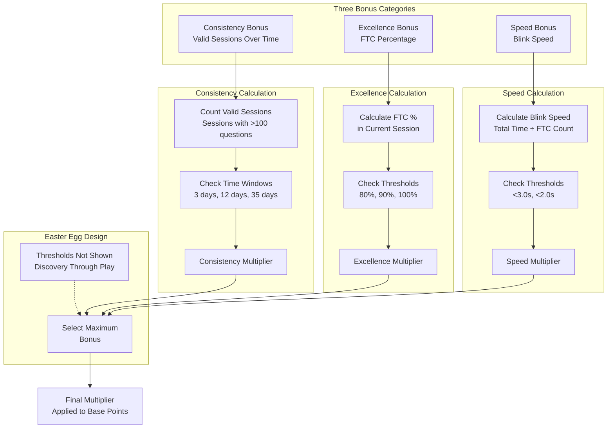

## 14. Evolution Score Calculation

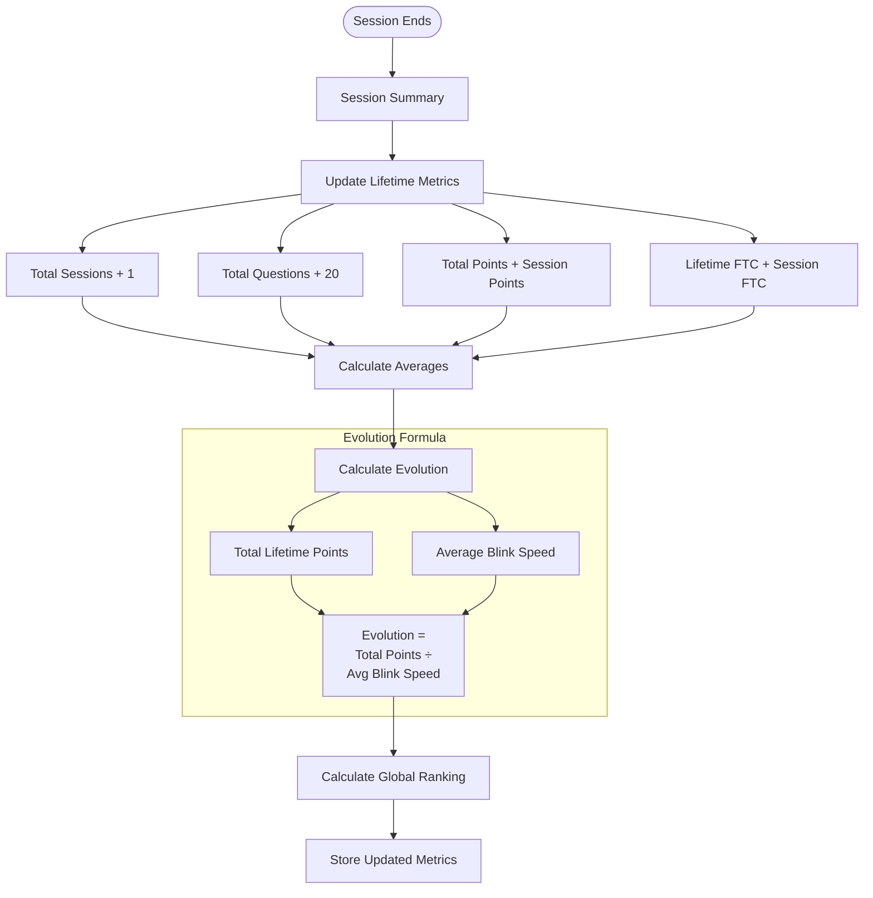

## 15. Global Ranking System

```mermaid
flowchart TB
    User([User Metrics]) --> Points[Total Points]
    User --> Evo[Evolution Score]
    User --> Activity[Recent Activity]
    
    Points --> PointRank[Points Percentile<br/>vs All Users]
    Evo --> EvoRank[Evolution Percentile<br/>vs All Users]
    Activity --> ActRank[Activity Percentile<br/>vs Active Users]
    
    PointRank --> Weight[Weighted Average<br/>Points: 40%<br/>Evolution: 40%<br/>Activity: 20%]
    EvoRank --> Weight
    ActRank --> Weight
    
    Weight --> Global[Global Ranking<br/>Percentile]
    
    Global --> Display[Display as<br/>"Top X%"]
    
    subgraph "Ranking Tiers"
        Display --> Elite[Top 1%: Elite]
        Display --> Expert[Top 5%: Expert]
        Display --> Advanced[Top 20%: Advanced]
        Display --> Intermediate[Top 50%: Intermediate]
        Display --> Beginner[Bottom 50%: Beginner]
    end
```

## Implementation Guidelines

### Using These Diagrams

1. **Technology Agnostic**: These flows work with any tech stack
2. **Atomic Operations**: Boxes in flows should be atomic operations
3. **Error Handling**: Each flow should have error paths
4. **Logging Points**: Log at each major state transition
5. **Testing Boundaries**: Test at each decision point

### Key Patterns to Implement

1. **Sparse Storage**: Use maps/dictionaries, not arrays
2. **Atomic Updates**: Use transactions for state changes
3. **Caching Strategy**: Cache immutable data aggressively
4. **Event Sourcing**: Log all state transitions
5. **Graceful Degradation**: Handle partial failures

### Performance Considerations

1. **Batch Operations**: Group database updates
2. **Lazy Loading**: Load data only when needed
3. **Optimistic Updates**: Update UI before server confirms
4. **Background Processing**: Defer non-critical updates
5. **Connection Pooling**: Reuse database connections