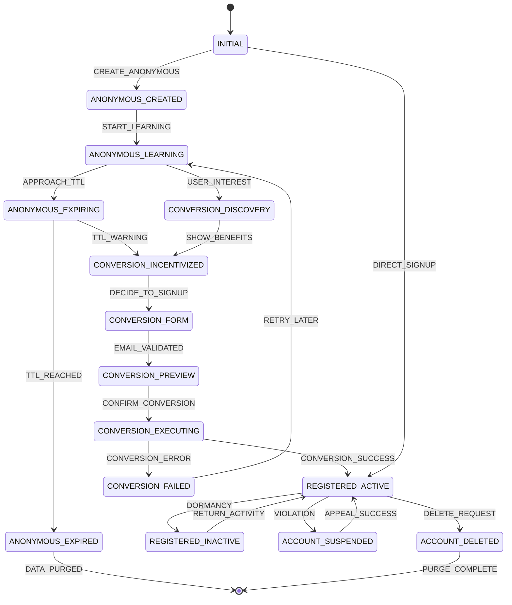

# User Lifecycle Flow Diagram
## APML v2.2 Interface Specification

This document defines the complete user lifecycle flow with special emphasis on the anonymous-to-registered conversion that preserves UX continuity.

## State Machine Overview



## Interface Integration Points

### 1. Auth-to-Player Flow Integration
```typescript
// Extended AuthToPlayerStateMachine states
type ExtendedAuthToPlayerState = 
  | AuthToPlayerState  // Existing states
  | 'CONVERSION_DISCOVERY'
  | 'CONVERSION_INCENTIVIZED' 
  | 'CONVERSION_FORM'
  | 'CONVERSION_EXECUTING'
  | 'CONVERSION_WELCOME';
```

### 2. User Experience Flows

#### Anonymous User Journey
```
Launch App → Anonymous Creation → Learning Sessions → TTL Warning → Conversion Incentive
                                      ↓
                              Continue Learning (with reminders)
                                      ↓
                              Eventually: TTL Expiry → Data Loss
```

#### Optimal UX: Seamless Conversion
```
Anonymous Learning → Conversion Interest → Preview Benefits → Sign Up → Keep Everything
        ↓                    ↓                  ↓              ↓            ↓
   Progress Made    See What You Keep    Email/Password   Atomic Switch   Seamless Continue
```

### 3. Critical UX Moments

#### Conversion Discovery Triggers
- User completes first successful session
- User achieves first milestone/achievement  
- User reaches 7 days of activity
- TTL warning appears (7 days remaining)
- Critical TTL warning (24 hours remaining)

#### Conversion Incentive Display
```typescript
interface ConversionIncentive {
  trigger: 'achievement' | 'ttl_warning' | 'milestone' | 'session_complete';
  preservationPreview: {
    sessionsCompleted: number;
    pointsEarned: number;
    achievementsUnlocked: string[];
    learningStreak: number;
    estimatedValue: string; // "3 weeks of progress"
  };
  urgency: 'low' | 'medium' | 'high' | 'critical';
  timeRemaining?: string; // For TTL-based triggers
}
```

## Data Preservation Contract

### What MUST Be Preserved
```typescript
interface PreservationContract {
  // Learning Progress (CRITICAL)
  stitchPositions: Record<string, any>;
  tripleHelixState: { activeTube: number; rotationCount: number };
  spacedRepetitionState: Record<string, any>;
  
  // Metrics (CRITICAL) 
  totalSessions: number;
  totalQuestions: number;
  totalCorrect: number;
  lifetimePoints: number;
  ftcPoints: number;
  ecPoints: number;
  
  // Achievements (HIGH PRIORITY)
  unlockedAchievements: string[];
  currentStreak: number;
  maxStreak: number;
  
  // Preferences (MEDIUM PRIORITY)
  settings: Record<string, any>;
  lastLearningPath: string;
  
  // Session History (LOW PRIORITY - can be summarized)
  sessionCount: number;
  firstSessionDate: string;
  lastSessionDate: string;
}
```

### Atomic Conversion Process
```typescript
interface ConversionTransaction {
  // Phase 1: Preparation (Reversible)
  prepare(): Promise<ConversionPreparationResult>;
  
  // Phase 2: Atomic Execution (Point of No Return)
  execute(): Promise<{
    preserveData: () => Promise<boolean>;
    updateUserType: () => Promise<boolean>;
    createAuthUser: () => Promise<boolean>;
    linkAuthToApp: () => Promise<boolean>;
    removeTTL: () => Promise<boolean>;
    verifyIntegrity: () => Promise<boolean>;
  }>;
  
  // Phase 3: Verification & Rollback
  verify(): Promise<ConversionVerificationResult>;
  rollback(): Promise<boolean>;
}
```

## UI/UX Implementation Points

### Conversion Discovery Components
- **InlineConversionPrompt**: Subtle prompt during learning
- **AchievementConversionModal**: Triggered by achievements
- **TTLWarningBanner**: Appears when TTL approaches
- **CriticalTTLModal**: Urgent conversion prompt

### Conversion Flow Components  
- **ConversionBenefitsPreview**: Shows what user will keep
- **ConversionForm**: Email/password collection
- **ConversionProgressIndicator**: Shows conversion status
- **ConversionWelcome**: Success state with preserved data summary

### Error Handling Components
- **ConversionFailedModal**: Recovery options
- **EmailConflictResolver**: Handle existing email addresses
- **DataPreservationError**: Critical error handling

## Integration with Existing Systems

### AuthToPlayerEventBus Integration
```typescript
// New events for conversion flow
type ConversionEvents = {
  'conversion:discovered': { trigger: string };
  'conversion:preview': { preservationData: ConversionPreservationData };
  'conversion:started': { email: string };
  'conversion:progress': { step: string; progress: number };
  'conversion:completed': { newUserType: 'registered'; preservedData: any };
  'conversion:failed': { error: string; rollbackSuccess: boolean };
};
```

### Admin Interface Integration
- Track conversion rates by trigger type
- Monitor failed conversions
- View preservation data integrity
- Analyze TTL expiry patterns

This interface-first design ensures the conversion flow is properly architected before implementation, maintaining the APML principle of designing contracts before code.